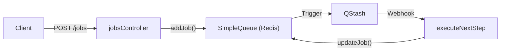
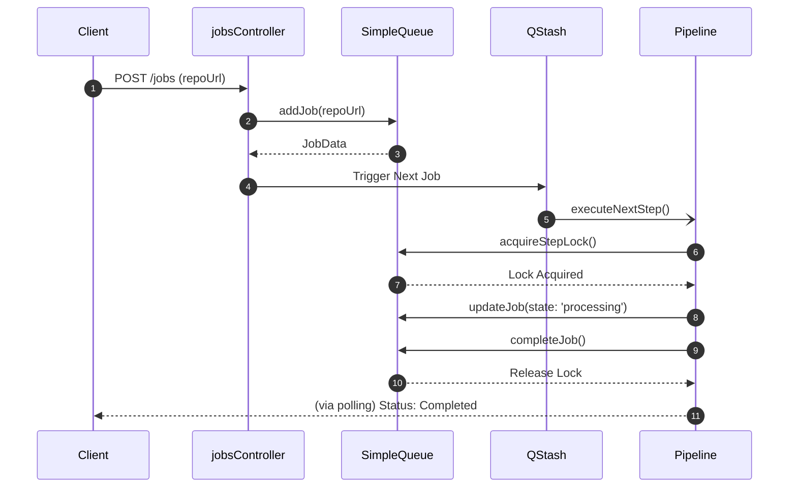

# Queue and Job Management

The Queue and Job Management module provides an asynchronous orchestration layer that allows GitDex to handle resource-intensive repository indexing tasks without blocking the main API thread. It leverages Upstash Redis for state persistence and QStash for reliable task triggering.

## Architecture Overview

The system utilizes a "producer-consumer" pattern. The `jobsController` acts as the producer, creating job records in Redis, while the indexing pipeline (triggered via QStash) acts as the consumer.



## Data Model

Job states and metadata are persisted in Redis to ensure that the system can recover from crashes and track progress across multiple distributed execution steps.

### Job State Definitions
The `JobState` type defines the lifecycle of an indexing task:
- `queued`: The job is created and waiting for processing.
- `processing`: The indexing pipeline is currently acting on the repository.
- `completed`: The repository has been successfully indexed.
- `failed`: A terminal error occurred during processing.

### Job Data Schema
The `JobData` interface ensures consistent tracking of repository metadata and progress.

| Field | Type | Description |
| :--- | :--- | :--- |
| `id` | `string` | Unique identifier for the job. |
| `state` | `JobState` | Current status of the job. |
| `repoUrl` | `string` | Full URL of the GitHub repository. |
| `owner` | `string` | GitHub organization or user owner. |
| `repo` | `string` | Name of the repository. |
| `currentStep` | `number` | The current stage of the indexing pipeline. |
| `updatedAt` | `number` | Timestamp of the last state change. |
| `error` | `string \| null` | Error message if the state is `failed`. |

## Queue Implementation

The `SimpleQueue` class manages the interaction with Redis, providing atomic-like operations for job lifecycle management.

### Core Logic
The queue uses specific key patterns to avoid collisions and manage concurrency:
- **Job Key**: Stores the `JobData` JSON.
- **Lock Key**: Prevents multiple workers from processing the same repository simultaneously.

```typescript
// Simplified JobData interface from server/src/queue.ts
export interface JobData {
    id: string;
    state: JobState;
    repoUrl: string;
    owner: string;
    repo: string;
    currentStep: number;
    // ... other fields
}
```

### Key Queue Operations
- `addJob(repoUrl, force)`: Validates the repository and adds it to the queue. If `force` is true, it overrides existing jobs for that repo.
- `acquireStepLock(jobId, sectionIndex)`: Implements a locking mechanism to ensure a specific step of a job is not executed concurrently by multiple workers.
- `healStuckJobs()`: A maintenance function that identifies jobs stuck in the `processing` state for too long and reverts them to `queued`.

## API Reference

The following endpoints are exposed via `jobsRoutes.ts` to allow the frontend to trigger and monitor indexing tasks.

| Method | Endpoint | Description | Payload/Params |
| :--- | :--- | :--- | :--- |
| `POST` | `/jobs` | Initiates a new indexing job. | `{ "repoUrl": string }` |
| `GET` | `/jobs/:id` | Retrieves the status of a specific job. | `id` (URL Param) |
| `GET` | `/jobs/repo/:owner/:repo` | Retrieves status by repository name. | `owner`, `repo` (URL Params) |
| `POST` | `/jobs/heal` | Triggers the self-healing process. | None |

## Job Lifecycle Sequence

The following sequence illustrates the flow from a user request to the final indexing completion.



## Invariants & Failure Modes

### Concurrency Control
To prevent race conditions where two workers attempt to index the same repository, the system employs a **Locking Mechanism**. The `acquireStepLock` method ensures that only one execution context can modify a specific job step at a time. If a lock cannot be acquired, the worker must wait or fail, preventing duplicate data insertion into the index.

### Distributed Reliability
Because the backend may be deployed in a serverless environment (e.g., Vercel), local memory is not persistent. The system handles this by:
1. **Redis Persistence**: All job states are stored in Upstash Redis.
2. **QStash Delivery**: Using QStash ensures that the "trigger" to start the pipeline is delivered with retry logic, mitigating transient network failures.

### Self-Healing (The "Stuck Job" Problem)
A job may remain in the `processing` state indefinitely if a worker crashes before calling `completeJob` or `failJob`. The `cronHeal` controller invokes `healStuckJobs()`, which scans for jobs that have not been updated within a specific threshold and resets them to `queued` for re-processing.