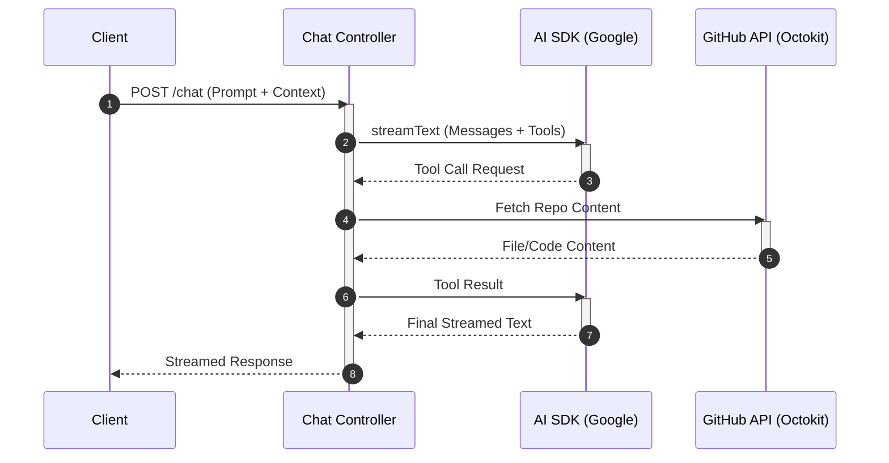

# AI Chat Controller

The AI Chat Controller is the central orchestration layer for GitDex's conversational interface. It manages the lifecycle of a chat request, interfaces with the Google Gemini model via the Vercel AI SDK, and provides the model with tools to interact with GitHub repositories in real-time.

## Functional Overview

The controller transforms raw HTTP requests into AI-compatible message formats, manages streaming responses to the client, and executes "tools" (function calling) that allow the AI to fetch codebase data using the GitHub API.

### API Endpoint Specification

The chat functionality is exposed via an Express handler that processes incoming prompts and repository context.

| Component | Detail | Description |
| :--- | :--- | :--- |
| **Handler** | `handleChat` | Primary entry point for processing AI chat requests. |
| **Model** | Google Gemini | Utilized via `@ai-sdk/google`. |
| **Input** | `Request` | Expects chat history and repository context (often derived from referer). |
| **Output** | `Response` | A streamed text response with potential tool-call metadata. |

## Request Lifecycle

The following sequence diagram illustrates how the AI Chat Controller mediates between the user, the AI model, and the GitHub API.



## Core Implementation Details

### Chat Handling Logic
The `handleChat` function utilizes `streamText` to provide a responsive UI experience. It leverages `convertToModelMessages` to ensure the conversation history is compatible with the Google AI SDK.

```typescript
export const handleChat = async (req: Request, res: Response) => {
  // Logic converts request body to model-compatible messages
  // and initiates a stream using the google model provider.
  const result = await streamText({
    model: google('models/gemini-1.5-pro-latest'),
    messages: convertToModelMessages(req.body.messages),
    tools: { /* tool definitions */ },
  });
  result.pipeDataStreamToResponse(res);
};
```

### AI Tool Integration
To prevent the model from hallucinating codebase details, the controller defines tools using `zod` for schema validation and `Octokit` for data retrieval. This allows the AI to dynamically request specific files or directory structures from GitHub.

### Reliability Layer
For non-streaming operations, the system employs a retry mechanism defined in `server/src/ai.ts` to handle transient API failures or rate limits.

```typescript
export async function generateWithRetry({
  systemPrompt,
  prompt,
  maxRetries = 3
}: GenerateOptions): Promise<string> {
  // Implementation iterates up to maxRetries 
  // using generateText from the 'ai' package.
}
```

## Invariants & Failure Modes

### Architecture Trade-offs & Constraints

| Potential Failure | Mitigation Strategy |
| :--- | :--- |
| **LLM Hallucinations** | Forced tool usage via `Octokit` to ensure responses are grounded in actual repository content. |
| **API Rate Limiting** | The `generateWithRetry` wrapper provides a basic resilience layer for critical non-streaming calls. |
| **Context Window Overflow** | Use of `convertToModelMessages` to manage and format the conversation history before sending to the model. |
| **Request Timeout** | Implementation of streaming (`streamText`) ensures the client receives partial data immediately rather than waiting for the full completion. |

### Security Considerations
- **Referer Parsing**: The `parseReferer` utility is used to extract repository context, ensuring the AI is scoped to the repository currently being viewed by the user.
- **Input Validation**: Zod schemas are used within tool definitions to strictly validate the arguments the AI attempts to pass to the GitHub API, preventing injection or malformed requests.