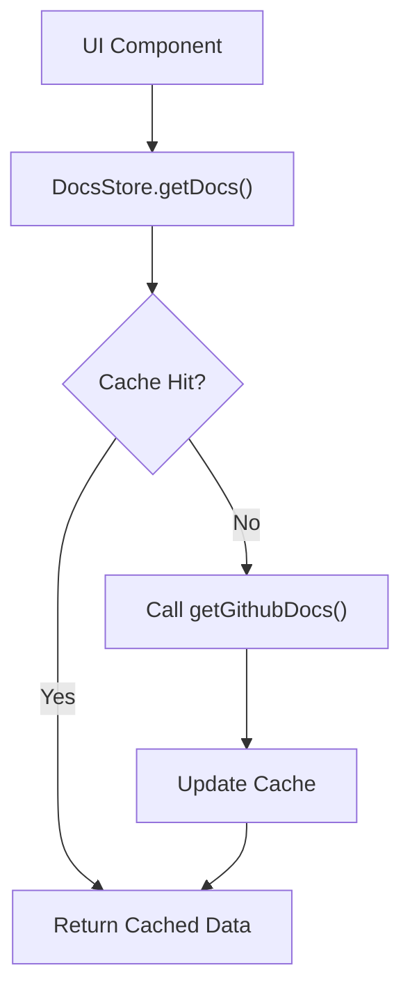

# Client-Side State & Data

The GitDex frontend employs a hybrid approach to data management, utilizing a centralized client-side store for caching documentation and a proxy-based communication layer to interface with both external GitHub APIs and internal backend services.

## State Management

The frontend uses **Zustand** to manage the global state of documentation data. This ensures that once repository documentation is fetched, it is cached locally to prevent redundant network requests and provide a snappier user experience during navigation.

### Documentation Store (`docs-store.ts`)

The `DocsStore` acts as a caching layer for the `DocsStructure` data retrieved from GitHub. It maps unique repository identifiers to their corresponding data and a timestamp for cache invalidation.

#### Cache Structure

The cache is implemented as a key-value map where the key is a unique identifier for the repository.

| Field | Type | Description |
| :--- | :--- | :--- |
| `data` | `DocsStructure` | The structured documentation content of the repository. |
| `timestamp` | `number` | The time at which the data was fetched, used for TTL/expiry logic. |

#### Store Interface

The `DocsStore` provides the following methods for managing state:

| Method | Parameters | Description |
| :--- | :--- | :--- |
| `getDocs` | `owner: string, repo: string` | Retrieves docs from cache if available; otherwise, fetches via `getGithubDocs` and updates the cache. |
| `clearCache` | `void` | Wipes all cached documentation across all repositories. |
| `clearCacheFor` | `owner: string, repo: string` | Removes the cached entry for a specific repository. |

```typescript
interface DocsStore {
  cache: DocsCache;
  getDocs: (owner: string, repo: string) => Promise<DocsStructure>;
  clearCache: () => void;
  clearCacheFor: (owner: string, repo: string) => void;
}
```

## Data Acquisition Flow

The following diagram illustrates the logic flow when the frontend requests documentation for a specific repository.



## API Communication

GitDex handles data communication through two primary channels: a generic proxy for backend services and dedicated Next.js API routes for external integrations.

### Backend Proxying (`proxy.ts`)

To avoid Cross-Origin Resource Sharing (CORS) issues and centralize backend communication, the client implements a proxy utility. The `proxy` function intercepts `NextRequest` objects and forwards them to the backend server, returning a `NextResponse`.

### GitHub Search Integration (`api/search/route.ts`)

The system provides a dedicated search endpoint to allow users to find repositories. This route leverages the `@octokit/rest` library to communicate with GitHub's API.

**Key Implementation Detail:** To improve user experience, the search route fetches a larger page of results from GitHub and then performs a lightweight local filter. This allows for more flexible partial-name matches than the default GitHub API provides.

#### Search API Reference

| Detail | Value |
| :--- | :--- |
| **Endpoint** | `/api/search` |
| **Method** | `GET` |
| **Dependency** | `@octokit/rest` |
| **Behavior** | Fetches repositories $\rightarrow$ Applies lightweight filter $\rightarrow$ Returns JSON |

## Communication Sequence

The following sequence describes the interaction when a user searches for a repository and views its documentation.

```mermaid
sequenceDiagram
    autonumber
    participant User as "User UI"
    participant SearchAPI as "Search Route"
    participant Octokit as "GitHub API"
    participant Store as "DocsStore"

    User ->> SearchAPI: GET /api/search?q=...
    activate SearchAPI
    SearchAPI ->> Octokit: Search Repositories
    Octokit -->> SearchAPI: Raw Results
    SearchAPI -->> User: Filtered Repo List
    deactivate SearchAPI

    User ->> Store: getDocs(owner, repo)
    activate Store
    alt Cache Miss
        Store ->> Octokit: Fetch Repo Docs
        Octokit -->> Store: Docs Data
        Store ->> Store: Update Cache
    end
    Store -->> User: DocsStructure
    deactivate Store