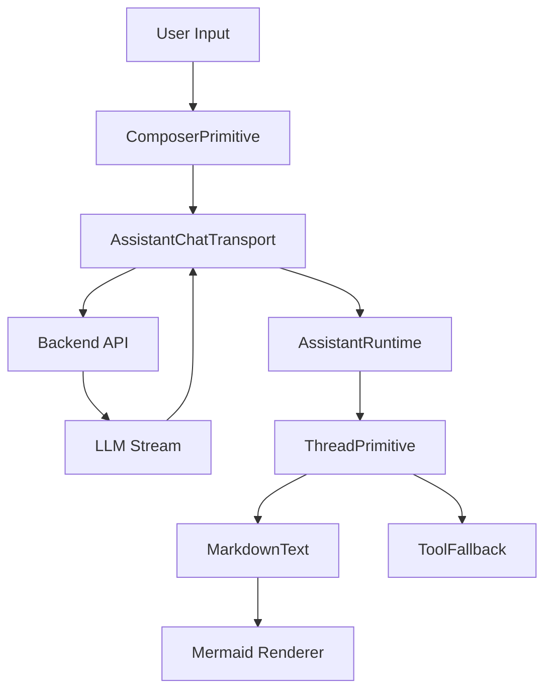

# AI Experience Layer

The AI Experience Layer serves as the specialized presentation boundary for GitDex, managing the bidirectional communication between the user and the LLM orchestration engine. It abstracts the complexities of streaming responses, tool execution states, and rich-text rendering into a cohesive chat modality. This layer is built upon the `@assistant-ui` framework, leveraging a runtime-provider pattern to synchronize client-side state with the backend AI SDK.

## System Role & Architectural Position

The AI Experience Layer sits atop the Frontend Infrastructure, acting as the primary consumer of the AI Processing Pipeline. It transforms raw LLM stream chunks into structured UI elements, handling the transition from text-based interaction to tool-driven execution.

### Component Dependency Matrix

| Component | Primary Responsibility | Key Dependencies | State Management |
| :--- | :--- | :--- | :--- |
| `AssistantModal` | Shell orchestration & windowing | `@assistant-ui/react`, `lucide-react` | Local (Width, Visibility) |
| `Thread` | Message orchestration & input | `ThreadPrimitive`, `ComposerPrimitive` | Runtime (Message History) |
| `MarkdownText` | Rich-text & diagram rendering | `remark-gfm`, `rehype-katex`, `Mermaid` | Memoized Rendering |
| `ToolFallback` | Tool execution state visualization | `ToolCallMessagePartComponent` | Local (Collapse state) |

## Core Execution & Data Flow Mechanics

The interaction flow follows a strict unidirectional data path from user input to rendered output, utilizing a transport layer to handle the asynchronous nature of LLM streaming.



### Interaction Lifecycle
1. **Input Capture**: The `ComposerPrimitive` captures user input and triggers the `AssistantChatTransport`.
2. **Transport Layer**: The transport layer manages the HTTP request to the backend, handling the stream of `TextPart` and `ToolCallPart` objects.
3. **Runtime Synchronization**: The `AssistantRuntimeProvider` updates the global chat state, triggering a re-render of the `Thread` component.
4. **Part-Based Rendering**:
   - **Text Parts**: Passed to `MarkdownText` for GFM, LaTeX, and Mermaid processing.
   - **Tool Parts**: Passed to `ToolFallback` to indicate execution progress (loading $\rightarrow$ success/fail).
5. **Visual Feedback**: The `ThreadScrollToBottom` utility ensures the viewport tracks the streaming output in real-time.

## Implementation Deep Dive

### Runtime Orchestration
The `AssistantModal` initializes the AI runtime, wrapping the entire chat interface in a provider that connects the UI components to the AI SDK transport.

```typescript title="client/src/components/assistant-ui/assistant-modal.tsx"
export function AssistantModal() {
  const runtime = useChatRuntime({
    api: "/api/chat", // Endpoint for AI orchestration
  });

  return (
    <AssistantRuntimeProvider runtime={runtime}>
      <div className={cn("fixed right-0 top-0 h-full", isOpen ? "w-[400px]" : "w-0")}>
        <Thread />
      </div>
    </AssistantRuntimeProvider>
  );
}
```
- **`useChatRuntime`**: Initializes the connection to the backend chat API.
- **`AssistantRuntimeProvider`**: Uses React Context to distribute the runtime state (messages, loading status, input focus) to all descendant components.
- **Dynamic Width**: Implements a mouse-event driven resizing logic (`handleMouseMove`) to allow users to adjust the sidebar dimensions.

### Advanced Markdown & Diagram Pipeline
The `MarkdownText` component extends standard markdown rendering to support technical documentation requirements, specifically mathematical notation and architectural diagrams.

```typescript title="client/src/components/assistant-ui/markdown-text.tsx"
const MarkdownText = memo(({ content }) => {
  return (
    <MarkdownTextPrimitive
      components={{
        code: (props) => {
          if (useIsMarkdownCodeBlock(props)) {
            return <CodeBlock {...props} />;
          }
          return <code className="bg-muted px-1 rounded">{props.children}</code>;
        },
        // Integration of Mermaid for AI-generated diagrams
        mermaid: ({ code }) => <Mermaid chart={code} />,
      }}
      remarkPlugins={[remarkGfm, remarkMath]}
      rehypePlugins={[rehypeKatex]}
    >
      {content}
    </MarkdownTextPrimitive>
  );
});
```
- **`remarkGfm`**: Enables GitHub Flavored Markdown (tables, checklists).
- **`remarkMath` & `rehypeKatex`**: Pipeline for rendering $\LaTeX$ formulas.
- **Custom Component Mapping**: Overrides the default `code` block to provide a `CodeBlock` wrapper with "Copy to Clipboard" functionality and syntax highlighting.

### Tool Execution State Handling
The `ToolFallback` component manages the UI during the "thinking" phase of the LLM, where the model invokes external functions (e.g., repository indexing or file searching).

```typescript title="client/src/components/assistant-ui/tool-fallback.tsx"
export const ToolFallback: FC<ToolCallMessagePartComponent> = ({ toolCall }) => {
  const [isExpanded, setIsExpanded] = useState(false);

  return (
    <div className="flex items-center gap-2 p-2 border rounded-md bg-secondary/50">
      {toolCall.status === 'loading' ? (
        <Loader2Icon className="animate-spin h-4 w-4" />
      ) : toolCall.status === 'error' ? (
        <XCircleIcon className="text-destructive h-4 w-4" />
      ) : (
        <CheckIcon className="text-green-500 h-4 w-4" />
      )}
      <span className="text-xs font-mono">{toolCall.toolName}</span>
      <Button onClick={() => setIsExpanded(!isExpanded)} variant="ghost" size="sm">
        {isExpanded ? <ChevronUpIcon /> : <ChevronDownIcon />}
      </Button>
    </div>
  );
};
```
- **`toolCall.status`**: Monitors the transition between `loading`, `success`, and `error`.
- **Conditional Rendering**: Switches icons based on the execution state of the tool call.
- **Stateful Expansion**: Uses `isExpanded` to toggle the visibility of the tool's raw input/output arguments.

## Method / State Reference & Error Recovery

### Runtime State Schema

| State Key | Type | Description | Update Trigger |
| :--- | :--- | :--- | :--- |
| `messages` | `Message[]` | Ordered list of user and assistant turns | API stream chunk |
| `isLoading` | `boolean` | Indicates if the LLM is currently generating | Transport request start/end |
| `input` | `string` | Current value of the composer input field | User keystroke |
| `error` | `Error \| null` | Captured exception from the transport layer | HTTP 4xx/5xx response |

### Error Recovery Modes

1. **Transport Failure**: If the `/api/chat` endpoint returns a non-200 status, the `ErrorPrimitive` within the `Thread` component catches the exception and renders a retry trigger.
2. **Tool Execution Timeout**: When a tool call exceeds the backend timeout threshold, the `ToolFallback` transitions to the `XCircleIcon` state, signaling to the user that the specific context retrieval failed.
3. **Markdown Parse Error**: The `MarkdownText` component is wrapped in a React Error Boundary to prevent a malformed AI-generated markdown string from crashing the entire chat thread.