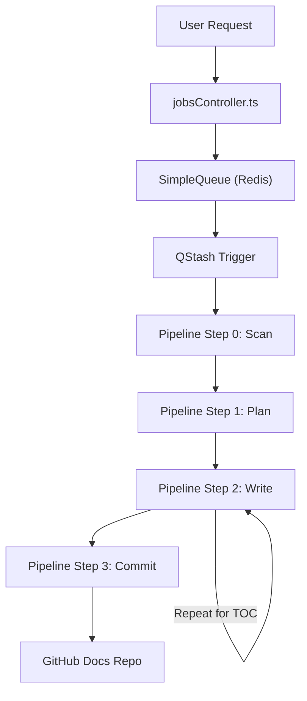

# AI Indexing Pipeline

The AI Indexing Pipeline is a distributed, asynchronous system designed to transform a raw GitHub repository into a structured set of MDX documentation files. The process utilizes a Redis-backed queue for state management, QStash for serverless execution triggering, and a multi-step AI pipeline for content generation.

## High-Level Workflow

The pipeline follows a linear progression from repository discovery to the final commit of documentation to a dedicated docs repository.



## The Queue System

The system employs a `SimpleQueue` class to manage job lifecycle and ensure strict serialization of processing to avoid overwhelming AI rate limits [server/src/queue.ts:24-213]().

### Job Lifecycle & States
Jobs transition through several states tracked in Redis:

| State | Description | Source |
| :--- | :--- | :--- |
| `queued` | Job is waiting in the `system:queue` list [server/src/queue.ts:108-111](). | [server/src/queue.ts:10] |
| `processing` | Job is currently being executed by the pipeline [server/src/queue.ts:101-106](). | [server/src/queue.ts:10] |
| `completed` | All pipeline steps finished successfully [server/src/queue.ts:198-202](). | [server/src/queue.ts:10] |
| `failed` | Job encountered an unrecoverable error [server/src/queue.ts:177-194](). | [server/src/queue.ts:10] |

### Concurrency & Locking
To prevent race conditions and resource exhaustion, the system implements three layers of locking:
1. **System Lock**: Only one job can be in the `processing` state globally, tracked via the `system:active_job` Redis key [server/src/queue.ts:100-111]().
2. **Repository Lock**: Prevents the same repository from being indexed multiple times within a 1-hour cooldown period [server/src/queue.ts:54-73]().
3. **Step Lock**: Prevents duplicate executions of the same pipeline step using a 60-second TTL lock [server/src/queue.ts:204-211]().

## The AI Processing Pipeline

The pipeline is implemented as a state machine within `executeNextStep` [server/src/pipeline.ts:30-87](), where each step updates the job's `currentStep` and triggers the next execution via QStash.

### Step 0: Repository Scanning
The `scanRepository` function identifies relevant source files. It filters for specific extensions (e.g., `.ts`, `.js`, `.py`, `.go`) and ignores common directories like `node_modules` or `dist` [server/src/pipeline.ts:114-124](). It limits the ingestion to the first 50 relevant files to maintain context window efficiency [server/src/pipeline.ts:126-134]().

### Step 1: Structure Planning
The `planStructure` function uses the AI to analyze the list of file paths and generate a hierarchical Table of Contents (TOC) [server/src/pipeline.ts:138-158](). 
- **Input**: List of all discovered file paths.
- **Output**: A JSON array containing section prefixes, titles, filenames, and the specific `relevant_files` needed for that section.

### Step 2: Section Generation
The `writeSections` function is executed iteratively for every entry in the TOC [server/src/pipeline.ts:160-213]().
1. **Context Assembly**: It gathers the content of the `relevant_files` assigned to the section.
2. **Token Management**: Using `js-tiktoken`, it truncates content to ensure the prompt fits within the model's limits [server/src/pipeline.ts:166-177]().
3. **MDX Generation**: The AI generates production-ready MDX including Mermaid diagrams, following strict formatting rules to exclude frontmatter and code fences [server/src/pipeline.ts:179-195]().
4. **Metadata Wrapping**: The system programmatically prepends the required MDX frontmatter (title, description, sidebar position) [server/src/pipeline.ts:202-204]().

### Step 3: GitHub Commitment
The `commitToGithub` function persists the generated documentation to the `gitdex-docs` repository [server/src/pipeline.ts:215-268](). It performs a clean sync by calculating the difference between existing files in the `docs/{owner}/{repo}` path and the newly generated files, ensuring stale files are deleted during the commit process [server/src/pipeline.ts:246-253]().

## AI Integration & Throttling

The pipeline interacts with the `gemma-4-31b-it` model via a wrapper that handles the inherent instability and rate limits of LLM APIs [server/src/ai.ts:1-56]().

### Throttle Logic
To stay within the 15 Requests Per Minute (RPM) limit, the system implements a module-level throttle:
- **Interval**: A `MIN_INTERVAL_MS` of 4500ms (approx. 13 RPM) is enforced between calls [server/src/ai.ts:7-8]().
- **Execution**: If a call is attempted too quickly, the system calculates the remaining wait time and sleeps before proceeding [server/src/ai.ts:26-31]().

### Reliability Strategy
The `generateWithRetry` function implements a robust error recovery mechanism [server/src/ai.ts:17-54]():
- **Exponential Backoff**: Non-rate-limit errors trigger a wait period that doubles with every attempt (`2000 * Math.pow(2, attempt)`).
- **429 Handling**: If a `429 Too Many Requests` error is received despite the throttle, the system forces a full 10-second pause [server/src/ai.ts:42-44]().
- **Retry Limit**: The system attempts generation up to 3 times before failing the job.

## Data Flow Sequence

```mermaid
sequenceDiagram
    autonumber
    participant C as jobsController
    participant Q as SimpleQueue
    participant S as QStash
    participant P as Pipeline
    participant AI as AI Service

    C ->> Q: addJob(repoUrl)
    Q -->> C: jobId, state
    C ->> S: publishJSON(/api/pipeline/step)
    S ->> P: executeNextStep(jobId)
    P ->> Q: acquireStepLock(jobId)
    P ->> AI: generateWithRetry(prompt)
    AI -->> P: content/TOC
    P ->> Q: updateJob(currentStep, data)
    P ->> S: triggerNextStep(jobId)
    P ->> Q: releaseStepLock(jobId)