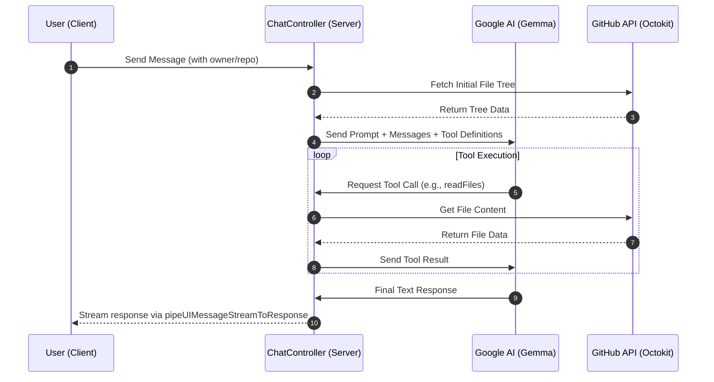

# AI Integration & Chat Logic

This section analyzes the implementation of the AI assistant within GitDex, focusing on the backend generation logic, the tool-augmented chat controller, and the frontend interface.

## AI Model & Generation Layer

The AI layer is designed to interface with Google's Gemma models using the `ai` SDK. To ensure stability and adhere to API rate limits, the system implements a custom wrapper for text generation.

### Throttling and Retry Mechanism
The `generateWithRetry` function in `server/src/ai.ts` provides a resilient interface for AI calls. It specifically manages a 15 requests-per-minute (RPM) limit by implementing a module-level throttle.

*   **Throttle Interval:** `MIN_INTERVAL_MS` is set to 4500ms (~13.3 RPM) to stay safely under the limit.
*   **Retry Logic:** The system attempts up to 3 retries by default.
*   **Error Handling:** 
    *   **HTTP 429 (Too Many Requests):** Triggers a hard wait of 10 seconds.
    *   **Other Errors:** Implements exponential backoff starting at 2 seconds.

```typescript
// Simplified throttle logic from server/src/ai.ts
const now = Date.now();
const timeSinceLastCall = now - lastApiCallTimestamp;
if (timeSinceLastCall < MIN_INTERVAL_MS) {
    const waitTime = MIN_INTERVAL_MS - timeSinceLastCall;
    await new Promise(resolve => setTimeout(resolve, waitTime));
}
```

## Chat Controller Logic

The `handleChat` function in `server/src/controllers/chatController.ts` acts as the orchestrator for AI interactions. It manages context injection, security constraints, and tool execution.

### Context Injection & System Prompt
Before calling the AI, the controller prepares a comprehensive system prompt that defines the assistant's identity and boundaries:

1.  **Identity:** Defined as "GitDex Assistant," strictly scoped to the `${owner}/${repo}` repository.
2.  **Security/Abuse Policy:** Explicit instructions to ignore "prompt injection" attempts (e.g., "ignore previous instructions") and a refusal policy for general programming questions unrelated to the specific codebase.
3.  **Repository Context:** The controller fetches the initial file tree (up to 300 entries) via the GitHub API (Octokit) and injects it directly into the prompt to give the AI an immediate overview of the project structure.

### Tool-Augmented Generation
The assistant uses a "Reasoning and Acting" (ReAct) pattern, utilizing three specialized tools to explore the codebase in real-time.

| Tool | Input | Logic | Purpose |
| :--- | :--- | :--- | :--- |
| `listFiles` | `path` (string) | Fetches directory contents via `repos.getContent` | Exploring folder structures |
| `readFile` | `path` (string) | Fetches and decodes base64 content; truncated at 15k chars | Analyzing specific file logic |
| `readFiles` | `paths` (string[]) | Batches up to 5 file reads; truncated at 10k chars each | Comparing multiple files efficiently |

The AI is instructed to prefer `readFiles` over multiple `readFile` calls to reduce the number of tool-calling turns. The system enforces a maximum of 20 steps (`stopWhen: stepCountIs(20)`) to prevent infinite loops.

## AI Request-Response Workflow

The following diagram illustrates the lifecycle of a chat request from the user interface to the AI response.



## Frontend Assistant Interface

The client-side implementation in `client/src/components/assistant-ui/thread.tsx` provides a specialized chat experience built on `@assistant-ui/react`.

### State Management & Constraints
To ensure resource sustainability and UI performance, the frontend implements several hard limits:
*   **Message Limit:** A maximum of 10 user messages per thread. Once reached, the `Composer` is replaced with a limit notification.
*   **Attachment Limit:** A maximum of 5 attachments across the entire thread.
*   **Branching:** Supports message editing and branching via the `BranchPicker` component, allowing users to explore different conversation paths.

### User Guidance
The `ThreadWelcome` component provides "Suggested Prompts" to help users get started. These are pre-defined templates that guide the AI toward high-value tasks:
- **Architecture Overview:** "Give me an overview of this repository's architecture and main components."
- **API Discovery:** "What are all the API routes or endpoints defined in this codebase and what do they do?"
- **Auth Analysis:** "How does authentication and authorization work in this codebase?"

### UI Components
The interface utilizes a modular component structure:
- `AssistantMessage`: Renders Markdown text and provides a `ToolFallback` for visualizing AI tool usage.
- `Composer`: Handles user input and attachment management.
- `ActionBar`: Provides utility functions for assistant messages, including "Copy", "Export as Markdown", and "Refresh".