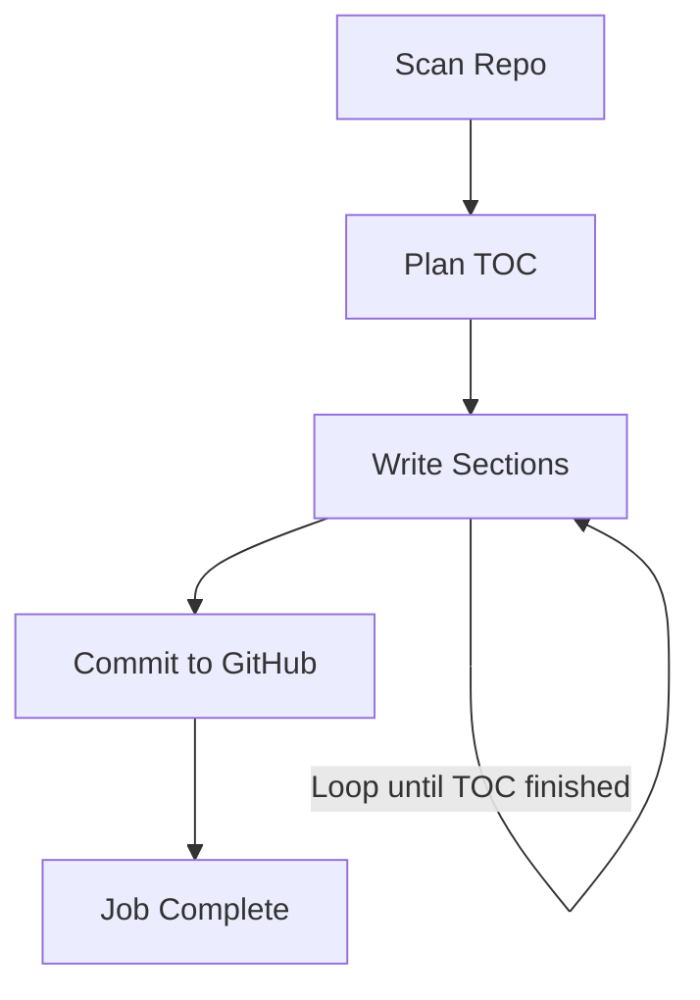
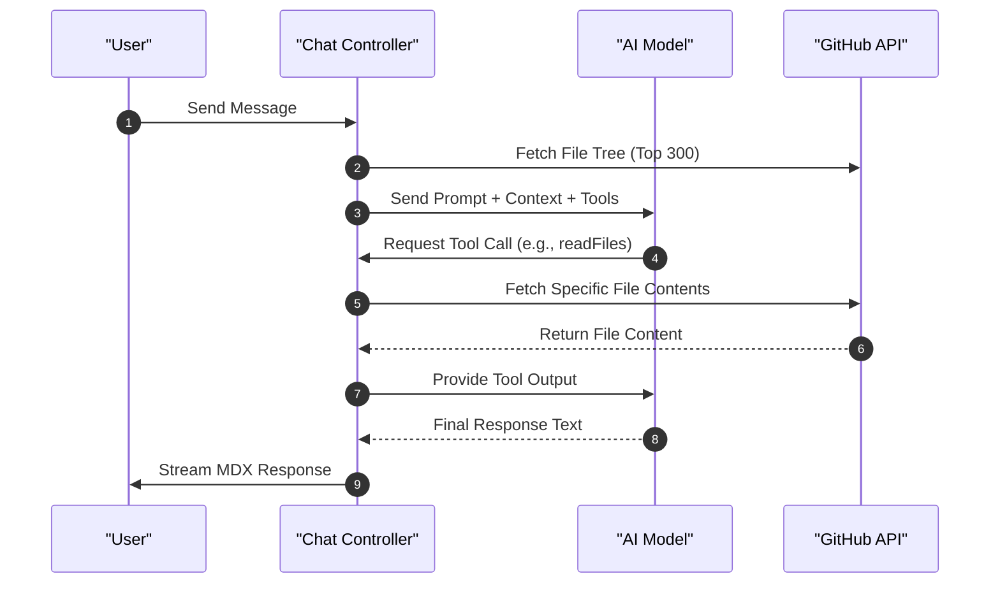

# AI Pipeline & Processing

The AI Pipeline and Processing module serves as the intelligence engine of GitDex. It handles two primary workflows: an asynchronous, multi-step pipeline for generating repository documentation and a real-time, tool-augmented chat interface for repository exploration.

## AI Generation Core

At the foundation of all AI interactions is a resilient wrapper around the Google Gemini API, designed to handle rate limits and transient failures.

### Throttling and Resilience
To comply with API rate limits (specifically a 15 RPM limit), the system implements a module-level throttle. 

| Feature | Implementation Detail | Source |
| :--- | :--- | :--- |
| **Model ID** | `gemma-4-31b-it` | [server/src/ai.ts:5]() |
| **Throttle Interval** | 4,500ms (~13 RPM) | [server/src/ai.ts:8]() |
| **Default Retries** | 3 attempts | [server/src/ai.ts:15]() |
| **Retry Strategy** | Exponential backoff; 10s fixed wait for 429 errors | [server/src/ai.ts:38-43]() |

The `generateWithRetry` function ensures that prompts are spaced correctly and recovered from failures before throwing a final error. Sources: [server/src/ai.ts:14-52]().

## Documentation Processing Pipeline

The documentation pipeline is a state-driven process orchestrated via QStash to handle long-running AI tasks without blocking the main server thread.

### Pipeline Data Flow
The pipeline progresses through four distinct steps, maintaining state in a `PipelineData` object.

### Detailed Step Execution

1.  **Step 0: Repository Scanning**: The system fetches the repository tree and filters for relevant source files (e.g., `.ts`, `.py`, `.go`). It excludes directories like `node_modules` and `dist`, and limits the initial context to the first 50 relevant files. Sources: [server/src/pipeline.ts:112-143]().
2.  **Step 1: Structure Planning**: The AI analyzes the gathered file paths to generate a hierarchical Table of Contents (TOC) in JSON format, specifying prefixes, titles, and relevant files for each section. Sources: [server/src/pipeline.ts:145-164]().
3.  **Step 2: Section Generation**: The system iterates through the TOC. For each section, it:
    *   Retrieves contents of relevant files.
    *   Uses `js-tiktoken` to truncate content to a 100k token limit.
    *   Generates MDX content including a Mermaid diagram if applicable.
    *   Injects controlled frontmatter (title, description, sidebar position).
    Sources: [server/src/pipeline.ts:166-215]().
4.  **Step 3: GitHub Commitment**: The generated files and a `meta.json` file are committed to a dedicated documentation repository. The process includes a cleanup phase where stale files under the repository's specific documentation path are deleted. Sources: [server/src/pipeline.ts:217-264]().

## Interactive Chat Assistant

The chat controller provides a real-time interface for users to query the codebase using a tool-calling agent.

### Request Lifecycle

### Agent Configuration
The assistant uses the `gemma-4-26b-a4b-it` model and is governed by a strict system prompt to prevent prompt injection and keep responses focused solely on the target repository. Sources: [server/src/controllers/chatController.ts:38-66]().

#### Available Tools
The AI can interact with the repository using the following tools defined in the `streamText` configuration:

| Tool | Description | Input | Source |
| :--- | :--- | :--- | :--- |
| `listFiles` | Lists files/dirs at a path | `path` (string) | [server/src/controllers/chatController.ts:74-87]() |
| `readFile` | Reads a single file (max 15k chars) | `path` (string) | [server/src/controllers/chatController.ts:88-102]() |
| `readFiles` | Reads up to 5 files (max 10k chars each) | `paths` (string[]) | [server/src/controllers/chatController.ts:103-128]() |

### Implementation Constraints
To maintain performance and cost-efficiency, the chat controller implements the following limits:
*   **Context Limit**: File tree is sliced to the first 300 items. Sources: [server/src/controllers/chatController.ts:33]().
*   **Execution Limit**: The conversation is capped at 20 tool-call steps using `stepCountIs(20)`. Sources: [server/src/controllers/chatController.ts:131]().
*   **Repository Identification**: Repo identity is resolved via `x-github-owner`/`x-github-repo` headers or by parsing the HTTP referer. Sources: [server/src/controllers/chatController.ts:14-17, 142-153]().