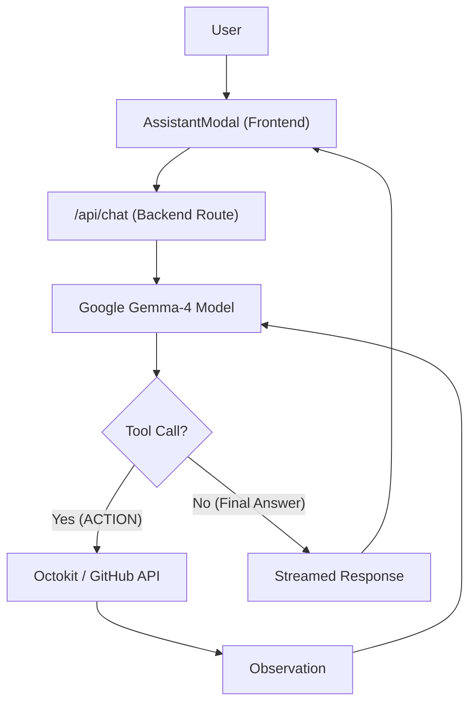

# AI Assistant Integration

GitDex features a sophisticated AI assistant designed to help users navigate and understand complex repositories. Unlike standard LLM integrations, the GitDex assistant utilizes a **ReAct (Reasoning and Acting) loop**, allowing it to actively explore the codebase by listing directories and reading files in real-time via the GitHub API.

## Architecture Overview

The integration is split between a specialized Next.js API route and a modular frontend UI built with `@assistant-ui`.

## Backend Implementation

The core logic resides in `client/src/app/api/chat/route.ts`. It manages the conversation state, repository context, and the tool-execution loop.

### 1. Context Injection
To give the AI a starting point, the backend fetches a recursive file tree of the repository (limited to the first 300 files) using Octokit. This is injected into the system prompt, preventing the AI from "guessing" file paths.

### 2. The ReAct Loop
The assistant does not simply generate a response; it follows a manual loop to gather information:

1.  **Reasoning**: The model analyzes the user's query and the current context.
2.  **Action**: If the model needs more data, it outputs a specific command:
    - `ACTION: LIST_FILES(path="...")`: Retrieves the contents of a directory.
    - `ACTION: READ_FILE(path="...")`: Reads the raw content of a file (truncated to 15,000 characters).
3.  **Observation**: The backend executes the GitHub API call and appends the result back to the message history as an `OBSERVATION`.
4.  **Iteration**: This process repeats for up to 10 steps before a final response is generated.

### 3. Final Streaming
Once the model determines it has sufficient information, the loop breaks, and the assistant enters a final state where tools are disabled, and the response is streamed to the UI using `streamText` from the AI SDK.

## Frontend Integration

The UI is implemented using a composite pattern to ensure a highly interactive and accessible chat experience.

### Assistant Modal
The `AssistantModal` component serves as the entry point. It initializes the `AssistantChatTransport`, passing the `x-github-owner` and `x-github-repo` headers to the backend to ensure the AI is grounded in the correct repository.

### The Thread System
The `Thread` component (`thread.tsx`) manages the visual representation of the conversation:
- **Composer**: A rich input area supporting attachments and state-aware buttons (Send vs. Cancel).
- **Message Components**: 
    - `UserMessage`: Displays user queries with an edit action.
    - `AssistantMessage`: Renders markdown and includes a "Thinking..." indicator when the ReAct loop is active.
- **Branching**: Integration of `BranchPicker` allows users to navigate between different versions of the conversation history.
- **Action Bar**: Provides utility functions such as "Copy to Clipboard," "Export as Markdown," and "Regenerate Response."

## Technical Specifications

| Feature | Implementation |
| :--- | :--- |
| **LLM** | Google Gemma-4 (`gemma-4-31b-it`) |
| **API Framework** | Next.js Route Handlers |
| **GitHub Integration** | `@octokit/rest` |
| **UI Library** | `@assistant-ui/react` |
| **Max Tool Steps** | 10 iterations |
| **Context Window** | 15k chars per file read |