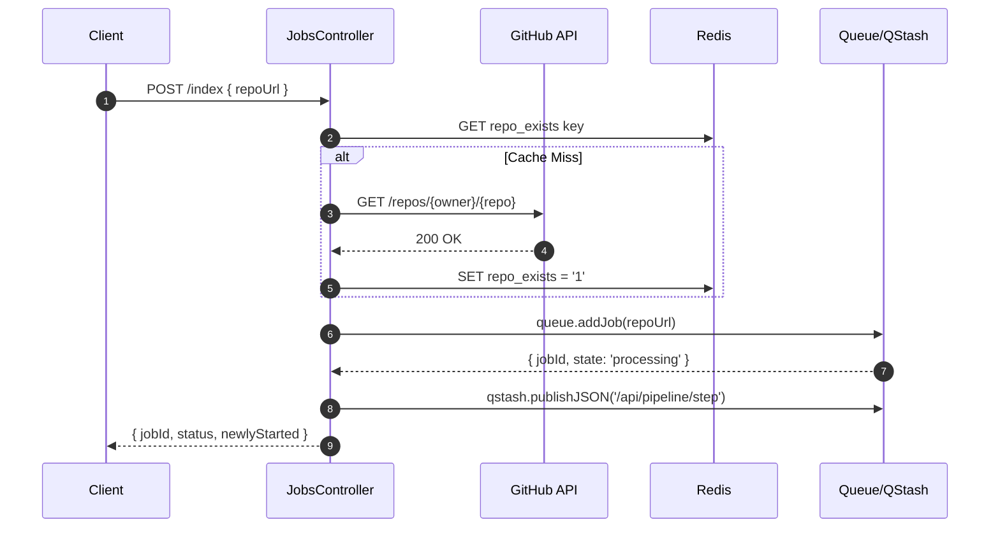
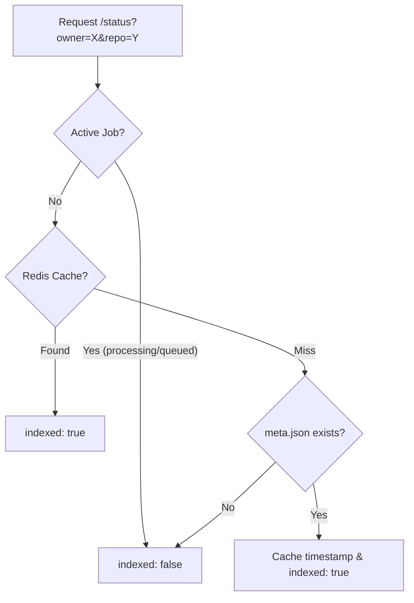

# API Design and Controllers

The GitDex backend exposes a REST API designed to handle repository indexing requests, track job progress, and provide an AI-powered chat interface for repository exploration. The API is built using Express and integrates with GitHub's REST API, Redis for caching, and Upstash QStash for asynchronous pipeline orchestration.

## API Surface Overview

All endpoints defined in `server/src/routes/jobsRoutes.ts` are grouped under the jobs router.

| Endpoint | Method | Description | Auth/Middleware |
| :--- | :--- | :--- | :--- |
| `/index` | `POST` | Initiates a repository indexing job | None |
| `/status/:jobId` | `GET` | Retrieves current state of a specific job | None |
| `/status` | `GET` | Checks if a repo is indexed via `owner` and `repo` queries | None |
| `/chat` | `POST` | Streams AI responses based on repo context | None |
| `/pipeline/step` | `POST` | Triggers the next step in the indexing pipeline | `verifyQstashSignature` |
| `/pipeline/cron-heal`| `POST` | Heals stuck indexing jobs | `verifyQstashSignature` |

## Indexing and Job Management

The `jobsController.ts` manages the lifecycle of repository ingestion. It ensures that repositories are valid before entering the queue and coordinates with QStash to trigger the processing pipeline.

### Job Creation Workflow
When a user submits a repository URL, the `createJob` controller performs the following sequence:
1. **URL Parsing**: Extracts `owner` and `repo` from the provided GitHub URL.
2. **Verification**: Calls `verifyRepoExists`, which checks a Redis cache (`repo_exists:${owner}/${repo}`) before querying the GitHub API to confirm the repository exists.
3. **Queueing**: Adds the job to the system queue via `queue.addJob`.
4. **Pipeline Trigger**: If the job is newly started and enters the `processing` state, the controller publishes a JSON payload to `/api/pipeline/step` via QStash.



### Repository Status Resolution
The `getStatusByName` endpoint implements a tiered priority system to determine if a repository is "indexed":

1. **Active Job Priority**: If a job exists in the queue with state `processing` or `queued`, the API returns `indexed: false` to ensure the client continues polling.
2. **Cache Check**: Checks Redis for a `last_indexed:${owner}/${repo}` timestamp.
3. **Fallback Verification**: If not cached, the controller attempts to find a `meta.json` file in the internal documentation repository (`docs/${owner}/${repo}/meta.json`). If found, it fetches the last commit timestamp to populate the cache.



## AI Chat Interface

The `chatController.ts` implements a context-aware assistant. Unlike general-purpose LLMs, the GitDex Assistant is strictly scoped to the repository being explored.

### Context Construction
For every request to `/chat`, the controller performs the following:
- **Identity Resolution**: Identifies the target repository using `x-github-owner`/`x-github-repo` headers or by parsing the `referer` header.
- **Structural Context**: Fetches the repository's file tree (up to the first 300 entries) using `octokit.rest.git.getTree` to provide the LLM with a map of the codebase.
- **Strict Prompting**: Injects a system prompt that forbids the AI from answering general programming questions or revealing its internal instructions.

### Tool Integration
The assistant uses `streamText` from the AI SDK with `gemma-4-26b-a4b-it` and has access to three specialized tools:

| Tool | Input | Logic | Limit |
| :--- | :--- | :--- | :--- |
| `listFiles` | `path` | Uses `octokit.rest.repos.getContent` to list directory items. | N/A |
| `readFiles` | `paths[]` | Reads content of multiple files via GitHub API. | Max 5 files; 10k chars/file |
| `searchCode` | `query` | Uses `octokit.rest.search.code` to find keywords. | N/A |

The chat loop is capped at 20 steps (`stepCountIs(20)`) to prevent infinite loops during tool calling.

## Infrastructure and Security

### QStash Signature Verification
To prevent unauthorized triggers of the processing pipeline, endpoints under `/pipeline/` use the `verifyQstashSignature` middleware.

```typescript
const verifyQstashSignature = async (req: any, res: any, next: any) => {
    const signature = req.headers["upstash-signature"];
    const body = req.rawBody || JSON.stringify(req.body);
    const isValid = await qstashReceiver.verify({
      signature: Array.isArray(signature) ? signature[0] : signature,
      body,
    });
    if (!isValid) return res.status(401).json({ error: "Invalid QStash signature" });
    next();
};
```

This ensures that only requests originating from the configured Upstash QStash instance can execute `cronHeal` or `executeNextStep`.