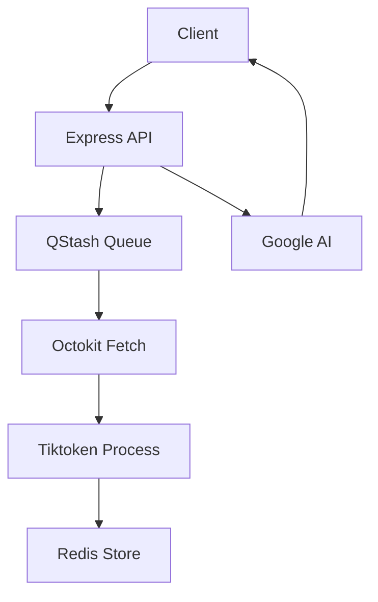

# Backend Implementation

The GitDex backend serves as the orchestration layer between the GitHub API, the vector-like state management of Redis, and Google's Generative AI models. Its primary responsibility is to transform a raw remote repository into a structured, AI-analyzable context without blocking the client's main thread.

By utilizing a non-blocking, asynchronous architecture, the backend handles the computationally expensive tasks of repository crawling and tokenization in the background, ensuring the user interface remains responsive during the indexing process.

### Core Technology Stack

The server is built on a modern TypeScript stack optimized for speed and scalability, utilizing the Bun runtime for high-performance execution.

| Component | Technology | Purpose |
| :--- | :--- | :--- |
| **Runtime** | `Bun` | Fast JS/TS execution and bundling. |
| **Web Framework** | `Express 5` | Routing and middleware management. |
| **AI SDK** | `ai` / `@ai-sdk/google` | Standardized interface for LLM interactions. |
| **LLM Provider** | `@google/genai` | Powering the repository analysis and chat. |
| **Task Queue** | `@upstash/qstash` | Managing asynchronous indexing jobs. |
| **State Store** | `@upstash/redis` | Storing indexing progress and cached documents. |
| **GitHub Client** | `@octokit/rest` | Programmatic access to GitHub repository data. |
| **Tokenization** | `js-tiktoken` | Calculating LLM context window usage. |

### Process Workflow

The backend follows a decoupled "Request-and-Poll" pattern. Instead of keeping a connection open while a repository is indexed, the server triggers a background job and provides the client with a job ID to track progress.



1.  **Initiation**: The client requests a repository index via an Express route.
2.  **Queuing**: The server schedules a job via **QStash**, offloading the heavy lifting of API calls and processing.
3.  **Ingestion**: The worker uses **Octokit** to recursively fetch the repository's file structure and contents.
4.  **Processing**: **js-tiktoken** analyzes the content to ensure it fits within the LLM's context limits.
5.  **Persistence**: The processed data and job status are stored in **Upstash Redis**.
6.  **Consumption**: The AI chat interface queries the backend, which retrieves the relevant context from Redis and streams a response via the **AI SDK**.

### Server Entry Point

The server is configured as an ES module using `express` and `cors` to allow cross-origin requests from the Next.js frontend.

```typescript
import express, { Request, Response, NextFunction } from "express";
import dotenv from "dotenv";
import cors from "cors";
import { Redis } from '@upstash/redis';
import jobsRoutes from "./src/routes/jobsRoutes.js";

// Initialize Express server
const app = express();
app.use(cors());
app.use(express.json());

// Route for job management (Indexing/Status)
app.use("/api/jobs", jobsRoutes);
```

The use of `jobsRoutes` separates the concerns of repository indexing from the core server configuration, allowing the job management logic to evolve independently of the API infrastructure.

### AI & LLM Integration

GitDex leverages the Vercel `ai` SDK and Google's Generative AI to provide context-aware responses. The integration is designed to handle large codebases by calculating token counts before sending prompts to the model.

*   **Context Management**: Using `js-tiktoken`, the backend ensures that the code snippets retrieved from the repository do not exceed the model's maximum token limit, preventing API errors and hallucinations.
*   **Structured Output**: The backend is configured to handle markdown and Mermaid diagram syntax, allowing the AI to visualize code architecture directly in the frontend.

### Asynchronous Job Processing

To prevent timeouts during the indexing of large repositories, the backend implements a distributed queue system.

*   **QStash**: Acts as the reliable trigger mechanism. It ensures that even if the server restarts, the indexing job is retried and completed.
*   **Redis**: Serves as the "Source of Truth" for the current state of a repository index. The frontend polls the Redis store via the backend to update the progress bar in real-time.

This architecture ensures that the backend remains lightweight and stateless, delegating the heavy lifting of queue management and data persistence to specialized Upstash services.