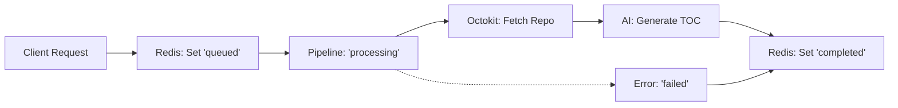

# Data Persistence & Typing

## System Role & Architectural Position

The Data Persistence & Typing layer serves as the formal schema definition and external service interface for the GitDex ecosystem. It abstracts the interaction between the Backend Core Engine and the underlying data stores (Upstash Redis) and third-party APIs (GitHub via Octokit), ensuring type safety across the asynchronous AI processing pipeline.

This layer is strategically positioned to decouple the business logic of the pipeline from the physical storage implementation, enabling stateless execution of the server API layer while maintaining persistent job states.

### Service Dependencies & Configuration

| Component | Provider | Protocol | Purpose | Primary Environment Variable |
| :--- | :--- | :--- | :--- | :--- |
| **Octokit** | GitHub API | HTTPS/REST | Repository metadata and content extraction. | `GITHUB_TOKEN` |
| **Redis** | Upstash | HTTPS/REST | Distributed state caching and job tracking. | `UPSTASH_REDIS_REST_URL` |
| **Job Store** | Redis | Key-Value | Persistence of `JobData` across worker restarts. | `UPSTASH_REDIS_REST_TOKEN` |

## Core Execution & Data Flow Mechanics

The system utilizes a state-machine approach to track repository indexing. When a job is initiated, a `JobData` object is serialized into Redis. The AI pipeline then iteratively updates this state as it progresses through the extraction and compression phases.

### State Transition Workflow



### Key Data Invariants
*   **Job Atomicity**: Each job is identified by a unique `id` string, serving as the primary key in the Redis store.
*   **State Determinism**: The `JobState` union (`queued` | `processing` | `completed` | `failed`) governs the visibility of the job in the frontend AI Experience Layer.
*   **Pipeline Continuity**: The `currentStep` integer in `JobData` allows the system to track progress through the `PipelineData` phases (TOC generation, file extraction, and content synthesis).

## Implementation Deep Dive & Code Snippets

### External Client Initialization
The system utilizes singleton-pattern exports for the Redis and Octokit clients to minimize connection overhead and leverage internal connection pooling.

```typescript title="server/src/config/octokit.ts"
import { Octokit } from '@octokit/rest';

export const octokit = new Octokit({
  auth: process.env.GITHUB_TOKEN,
});
```
*   **`Octokit`**: Initialized with a GitHub Personal Access Token (PAT) to bypass rate limits and access private repositories.
*   **Auth Scope**: The client operates with the permissions granted to `GITHUB_TOKEN` for all repository-level GET requests.

```typescript title="server/src/config/redis.ts"
import { Redis } from '@upstash/redis';

export const redis = new Redis({
  url: process.env.UPSTASH_REDIS_REST_URL!,
  token: process.env.UPSTASH_REDIS_REST_TOKEN!,
});
```
*   **REST-based Redis**: Uses the `@upstash/redis` SDK, which communicates via HTTP rather than TCP, facilitating compatibility with serverless environments (e.g., Vercel/Next.js).
*   **Bang Operator (`!`)**: Asserts that environment variables are defined at runtime, failing fast during instantiation if configuration is missing.

### Domain Type Definitions
The typing system is split between job orchestration and pipeline data structures to separate the *status* of the process from the *payload* of the AI analysis.

```typescript title="server/src/types/job.ts"
export type JobState = 'queued' | 'processing' | 'completed' | 'failed';

export interface JobData {
  id: string;
  state: JobState;
  repoUrl: string;
  owner: string;
  repo: string;
  createdAt: number;
  updatedAt: number;
  error?: string | null;
  currentStep: number;
  data?: string | null;
}
```
*   **`JobState`**: A string union acting as a finite state machine (FSM) trigger.
*   **`createdAt`/`updatedAt`**: Epoch timestamps used for cache expiration and TTL calculations.
*   **`data`**: An optional string field typically storing a serialized JSON string of the finalized `PipelineData`.

```typescript title="server/src/types/pipeline.ts"
export interface TocEntry {
  prefix: string;
  title: string;
  filename: string;
  description: string;
  relevant_files: string[];
}

export interface PipelineData {
  files: { path: string; content: string }[];
  toc: TocEntry[];
  generatedFiles: { filename: string; content: string }[];
  sectionsWritten: number;
  defaultBranch?: string;
}
```
*   **`TocEntry`**: Defines the mapping between a conceptual repository section and the physical files that constitute its context.
*   **`PipelineData`**: The central accumulator for the AI pipeline. It aggregates the raw file content (`files`), the AI-generated Table of Contents (`toc`), and the resulting documentation fragments (`generatedFiles`).

## Method / State Reference & Error Recovery

### Job State Matrix

| State | Trigger | Persistence Action | Recovery Path |
| :--- | :--- | :--- | :--- |
| `queued` | API Request Receipt | `SET job:{id}` | Auto-pickup by Task Queue |
| `processing` | Worker Execution Start | `HSET job:{id} state 'processing'` | Timeout $\rightarrow$ Mark as `failed` |
| `completed` | Pipeline Finalization | `HSET job:{id} state 'completed'` | None (Terminal State) |
| `failed` | Exception / API Error | `HSET job:{id} state 'failed' + error` | Manual Retry via API |

### Error Recovery & Failure Modes

1.  **GitHub API Rate Limiting**: Octokit throws a 403 Forbidden when rate limits are exceeded. The system catches this in the pipeline layer and updates `JobData.error` with the rate limit reset timestamp.
2.  **Redis Connection Timeout**: Since Upstash uses REST, timeouts are handled via standard HTTP retry logic. If the Redis store is unreachable, the server API layer returns a `503 Service Unavailable`, preventing the creation of orphaned jobs.
3.  **Pipeline Crash**: If the AI process crashes without updating the state, the `updatedAt` timestamp is used by a cleanup cron to identify "stalled" jobs (where `state === 'processing'` but `updatedAt` is $> N$ minutes ago), transitioning them to `failed`.