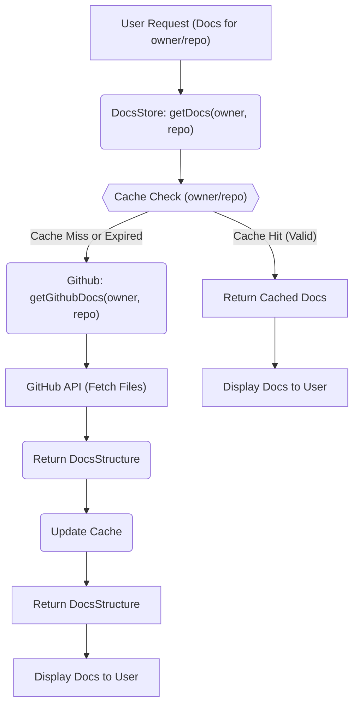
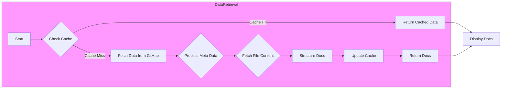

# Data Sources and Management

GitDex fetches and manages data to provide comprehensive documentation. This involves retrieving documentation files from a designated repository, caching strategies, and structuring the data for efficient access and presentation. This document explains how GitDex gets its data.

## Data Acquisition

GitDex uses the GitHub API to retrieve documentation files. It expects these files to be located in a specific repository structured in a particular way. The core logic for fetching these documents is in `client/lib/github.ts`.

```typescript
// File: client/lib/github.ts
import { Octokit } from '@octokit/rest';

const octokit = new Octokit({ 
  auth: process.env.GITHUB_TOKEN 
});

export interface DocFile {
  path: string;
  content: string;
}

export interface DocsStructure {
  index: string;
  meta: any;
  files: DocFile[];
}

export async function getGithubDocs(owner: string, repo: string): Promise<DocsStructure> {
  try {
    const docsRepo = 'gitdex-docs';
    const docsPath = `docs/${owner}/${repo}`;

    console.log(`Fetching docs for ${owner}/${repo} from ${docsRepo}/${docsPath}`);
    
    // Fetch the meta.json file
    console.log(`Fetching meta file from ${docsPath}/meta.json`);
    const { data: metaData } = await octokit.rest.repos.getContent({
      owner: process.env.GITHUB_USERNAME || 'your-github-username',
      repo: docsRepo,
      path: `${docsPath}/meta.json`,
    });
    
    // Handle meta content
    let metaContent = {};
    if ('content' in metaData && typeof metaData.content === 'string') {
      try {
        metaContent = JSON.parse(Buffer.from(metaData.content, 'base64').toString());
      } catch (e) {
        console.error('Error parsing meta JSON:', e);
      }
    } else if ('title' in metaData || 'description' in metaData) {
      // This is the direct JSON object
      metaContent = metaData;
    }
    
    // console.log('=== META CONTENT ===');
    // console.log(JSON.stringify(metaContent, null, 2));
    // console.log('=== END META CONTENT ===');

    // Fetch all files in the directory recursively
    console.log(`Fetching tree data for ${docsRepo}`);
    const { data: treeData } = await octokit.rest.git.getTree({
      owner: process.env.GITHUB_USERNAME || 'your-github-username',
      repo: docsRepo,
      tree_sha: 'main',
      recursive: "true",
    });

    console.log(`Found ${treeData.tree.length} total files in repository`);

    // Filter files in our docs path
    const docsFiles = treeData.tree.filter(
      item => item.path.startsWith(`${docsPath}/`) && item.type === 'blob'
    );

    console.log(`Found ${docsFiles.length} files in docs path: ${docsPath}`);
    console.log('Files:', docsFiles.map(f => f.path));

    // Fetch content for each file
    const filesContent = await Promise.all(
      docsFiles.map(async file => {
        console.log(`Fetching content for ${file.path}`);
        
        // Don't use raw format to get consistent response
        const { data } = await octokit.rest.repos.getContent({
          owner: process.env.GITHUB_USERNAME || 'your-github-username',
          repo: docsRepo,
          path: file.path,
        });

        let content = '';
        
        // All responses should have 'content' property when not using raw format
        if ('content' in data && typeof data.content === 'string') {
          content = Buffer.from(data.content, 'base64').toString();
          
        //   console.log(`=== CONTENT PREVIEW for ${file.path} ===`);
        //   console.log(content.substring(0, 200));
        //   if (content.length > 200) {
        //     console.log('... (truncated)');
        //   }
        //   console.log('=== END CONTENT PREVIEW ===');
        } else {
          console.log(`No content found for ${file.path}`);
        }
        
        return {
          path: file.path.replace(`${docsPath}/`, ''),
          content,
        };
      })
    );

    console.log(`Successfully fetched ${filesContent.length} files`);

    return {
      index: '', // No index file in the new structure
      meta: metaContent,
      files: filesContent,
    };
  } catch (error) {
    console.error('Error fetching GitHub docs:', error);
    return {
      index: '',
      meta: {},
      files: [],
    };
  }
}
```

[View on GitHub](https://github.com/shinymack/gitdex/blob/main/client/lib/github.ts)

This function, `getGithubDocs`, is the primary interface for retrieving documentation. It uses the `Octokit` library to interact with the GitHub API.  It first retrieves a `meta.json` file for metadata and then recursively fetches all files within the specified `docsPath`. The function constructs a `DocsStructure` object containing the documentation files and their content. This involves decoding the base64 encoded content from the GitHub API response.

## Data Caching

To improve performance and reduce API calls, GitDex employs a caching mechanism using `zustand` and `zustand/middleware` for persistence. The cache is managed in `client/lib/docs-store.ts`.

```typescript
// File: client/lib/docs-store.ts
import { create } from 'zustand';
import { persist } from 'zustand/middleware';
import { getGithubDocs, type DocsStructure } from './github';

interface DocsCache {
  [key: string]: {
    data: DocsStructure;
    timestamp: number;
  };
}

interface DocsStore {
  cache: DocsCache;
  getDocs: (owner: string, repo: string) => Promise<DocsStructure>;
  clearCache: () => void;
  clearCacheFor: (owner: string, repo: string) => void;
}

const CACHE_TTL = 10 * 60 * 1000; // 10 minutes

export const useDocsStore = create<DocsStore>()(
  persist(
    (set, get) => ({
      cache: {},
      
      getDocs: async (owner: string, repo: string) => {
            const key = `${owner}/${repo}`;
            const now = Date.now();

            // On the server, always fetch fresh data (do not rely on persisted localStorage)
            if (typeof window === 'undefined') {
              const data = await getGithubDocs(owner, repo);
              set((state) => ({
                cache: {
                  ...state.cache,
                  [key]: { data, timestamp: now },
                },
              }));
              return data;
            }

            const cached = get().cache[key];
            if (cached && now - cached.timestamp < CACHE_TTL) {
              return cached.data;
            }

            // Always fetch fresh if not cached or cache expired
            const data = await getGithubDocs(owner, repo);
            set((state) => ({
              cache: {
                ...state.cache,
                [key]: { data, timestamp: now },
              },
            }));
            return data;
      },
      
      clearCache: () => set({ cache: {} }),
      clearCacheFor: (owner: string, repo: string) =>
        set((state) => {
          const key = `${owner}/${repo}`;
          const next = { ...state.cache };
          delete next[key];
          return { cache: next };
        }),
    }),
    {
      name: 'docs-cache',
    }
  )
);
```

[View on GitHub](https://github.com/shinymack/gitdex/blob/main/client/lib/docs-store.ts)

The `useDocsStore` hook provides a state management solution with caching.  The `getDocs` function checks if the requested documentation is in the cache and if the cache has not expired (defined by `CACHE_TTL`). If the data is not cached or the cache has expired, it fetches fresh data using `getGithubDocs` and updates the cache. The cache TTL is set to 10 minutes. The function also distinguishes between server and client environments, always fetching fresh data on the server.

```javascript
const CACHE_TTL = 10 * 60 * 1000; // 10 minutes
```

This line sets the cache expiry time to 10 minutes.  After 10 minutes, the cached data is considered stale, and new data will be fetched from the GitHub repository.

```javascript
 clearCacheFor: (owner: string, repo: string) =>
        set((state) => {
          const key = `${owner}/${repo}`;
          const next = { ...state.cache };
          delete next[key];
          return { cache: next };
        }),
```

This function provides a method to selectively clear the cache for a specific repository, identified by its owner and name.

## Data Structure

The `DocsStructure` interface defines the shape of the data that `getGithubDocs` returns.

```typescript
// File: client/lib/github.ts
export interface DocsStructure {
  index: string;
  meta: any;
  files: DocFile[];
}
```

[View on GitHub](https://github.com/shinymack/gitdex/blob/main/client/lib/github.ts)

- `index`:  This field seems to be deprecated according to the comments.
- `meta`: Contains metadata about the documentation, such as title and description, typically fetched from `meta.json`.
- `files`:  An array of `DocFile` objects, each representing a documentation file with its path and content.

```typescript
// File: client/lib/github.ts
export interface DocFile {
  path: string;
  content: string;
}
```

[View on GitHub](https://github.com/shinymack/gitdex/blob/main/client/lib/github.ts)

Each `DocFile` has a `path` (the file path relative to the documentation root) and `content` (the actual content of the file).

## Data Flow





This diagram illustrates the flow of data from a user request to the display of documentation. The `DocsStore` checks the cache first. If the data is in the cache and valid, it returns the cached data. Otherwise, it fetches the data from GitHub, updates the cache, and returns the data.

## Key Integration Points

1.  **GitHub API:**  GitDex relies on the GitHub API to retrieve documentation files. The `GITHUB_TOKEN` environment variable is essential for authenticating with the API and avoiding rate limits.

    ```bash
    GITHUB_TOKEN=your_github_token
    GITHUB_USERNAME=your_github_username #Or organization name
    ```

    These are the two environment variables required to be present in your `.env` file.

2.  **Caching with Zustand:** The `zustand` library provides a simple and effective way to manage the application state, including the documentation cache.  The `persist` middleware ensures that the cache is persisted across sessions.  Adjusting the `CACHE_TTL` value allows you to control the cache expiration time.

3.  **Documentation Repository Structure:** GitDex expects the documentation to be organized in a specific way within the `gitdex-docs` repository.  Specifically, it looks for the files under  `docs/{owner}/{repo}`. This structure allows GitDex to locate and retrieve the correct documentation for a given repository.
    ```
    gitdex-docs
    └── docs
        └── shinymack
            └── gitdex
                ├── meta.json
                ├── getting-started.mdx
                └── advanced-usage.mdx
    ```
    This is just an example of how files should be structured in the `gitdex-docs` repository.

## Best Practices

-   **Optimize Cache TTL:** Experiment with different `CACHE_TTL` values to find the optimal balance between performance and data freshness.  Consider increasing the TTL for documentation that is updated infrequently.
-   **Monitor API Usage:** Keep an eye on your GitHub API usage to avoid exceeding rate limits.  Implement error handling and retry logic to gracefully handle API errors.
-   **Standardize Documentation Structure:** Enforce a consistent documentation structure within the `gitdex-docs` repository to ensure that GitDex can reliably locate and retrieve documentation files. Consider adding validation to the `meta.json` file and the file structure itself.
-   **Implement more robust error handling**: The current implementation provides simple error logging. Enhanced error handling, including user notifications and fallback mechanisms, will greatly improve the user experience.





## Future Improvements
-   **Support for Multiple Documentation Sources:**  Extend GitDex to support documentation from other sources, such as local files or other online repositories.
-   **Automated Documentation Updates:** Implement a mechanism to automatically update the documentation cache when changes are made to the documentation repository.  This could involve using webhooks or polling the repository for changes.
-   **Add a proper 'index' file**: By adding an index file into the `DocsStructure`, developers can add a starting point and allow developers to add a dedicated start page.