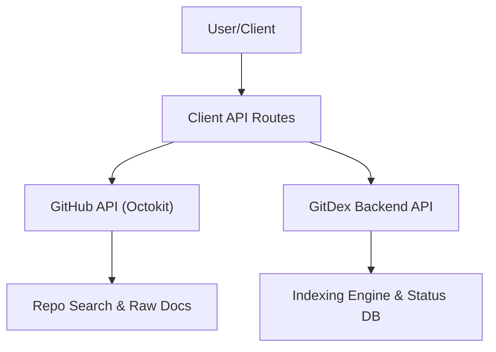

# Data Integration and API

GitDex utilizes a hybrid API architecture, acting as an orchestration layer between the user interface, the GitHub REST API, and the GitDex backend indexing service. This ensures a seamless flow of data from repository discovery to content retrieval.

## Architecture Overview

The data flow is split between read-only discovery (via GitHub) and stateful indexing management (via the GitDex Backend).



## Internal API Endpoints

The client implements several Next.js API routes to handle sensitive tokens and proxy requests to the backend.

### Repository Search
`GET /api/search?q={query}`

This endpoint provides a filtered search experience to help users find repositories quickly.

- **Implementation**: Uses `@octokit/rest` to query GitHub's `/search/repositories`.
- **Logic**: 
    - Searches within repository names and descriptions.
    - Performs a secondary client-side filter to ensure partial-name matches are prioritized.
    - Returns a maximum of 7 refined results to maintain UI performance.
- **Authentication**: Uses `GITHUB_TOKEN` server-side to avoid rate-limiting.

### Indexing Trigger
`POST /api/index`

Triggers the backend to crawl and index a specific repository.

- **Payload**: `{ "repoUrl": string, "force": boolean }`
- **Behavior**: Acts as a proxy to the `NEXT_PUBLIC_API_URL/api/index` endpoint.
- **Validation**: Returns a `400 Bad Request` if the `repoUrl` is missing.

### Index Status Check
`GET /api/status?owner={owner}&repo={repo}`

Verifies if a specific repository has already been processed by the indexing engine.

- **Behavior**: Proxies the request to the backend status endpoint.
- **Fallback**: If the backend returns a non-JSON response or fails, it defaults to `{ "indexed": false }` to ensure the UI can prompt the user for indexing.

## GitHub Data Integration

The `getGithubDocs` utility in `client/src/lib/github.ts` handles the retrieval of documentation stored in the centralized `gitdex-docs` repository.

### Documentation Retrieval Flow

1. **Tree Discovery**: Uses `octokit.rest.git.getTree` with `recursive: "true"` to map the entire directory structure for a specific `owner/repo` path.
2. **Content Fetching**: Iterates through the discovered blobs and fetches raw file content via `raw.githubusercontent.com`.
3. **Cache Busting**: Appends a timestamp `t=${Date.now()}` to raw fetch requests to bypass aggressive CDN caching.
4. **Metadata Parsing**: Specifically looks for a `meta.json` file within the doc folder to extract repository-specific configuration and metadata.

### Data Structures

The integration ensures a consistent type system for documentation:

```typescript
export interface DocFile {
    path: string;    // Relative path within the docs folder
    content: string; // Raw file content
}

export interface DocsStructure {
    index: string;   // Main index reference
    meta: any;       // Parsed content from meta.json
    files: DocFile[]; // Array of all documentation files
}
```

## Environment Requirements

To maintain the integrity of these integrations, the following environment variables must be configured:

| Variable | Purpose | Source |
| :--- | :--- | :--- |
| `GITHUB_TOKEN` | Authenticates Octokit requests to avoid rate limits | GitHub Personal Access Token |
| `NEXT_PUBLIC_API_URL` | Target URL for the backend indexing service | Deployment Environment |
| `GITHUB_USERNAME` | Owner of the `gitdex-docs` repository | GitHub Account |