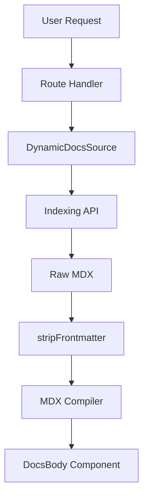

# Documentation Frontend

The Documentation Frontend is a dynamic rendering system built with Next.js and `fumadocs-ui`. It transforms repository-specific metadata and AI-generated MDX content into a structured documentation site. The system uses catch-all segments to handle an arbitrary number of repositories and documentation pages without requiring static build-time configuration for every project.

## Dynamic Routing Architecture

The frontend utilizes Next.js dynamic route segments to capture the GitHub repository identity and the specific documentation page being requested.

### Route Structure
The routing hierarchy is defined as: `/app/[owner]/[repo]/[[...slug]]/page.tsx`.

| Segment | Type | Description |
| :--- | :--- | :--- |
| `[owner]` | Dynamic | GitHub organization or user account name. |
| `[repo]` | Dynamic | The specific repository name. |
| `[[...slug]]` | Optional Catch-all | The path to the specific documentation page (e.g., `guides/installation`). |

```tsx title="client/src/app/[owner]/[repo]/[[...slug]]/page.tsx"
interface PageProps {
  params: Promise<{
    owner: string;
    repo: string;
    slug?: string[];
  }>;
}

export default async function Page({ params }: PageProps) {
  const { owner, repo, slug } = await params;
  // Logic to fetch content via DynamicDocsSource...
}
```
The `params` are used to instantiate the `DynamicDocsSource`, which resolves the correct content from the indexing server based on the repository's unique identity.

## Content Processing Pipeline

To ensure stability when rendering AI-generated MDX, the system implements a preprocessing layer to sanitize content before it reaches the JSX parser.

### Frontmatter Sanitization
LLMs occasionally generate redundant or malformed YAML frontmatter blocks. The `stripFrontmatter` utility recursively removes these blocks to prevent the MDX compiler from crashing.

```typescript title="client/src/app/[owner]/[repo]/[[...slug]]/page.tsx"
function stripFrontmatter(content: string): string {
  let currentContent = content;
  while (currentContent.startsWith('---')) {
    const nextIndex = currentContent.indexOf('---', 3);
    if (nextIndex === -1) break;
    currentContent = currentContent.slice(nextIndex + 3).trim();
  }
  return currentContent;
}
```
This loop ensures that even if multiple `---` delimiters are present at the top of the generated string, only the actual MDX body is passed to the compiler.

### Rendering Flow
The following diagram illustrates the request-to-render lifecycle:



## Specialized Documentation Components

### SourceLink Component
The `SourceLink` component provides a direct bridge between the AI-generated documentation and the actual source code on GitHub, allowing users to verify the context of the documentation.

```tsx title="client/src/components/SourceLink.tsx"
export function SourceLink({
  owner,
  repo,
  defaultBranch,
  filePath,
  lines,
}: { 
  owner: string; 
  repo: string; 
  defaultBranch: string; 
  filePath: string; 
  lines: string; 
}) {
  // Fetches raw content from GitHub API and renders in a Dialog
}
```

### Mermaid Diagram Engine
GitDex includes a robust Mermaid.js integration to render architectural diagrams. Because AI-generated Mermaid syntax is often slightly imprecise, the component includes a synthesis and correction layer.

#### Implementation Details
1.  **Syntax Correction**: The `fixMermaidSyntax` function cleans common LLM errors in Mermaid chart definitions.
2.  **SVG Optimization**: The component extracts the raw SVG from the Mermaid render result.
3.  **Interactivity**: Integration with `panzoom` allows users to navigate large, complex diagrams.

```typescript title="client/src/components/mermaid.tsx"
function fixMermaidSyntax(chart: string): string {
  // Implementation removes invalid characters and corrects 
  // common AI-generated Mermaid syntax errors
}

function wrapLabelText(text: string, maxLen: number = 20): string {
  // Prevents excessively long labels from breaking diagram layout
}
```

## Layout and Guarding

The documentation is wrapped in a layout that provides global context and prevents users from accessing documentation for repositories that are still being indexed.

### SyncingGuard
The `SyncingGuard` component wraps the page content. It checks the indexing status of the repository; if the repository is still in the ingestion pipeline, it renders a loading state instead of a 404 or empty page.

### Assistant Integration
The `AssistantModal` is injected at the layout level, providing a persistent AI chat interface that is aware of the current `owner` and `repo` context.

```tsx title="client/src/app/[owner]/[repo]/layout.tsx"
export default async function RepoLayout({ 
  children, 
  params 
}: LayoutProps) {
  return (
    <>
      {children}
      <AssistantModal />
    </>
  );
}