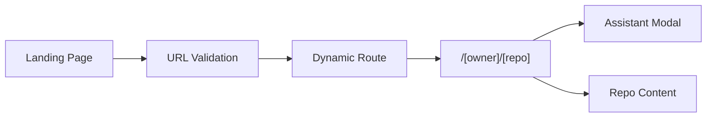
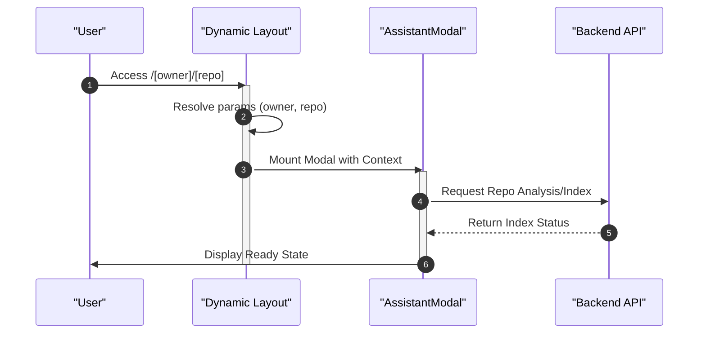

# Frontend Implementation

The GitDex frontend is built using **Next.js**, leveraging a modern App Router architecture to provide a seamless, responsive interface for analyzing GitHub repositories. The implementation focuses on a high-performance landing experience and a context-aware repository exploration environment.

## Architecture Overview

The frontend is structured as a hierarchical layout system. It utilizes a root layout for global state and theme management, and a nested dynamic layout for repository-specific operations.

### Global Layout and Providers
The root layout (`client/src/app/layout.tsx`) serves as the entry point for the application, wrapping the entire UI in several critical providers to ensure consistent styling and functionality:

| Provider | Source/Library | Purpose |
| :--- | :--- | :--- |
| `ThemeProvider` | `next-themes` | Manages light/dark mode switching. |
| `RootProvider` | `fumadocs-ui` | Provides documentation-specific context and state. |
| `Toaster` | `@/components/ui/sonner` | Global notification system for user alerts. |

The application also implements a custom typography system using `MozillaHeadline` and `MozillaText` fonts to maintain visual consistency.

## Dynamic Routing Structure

GitDex employs Next.js dynamic segments to handle an arbitrary number of GitHub repositories without requiring unique pages for each.

### Repository Routing
The path `client/src/app/[owner]/[repo]/layout.tsx` defines a dynamic layout that captures the GitHub username (`owner`) and the repository name (`repo`) from the URL.

```tsx
interface LayoutProps {
  children: ReactNode;
  params: Promise<{
    owner: string;
    repo: string;
  }>;
}
```

This structure allows the application to resolve the specific codebase context before rendering the child components, ensuring that the AI assistant and codebase visualizers are scoped to the correct repository.

### Routing Flow
The following diagram illustrates the transition from the landing page to a specific repository context.



## Repository Discovery and Entry

The main landing page (`client/src/app/page.tsx`) acts as the gateway for users to ingest repositories into the GitDex system.

### Key Components
- **`InteractiveConstellation` & `FlickeringGrid`**: Provide high-fidelity visual backgrounds.
- **`FeatureGrid`**: Outlines the core capabilities of the analyzer.
- **`ModernNav`**: Handles global navigation.

### Repository Ingestion Logic
The landing page implements a search and validation flow to ensure only valid GitHub URLs are processed.

1. **Validation**: The `validateGitHubUrl` utility is used to sanitize user input.
2. **Suggestions**: The interface uses a `RepoSuggestion` type to handle autocomplete results:
   ```tsx
   interface RepoSuggestion {
     full_name: string;
     description: string;
     html_url: string;
   }
   ```
3. **Navigation**: Once a repository is selected via `handleSelectRepo` or submitted via `handleSubmit`, the user is redirected to the dynamic `/[owner]/[repo]` route.

## AI Assistant Interface

The AI chat interface is integrated as a persistent layer within the repository-specific layout.

### The Assistant Modal
Rather than a standalone page, the AI interface is implemented via the `AssistantModal` component. By placing this in `client/src/app/[owner]/[repo]/layout.tsx`, the assistant remains accessible regardless of which specific file or documentation page the user is viewing within that repository.

### Component Interaction Sequence
The following sequence describes how the frontend interacts with the repository context to initialize the AI interface.



## Client-Side State Management

The frontend utilizes a combination of React hooks and specialized providers to manage state:
- **`useState` & `useEffect`**: Used in the landing page for managing search input and repository suggestions.
- **`useCallback` & `useRef`**: Employed to optimize event handlers for the interactive background elements and input fields.
- **`ClientOnly`**: A wrapper component used to prevent hydration mismatch errors when rendering components that rely on browser-only APIs (e.g., complex animations or local storage).