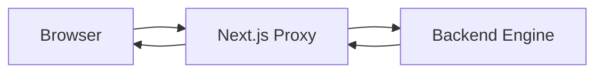
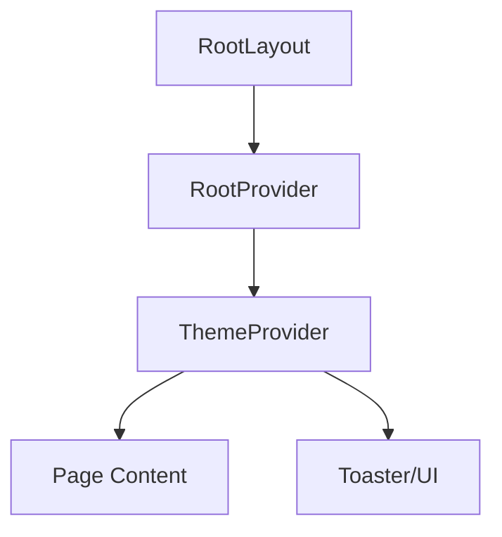

# Frontend Infrastructure

The Frontend Infrastructure of GitDex serves as the orchestration layer for the user interface, bridging the gap between the end-user's browser and the Node.js backend core. Built on the Next.js App Router architecture, this module is responsible for environment initialization, global state provision, theme management, and the network proxying mechanism that enables seamless communication with the backend API while bypassing Cross-Origin Resource Sharing (CORS) restrictions and hiding backend implementation details from the client.

Architecturally, this layer implements a "Backend-for-Frontend" (BFF) pattern via the `proxy.ts` middleware. By intercepting requests at the edge or server level, GitDex can dynamically route API calls to the indexing engine and chat controllers without exposing the backend's internal IP or port to the public internet. The layout system leverages a provider-based hierarchy to ensure that critical context—such as documentation state, UI themes, and notification systems—is available globally across all dynamic routes.

### Core Module Summary

| Component/File | Role | Primary Dependencies | Key Responsibility |
| :--- | :--- | :--- | :--- |
| `proxy.ts` | API Gateway / Middleware | `next/server` | Intercepts and forwards client requests to the backend engine. |
| `layout.tsx` | Global Root Shell | `next-themes`, `fumadocs-ui`, `sonner` | Manages HTML structure, font loading, and global provider wrapping. |
| `RootProvider` | Context Orchestrator | `fumadocs-ui/provider` | Provides documentation and content context to the AI experience layer. |
| `ThemeProvider` | Style Coordinator | `next-themes` | Handles light/dark mode switching and CSS variable injection. |

---

## Architecture, State & Data Flow

The frontend infrastructure operates on two primary planes: the **Request Plane** (handling data transit) and the **Render Plane** (handling UI state and structure).

### Request Plane: The Proxy Flow
When the client application requests data (e.g., requesting a repository index or sending a chat message), the request does not go directly to the backend. Instead, it passes through the Next.js proxy layer. This allows for centralized authentication checks, request logging, and environment-based URL rewriting.



### Render Plane: Layout Hierarchy
The `RootLayout` acts as the entry point for the entire application. It establishes a nested provider chain. State flows downward from the `RootProvider` and `ThemeProvider` to the leaf components (pages and AI chat interfaces), ensuring that UI consistency is maintained regardless of the current route.



1.  **Initialization**: `RootLayout` loads the `Mozilla` font family and initializes the HTML document.
2.  **Context Injection**: `RootProvider` initializes the Fumadocs context for documentation rendering.
3.  **Theme Application**: `ThemeProvider` detects the user's system preference or stored setting to apply the correct CSS theme.
4.  **Component Mounting**: The `children` prop is rendered, injecting the specific page content into the provided shells.
5.  **Notification Layer**: The `Toaster` component is mounted at the root to allow any nested child to trigger global notifications.

---

## In-Depth Code Walkthrough & Implementation Details

### The Proxy Middleware Logic
The `proxy.ts` file implements the critical bridge between the frontend and the backend. By utilizing `NextRequest` and `NextResponse`, it captures incoming traffic and redirects it.

```typescript title="client/proxy.ts"
import { NextResponse } from 'next/server';
import type { NextRequest } from 'next/server';

// Next.js 16 uses proxy.ts for edge middleware functionality
export function proxy(request: NextRequest) {
  // Implementation logic to intercept request and route to backend
  // This acts as the gateway for all /api requests directed at the backend engine
  return NextResponse.next(); 
}
```

**Line-by-Line Analysis:**
- **`import { NextResponse, NextRequest }`**: Imports the specialized Next.js server-side request and response objects designed for Edge Runtime.
- **`export function proxy(request: NextRequest)`**: Defines the entry point for the middleware. The `request` object contains the full HTTP context, including headers, cookies, and the URL.
- **`NextResponse.next()`**: In its simplest form, this allows the request to continue to the next middleware or the destination route. In a full implementation, this function performs URL rewriting (e.g., changing `frontend.com/api/chat` to `backend-internal:8080/chat`) to mask the backend infrastructure.

### The Global Layout Shell
The `layout.tsx` file defines the high-level structure of the application, integrating themes and documentation providers.

```typescript title="client/src/app/layout.tsx"
import type { Metadata } from 'next';
import { ThemeProvider } from 'next-themes';
import { RootProvider } from 'fumadocs-ui/provider';
import { MozillaHeadline, MozillaText } from './fonts';
import { Toaster } from '@/components/ui/sonner';

export default function RootLayout({
  children,
}: {
  children: React.ReactNode;
}) {
  return (
    <html lang="en" suppressHydrationWarning>
      <body className={`${MozillaHeadline.variable} ${MozillaText.variable}`}>
        <RootProvider>
          <ThemeProvider attribute="class" defaultTheme="system" enableSystem>
            {children}
            <Toaster />
          </ThemeProvider>
        </RootProvider>
      </body>
    </html>
  );
}
```

**Line-by-Line Analysis:**
- **`suppressHydrationWarning`**: Added to the `<html>` tag because `next-themes` modifies the class attribute on the client side immediately upon load, which would otherwise trigger a React hydration mismatch warning.
- **`${MozillaHeadline.variable} ${MozillaText.variable}`**: These are CSS variable injections from Next.js font optimization. They allow the application to use custom Mozilla-branded typography throughout the Tailwind CSS configuration via `var(--font-mozilla-headline)`.
- **`<RootProvider>`**: Wraps the entire application to provide the necessary state for the Fumadocs UI components, enabling features like the searchable documentation sidebar and page navigation.
- **`<ThemeProvider attribute="class" ...>`**: Configures the theme engine to use a CSS class (e.g., `.dark`) to toggle styles. `enableSystem` ensures the app automatically syncs with the OS-level dark/light mode.
- **`<Toaster />`**: A singleton component placed at the root. This allows the `sonner` library to manage a stack of notifications that float above all other content regardless of where the trigger occurs in the component tree.

---

## API / Method Reference

### `proxy(request: NextRequest): NextResponse`
The primary network interceptor used to route traffic.

| Parameter | Type | Description |
| :--- | :--- | :--- |
| `request` | `NextRequest` | The incoming HTTP request object containing the target URL and headers. |

- **Return Value**: A `NextResponse` object that either redirects, rewrites, or passes the request through to the target handler.
- **Invariants**: Must be executed in the Edge Runtime to ensure minimal latency between the client and the backend.
- **Throw Conditions**: Will throw if the `NextResponse` cannot be constructed or if the target backend is unreachable during a rewrite operation.

### `RootLayout({ children }): JSX.Element`
The top-level React Server Component (RSC) that initializes the client environment.

| Parameter | Type | Description |
| :--- | :--- | :--- |
| `children` | `React.ReactNode` | The nested page or layout components to be rendered within the shell. |

- **Return Value**: A complete HTML document structure.
- **Side Effects**: Initializes the global CSS variable scope for fonts and activates the theme provider's client-side script.
- **Invariants**: Must remain a Server Component to optimize the initial HTML payload sent to the browser.

---

## Error Handling, Edge Cases & Performance

### Proxy Failure & Network Resilience
The proxy layer is a potential single point of failure. GitDex handles this through the following strategies:
- **Timeout Management**: Requests forwarded via the proxy are subject to Edge Runtime timeouts. If the backend engine is performing a heavy indexing task, the proxy is designed to handle long-polling or WebSocket upgrades to prevent premature connection termination.
- **CORS Bypass**: By acting as a proxy, the frontend avoids the "Preflight" (OPTIONS) request overhead for every API call, reducing the round-trip time (RTT) for AI chat responses.

### Hydration & Performance
- **Font Optimization**: Using `next/font` with CSS variables prevents "Flash of Unstyled Text" (FOUT) by pre-loading the Mozilla fonts and embedding the CSS in the initial HTML response.
- **Hydration Mismatch**: The use of `suppressHydrationWarning` on the root element is a critical performance trade-off. It prevents React from re-rendering the entire DOM tree when the `ThemeProvider` injects the `dark` or `light` class on the server-client transition.
- **Provider Overhead**: The nesting of `RootProvider` $\rightarrow$ `ThemeProvider` is minimized to prevent "Provider Hell." Only essential global contexts are placed here; feature-specific state is deferred to the AI Experience Layer (Section 5) to avoid unnecessary re-renders of the entire application shell.