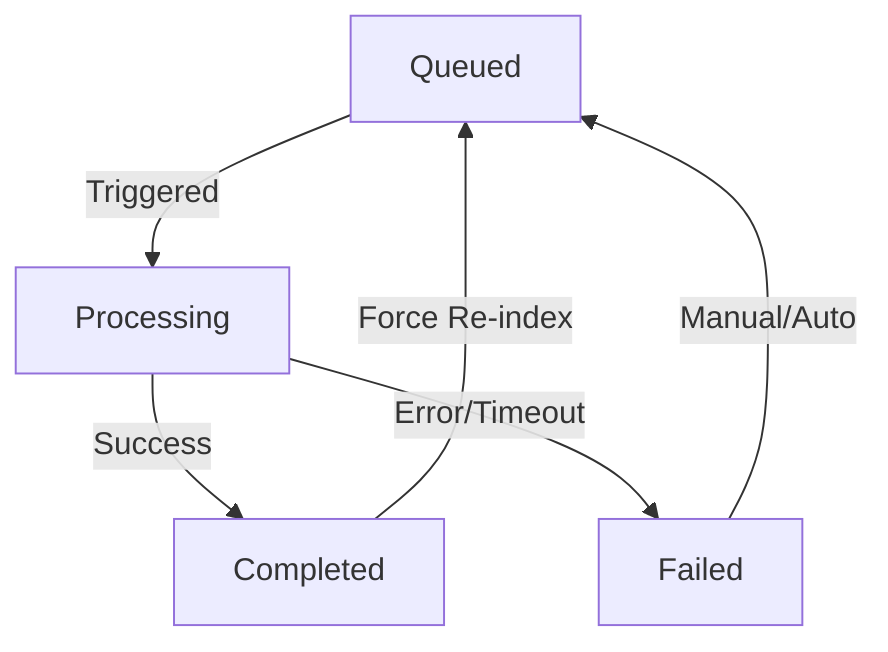
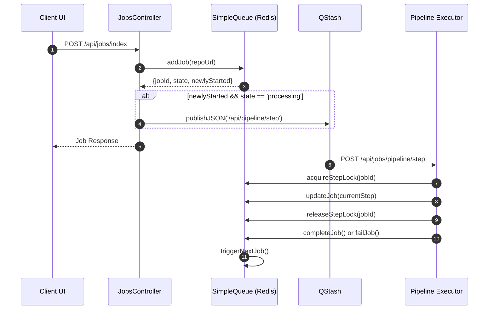

# Job Queue & Management

The Job Queue & Management system in GitDex handles the asynchronous nature of repository indexing. Since analyzing a repository and interacting with AI providers can be time-consuming and resource-intensive, GitDex utilizes a Redis-backed queue and QStash for distributed task triggering to ensure system stability and prevent concurrent execution conflicts.

## Asynchronous Job Architecture

The system is designed around a **Strict Serialization** model. Only one job is processed at a time globally to maintain consistency and avoid hitting API rate limits.

### Job State Transitions

Jobs move through a specific set of states managed by the `SimpleQueue` class.



### Component Interaction Flow

The indexing process begins with a user request and is orchestrated via an external trigger (QStash) to handle serverless execution limits.



## Queue Logic & Constraints

The `SimpleQueue` class implements several safeguards to ensure the system remains healthy and efficient.

### 1. Cooldown Mechanism
To prevent redundant indexing of the same repository, a cooldown period is enforced.
- **Duration**: 1 Hour (`COOLDOWN_MS = 60 * 60 * 1000`).
- **Implementation**: 
    - **Layer 1**: A Redis lock key (`lock:{owner}/{repo}`) with a 3600s TTL.
    - **Layer 2**: Fallback check against the `updatedAt` timestamp of the last completed job.
- **Override**: The `force` flag in the request body allows bypassing these cooldowns.

### 2. Strict Serialization
GitDex ensures only one job is active globally:
- **Active Job**: Tracked via the `system:active_job` Redis key.
- **Waiting Room**: Jobs that cannot start immediately are pushed to the `system:queue` list via `RPUSH`.
- **Triggering**: When a job completes or fails, `triggerNextJob()` pops the oldest job (`LPOP`) and promotes it to the active state.

### 3. Self-Healing & Step Locking
To prevent "zombie" jobs caused by serverless timeouts or crashes:
- **Stuck Job Detection**: `getJob()` checks if a job has been in the `processing` state for more than 3 minutes without an update. If so, it automatically marks the job as `failed` and triggers the next job in the queue.
- **Step Locking**: `acquireStepLock()` creates a short-lived (60s) lock per job step to prevent race conditions if multiple triggers occur.

## API Reference

### Job Management Endpoints

| Endpoint | Method | Description | Key Parameters |
| :--- | :--- | :--- | :--- |
| `/api/jobs/index` | `POST` | Initiates a repository indexing job. | `repoUrl` (req), `force` (opt) |
| `/api/jobs/status/:jobId` | `GET` | Returns current state and metadata of a specific job. | `jobId` (path) |
| `/api/jobs/status` | `GET` | Checks if a repo is indexed and returns its status. | `owner`, `repo` (query) |
| `/api/jobs/pipeline/step` | `POST` | QStash webhook to execute the next pipeline step. | `jobId` (body) |

### Indexing Status Logic
The `getStatusByName` controller uses a prioritized hierarchy to determine if a repository is "indexed":

1. **Active Job Priority**: If a job exists in `processing` or `queued` state, `indexed` is always `false` to keep the frontend polling.
2. **Redis Cache**: Checks for a `last_indexed:{owner}/{repo}` key.
3. **GitHub Source of Truth**: If the cache misses, the system checks the `docs-repo` for the existence of `docs/{owner}/{repo}/meta.json` via the GitHub API. If found, it extracts the commit timestamp and caches it.

## Implementation Details

### Job Data Structure
Jobs are stored in Redis as hashes with the following schema:

```typescript
export interface JobData {
    id: string;             // Format: job:owner/repo
    state: JobState;        // 'queued' | 'processing' | 'completed' | 'failed'
    repoUrl: string;
    owner: string;
    repo: string;
    createdAt: number;      // Timestamp
    updatedAt: number;      // Timestamp
    error?: string | null;
    currentStep: number;
    data?: string | null;   // Heavy payload (omitted in status API)
}
```

### QStash Integration
The `/pipeline/step` route is protected by a signature verification middleware to ensure requests only originate from Upstash:

```typescript
const verifyQstashSignature = async (req: any, res: any, next: any) => {
  const signature = req.headers["upstash-signature"];
  const isValid = await qstashReceiver.verify({
    signature: Array.isArray(signature) ? signature[0] : signature,
    body: req.rawBody || JSON.stringify(req.body),
  });
  if (!isValid) return res.status(401).json({ error: "Invalid QStash signature" });
  next();
};