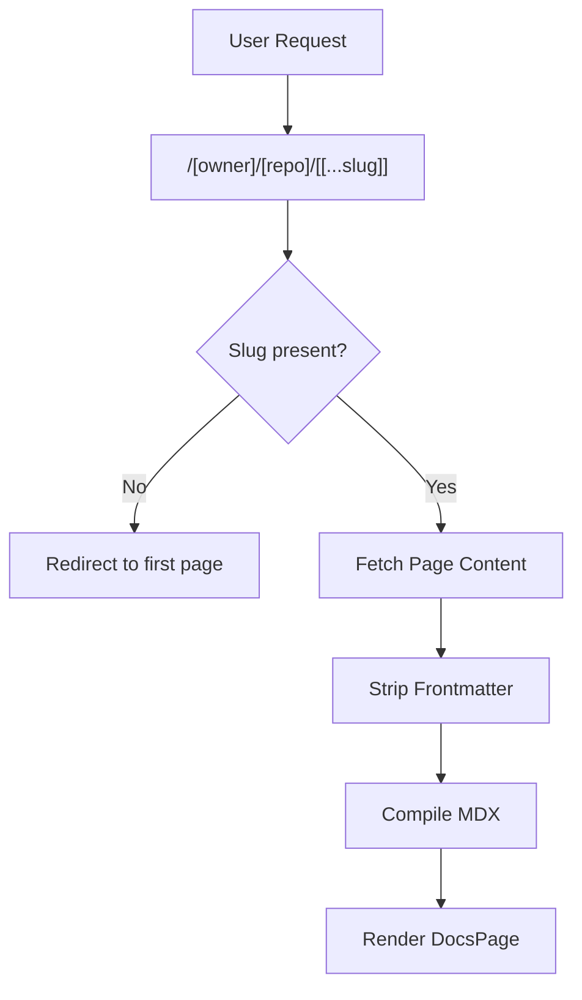

# Routing & API Endpoints

GitDex utilizes the Next.js App Router to provide a seamless, dynamic documentation experience. It employs a combination of dynamic route segments for content rendering and internal API routes to interface with GitHub and the indexing backend.

## Dynamic Documentation Routing

The core of the GitDex reading experience is handled by the dynamic route: `/[owner]/[repo]/[[...slug]]`. This structure allows the application to resolve any GitHub repository and any nested page within its documentation hierarchy.

### Route Resolution Flow

When a user requests a documentation page, GitDex follows this logic:

1.  **Parameter Extraction**: The `owner`, `repo`, and optional `slug` are extracted from the URL.
2.  **Root Redirection**: If the `slug` is empty (the user visited `/[owner]/[repo]`), the system initializes a `DynamicDocsSource` and automatically redirects the user to the first available page in the repository.
3.  **Content Retrieval**: If a slug is present, the system fetches the corresponding page content.
4.  **Preprocessing**: The `stripFrontmatter` utility is applied to the raw MDX. This ensures that multiple or malformed YAML frontmatter blocks are removed, preventing JSX parser crashes.
5.  **Compilation**: The cleaned MDX is passed through the `compiler` and rendered using `fumadocs-ui` components.

### Rendering Pipeline

## Internal API Endpoints

GitDex provides several API routes that act as intermediaries between the client UI and external services (GitHub API and the GitDex Indexing Backend).

### Repository Search
`GET /api/search`

This endpoint facilitates the discovery of repositories to be indexed.

-   **Functionality**: Uses `@octokit/rest` to query the GitHub Search API.
-   **Filtering**: It fetches up to 50 results and performs a secondary client-side filter to ensure high-relevancy matches across the repository name, full name, and description.
-   **Query Parameter**: `q` (Search string).

### Indexing Trigger
`POST /api/index`

Used to initiate the indexing process for a specific repository.

-   **Payload**: `{ "repoUrl": string, "force": boolean }`
-   **Behavior**: Proxies the request to the backend indexing service defined by `NEXT_PUBLIC_API_URL`.
-   **Validation**: Returns a `400 Bad Request` if the `repoUrl` is missing.

### Status Check
`GET /api/status`

Polls the backend to determine if a repository has been successfully indexed.

-   **Query Parameters**: `owner`, `repo`.
-   **Behavior**: Contacts the backend API to retrieve the indexing state.
-   **Error Handling**: If the backend returns non-JSON text or fails, it defaults to `{ "indexed": false }` to ensure the UI can display the `SyncingGuard` component.

## Technical Constraints

To ensure content is always fresh and reflects the latest repository state, the documentation routes are configured with:

-   `export const dynamic = 'force-dynamic'`: Disables static optimization to allow real-time repository fetching.
-   `export const revalidate = 0`: Ensures the cache is bypassed for every request.