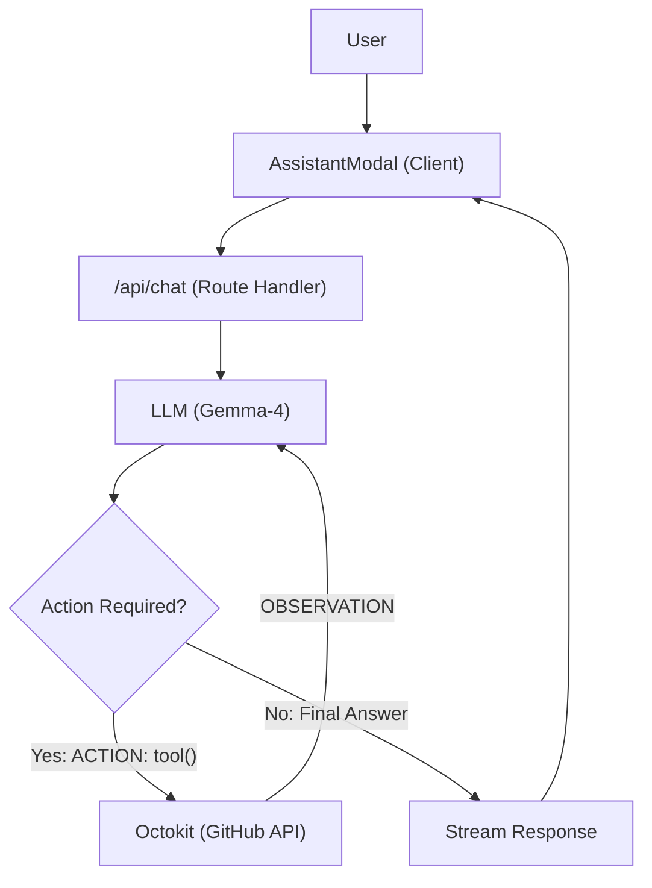

# Search & AI Assistant

GitDex provides an integrated search experience and an AI-powered codebase assistant to help developers navigate and understand repositories efficiently.

## Global Repository Search

The search functionality allows users to discover repositories across GitHub. It implements a hybrid approach by combining the GitHub Search API with a local filtering layer to ensure higher relevance for partial name matches.

### Search API
**Endpoint:** `GET /api/search`

The API performs the following steps:
1. **Querying:** Hits the `/search/repositories` endpoint on GitHub with the query scoped to `in:name,description`.
2. **Fetching:** Retrieves the top 50 results.
3. **Refinement:** Performs a case-insensitive filter on the results to ensure the query string is explicitly present in the repository name, full name, or description.
4. **Slicing:** Returns the top 7 most relevant matches to the client.

---

## AI Assistant

The AI Assistant is a sophisticated chat interface capable of exploring the codebase in real-time to answer technical questions. It uses a **ReAct (Reasoning and Acting)** pattern to interact with the GitHub API.

### Architecture Flow

### The ReAct Loop

The assistant doesn't just guess; it explores. The `POST /api/chat` handler implements a manual loop (up to 10 steps) to gather context:

1. **Context Initialization:** The system identifies the current repository via `x-github-owner` and `x-github-repo` headers. It fetches a recursive file tree (up to 300 files) to provide the LLM with a starting map of the project.
2. **Tool Reasoning:** The LLM (Gemma-4) analyzes the user request and decides if it needs more information. If so, it outputs a specific command:
   - `ACTION: LIST_FILES(path="...")`: Lists contents of a directory.
   - `ACTION: READ_FILE(path="...")`: Retrieves the content of a specific file (truncated to 15k characters).
3. **Observation:** The server executes the requested GitHub action via Octokit and feeds the result back to the LLM as an `OBSERVATION`.
4. **Final Response:** Once the LLM has sufficient context, it enters the final streaming phase to provide a comprehensive answer to the user.

---

## UI Implementation

The assistant is built using `@assistant-ui/react`, providing a production-grade chat interface with a modular architecture.

### Assistant Modal
The `AssistantModal` component acts as the entry point. It initializes the `AssistantChatTransport`, which bridges the UI to the `/api/chat` endpoint and passes the necessary repository metadata in the headers.

### Thread Component
The `Thread` component manages the conversation state and rendering:
- **Viewport:** Handles the message history with smooth scrolling and a "scroll to bottom" shortcut.
- **Message Components:** Custom implementations for `UserMessage` and `AssistantMessage`, including a "Thinking..." indicator while the ReAct loop is executing.
- **Composer:** A sophisticated input area supporting attachments and a stop-generation trigger via `ComposerPrimitive.Cancel`.
- **Action Bar:** Provides utility functions for each message, such as copying text, exporting as Markdown, or regenerating responses.

### Component Hierarchy
- `AssistantModal` $\rightarrow$ `AssistantRuntimeProvider` $\rightarrow$ `AssistantModalPrimitive`
  - `Thread`
    - `ThreadPrimitive.Messages` $\rightarrow$ (`UserMessage`, `AssistantMessage`, `EditComposer`)
    - `Composer` $\rightarrow$ `ComposerPrimitive.Input` $\rightarrow$ `ComposerAction`