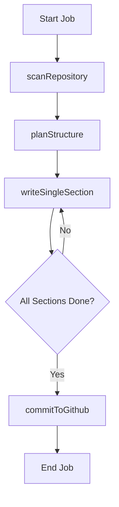

# Server Implementation

The GitDex server is a Node.js-based backend engine designed to automate the analysis of GitHub repositories and the generation of comprehensive technical documentation. It leverages a distributed task queue and a sophisticated AI pipeline to transform raw source code into structured markdown files.

## 4.1 Indexing Pipeline

The indexing pipeline is a multi-stage asynchronous workflow that processes a repository from initial discovery to final commit. The pipeline is designed to be stateful, tracking progress through a `PipelineData` object stored across job iterations.

### Workflow Process
The pipeline follows a linear progression with a looping phase for content generation:



### Pipeline Stages
1.  **Repository Scanning**: The `scanRepository` function utilizes the Octokit library to fetch the file tree and contents of the target repository.
2.  **Structure Planning**: The `planStructure` phase uses the AI model to analyze the codebase and generate a Table of Contents (TOC) based on the `TocEntry` schema.
3.  **Iterative Writing**: The server executes `writeSingleSection` repeatedly. Each call focuses on a specific `TocEntry`, ensuring that the AI context is focused and does not exceed token limits.
4.  **GitHub Integration**: Once all sections are generated, `commitToGithub` pushes the resulting documentation back to the repository.

### Data Models

**Pipeline State (`PipelineData`)**
| Field | Type | Description |
| :--- | :--- | :--- |
| `files` | `Array` | List of paths and contents of scanned source files |
| `toc` | `TocEntry[]` | The AI-generated blueprint for the documentation |
| `generatedFiles` | `Array` | Collection of completed markdown files |
| `sectionsWritten` | `number` | Counter tracking current progress through the TOC |
| `defaultBranch` | `string` | The target branch for the final commit |

**TOC Entry (`TocEntry`)**
| Field | Type | Description |
| :--- | :--- | :--- |
| `prefix` | `string` | Hierarchy prefix for the file |
| `title` | `string` | The heading of the section |
| `filename` | `string` | The target destination filename |
| `description` | `string` | AI-generated summary of what this section covers |
| `relevant_files` | `string[]` | List of source files the AI should reference |

## 4.2 Queue and Job Management

To handle long-running AI tasks without blocking the main thread or hitting timeout limits, GitDex employs an asynchronous job controller utilizing Redis and QStash.

### Execution Logic
The server does not process the entire pipeline in a single request. Instead, it uses a "step-trigger" mechanism:

```typescript
async function triggerNextStep(jobId: string, sectionIndex?: number) {
  // Logic to queue the next execution via QStash/Redis
}

export async function executeNextStep(jobId: string, sectionIndex?: number) {
  // Determines current state and calls the appropriate pipeline function
}
```

### Queue Infrastructure
*   **Redis (@upstash/redis)**: Used for persisting job state and tracking the progress of indexing tasks.
*   **QStash (@upstash/qstash)**: Acts as the reliable delivery mechanism to trigger `executeNextStep` asynchronously, preventing HTTP timeouts during heavy AI generation phases.
*   **Worker**: A background process that listens for job triggers and orchestrates the transition between `scan` $\rightarrow$ `plan` $\rightarrow$ `write` $\rightarrow$ `commit`.

## 4.3 AI Chat and Generation Controller

The AI integration is abstracted through a retry-resilient wrapper that interfaces with the Google AI SDK.

### Generation Strategy
The server implements `generateWithRetry` to mitigate transient API failures or rate limits common in LLM providers.

```typescript
interface GenerateOptions {
  systemPrompt?: string;
  prompt: string;
  maxRetries?: number;
}

export async function generateWithRetry({
  systemPrompt,
  prompt,
  maxRetries = 3
}: GenerateOptions): Promise<string> {
  // Implementation handles exponential backoff and SDK calls
}
```

### Token Management
To prevent "context window overflow," the server utilizes `js-tiktoken` for precise token counting. This allows the `writeSingleSection` function to intelligently select only the `relevant_files` identified during the `planStructure` phase, ensuring the prompt remains within the model's limits.

## Invariants & Failure Modes

| Scenario | Handling Mechanism | Effect |
| :--- | :--- | :--- |
| **AI API Timeout** | `generateWithRetry` | Retries the request up to 3 times before marking the job as failed. |
| **Large Repositories** | `relevant_files` filtering | Only files mapped to a specific TOC section are sent to the AI, avoiding token limits. |
| **Server Crash** | Redis State Persistence | Because state is stored in Redis, the pipeline can resume from the last `sectionsWritten` index. |
| **GitHub API Rate Limit** | Octokit Integration | The pipeline processes files in batches and handles asynchronous commits to respect GitHub's quotas. |
| **Incomplete TOC** | `executeNextStep` validation | If a section fails to generate, the job controller can re-trigger the specific `sectionIndex`. |