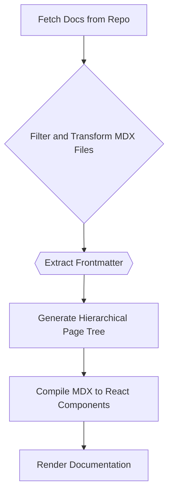

# Source Code Analysis

This document provides an overview of how GitDex retrieves, processes, and analyzes source code from repositories. Understanding this process is crucial for developers looking to extend or modify GitDex's functionality. The core of this process lies in fetching files from a repository, extracting relevant information, and structuring it in a way that can be used for documentation generation and other analysis tasks.

## Source Code Retrieval and Initial Processing

The process begins with fetching the source code from a given repository. This is handled within the `client/lib/dynamic-source.ts` file.  The `DynamicDocsSource` class is responsible for fetching and parsing the documentation files.

```typescript
// client/lib/dynamic-source.ts
import { useDocsStore } from './docs-store';

export class DynamicDocsSource {
  // ...
  async initialize() {
    console.log(`Initializing DynamicDocsSource for ${this.owner}/${this.repo}`);
    const { getDocs } = useDocsStore.getState();
    const docs = await getDocs(this.owner, this.repo);
    
    console.log(`Got docs structure with ${docs.files.length} files`);
    // ...
  }
  // ...
}
```

The `initialize` method retrieves the documentation files using the `useDocsStore`.  This method initiates the data fetching, setting the stage for subsequent data processing. [View on GitHub](https://github.com/shinymack/gitdex/blob/main/client/lib/dynamic-source.ts)

## Filtering and Transforming Files

Once the files are retrieved, they are filtered to include only MDX files (excluding `meta.json`) and then transformed into a page structure.  This involves extracting frontmatter, generating slugs, and setting other properties.

```typescript
// client/lib/dynamic-source.ts
this.pages = docs.files
  .filter(file => file.path.endsWith('.mdx') && !file.path.includes('meta.json'))
  .map(file => {
    // Extract the filename without extension
    const filename = file.path.replace(/^docs\/[^\/]+\//, '').replace('.mdx', '');
    
    // Convert to slug format - keep the full filename as the slug
    const slugs = [filename];
    const urlPath = filename;
    
    const frontmatter = this.extractFrontmatter(file.content);
    
    // Extract sidebar_position from frontmatter
    const sidebar_position = frontmatter.sidebar_position ? 
      parseFloat(frontmatter.sidebar_position) : 999;
    
    const page = {
      url: `/${urlPath}`,
      name: filename,
      title: frontmatter.title || this.formatTitleFromFilename(filename),
      description: frontmatter.description,
      content: file.content,
      frontmatter,
      slugs,
      sidebar_position
    };
    
    return page;
  });
```

This code snippet shows how the files are filtered and transformed into a structured `page` object.  The `sidebar_position` from the frontmatter is parsed to control the order in the sidebar. [View on GitHub](https://github.com/shinymack/gitdex/blob/main/client/lib/dynamic-source.ts)

## Frontmatter Extraction

The `extractFrontmatter` function plays a crucial role in extracting metadata from the MDX files. This metadata is used to populate page titles, descriptions, and other relevant information.

```typescript
// client/lib/dynamic-source.ts
private extractFrontmatter(content: string): Frontmatter {
  const frontmatterMatch = content.match(/^---\s*\n([\s\S]*?)\n---/);
  if (!frontmatterMatch) return {};
  
  try {
    const frontmatter: Frontmatter = {};
    const lines = frontmatterMatch[1].split('\n');
    
    for (const line of lines) {
      const [key, ...rest] = line.split(':');
      if (key && rest.length > 0) {
        const value = rest.join(':').trim();
        frontmatter[key.trim()] = value.replace(/^["']|["']$/g, '');
      }
    }
    
    return frontmatter;
  } catch {
    return {};
  }
}
```

This function uses a regular expression to find the frontmatter block in the MDX content and then parses it into a JavaScript object. [View on GitHub](https://github.com/shinymack/gitdex/blob/main/client/lib/dynamic-source.ts)

## Hierarchical Page Tree Generation

The `generateHierarchicalPageTree` function is responsible for constructing a hierarchical tree structure from the processed pages. This tree structure is used to render the sidebar navigation.

```typescript
// client/lib/dynamic-source.ts
private generateHierarchicalPageTree(): PageTree.Root {
  console.log(`Generating hierarchical page tree from ${this.pages.length} pages`);
  
  // Group pages by their hierarchy level
  const topLevelPages: DocPage[] = [];
  const subPagesMap = new Map<string, DocPage[]>();
  
  // Separate top-level pages and sub-pages based on naming convention
  this.pages.forEach(page => {
    const filename = page.slugs[page.slugs.length - 1] || '';
    
    // Check if it's a sub-page (has decimal in the prefix)
    const prefixMatch = filename.match(/^(\d+)\.(\d+)/);
    
    if (prefixMatch) {
      // This is a sub-page
      const topLevelPrefix = prefixMatch[1];
      
      if (!subPagesMap.has(topLevelPrefix)) {
        subPagesMap.set(topLevelPrefix, []);
      }
      subPagesMap.get(topLevelPrefix)!.push(page);
    } else {
      // This is a top-level page
      topLevelPages.push(page);
    }
  });
  // ...
}
```

The function identifies top-level pages and sub-pages based on filename prefixes and constructs the tree accordingly. [View on GitHub](https://github.com/shinymack/gitdex/blob/main/client/lib/dynamic-source.ts)

## MDX Compilation
The `client/lib/mdx-compiler.ts` file handles the compilation of MDX files into React components. This involves using the `@fumadocs/mdx-remote` library and configuring it with the necessary plugins.

```typescript
// client/lib/mdx-compiler.ts
import { createCompiler } from '@fumadocs/mdx-remote';
import { remarkMdxMermaid } from 'fumadocs-core/mdx-plugins';

export const compiler = createCompiler({
    remarkPlugins : [
        remarkMdxMermaid
    ]
});
```

This code initializes the MDX compiler with the `remarkMdxMermaid` plugin, which enables the rendering of Mermaid diagrams within the MDX content. [View on GitHub](https://github.com/shinymack/gitdex/blob/main/client/lib/mdx-compiler.ts)

## Configuration

The `client/source.config.ts` file configures the MDX compilation process, including specifying remark plugins and other options.

```typescript
// client/source.config.ts
import { defineConfig } from 'fumadocs-mdx/config';
import { remarkMdxMermaid } from 'fumadocs-core/mdx-plugins';

export default defineConfig({
  mdxOptions: {
    remarkPlugins: [remarkMdxMermaid],
  },
});
```

This configuration ensures that the `remarkMdxMermaid` plugin is used when compiling MDX files, allowing for the inclusion of diagrams in the documentation. [View on GitHub](https://github.com/shinymack/gitdex/blob/main/client/source.config.ts)

## Key Integration Points

The integration between these files ensures that GitDex can dynamically fetch, process, and display documentation from various repositories. The flow can be summarized as follows:

1.  The `DynamicDocsSource` class is initialized with the repository owner and name.
2.  The `initialize` method fetches the documentation files using `useDocsStore`.
3.  The files are filtered and transformed into a structured page format.
4.  Frontmatter is extracted from each file to populate metadata.
5.  A hierarchical page tree is generated for navigation.
6.  MDX files are compiled into React components using the configured compiler.

### Best Practices

*   **Consistent Frontmatter:** Ensure that all MDX files have consistent frontmatter to facilitate accurate metadata extraction and page ordering.
*   **Standardized File Naming:** Adhere to a standardized file naming convention to enable the correct generation of the hierarchical page tree.
*   **Error Handling:** Implement robust error handling to gracefully handle issues such as invalid frontmatter or missing files.




