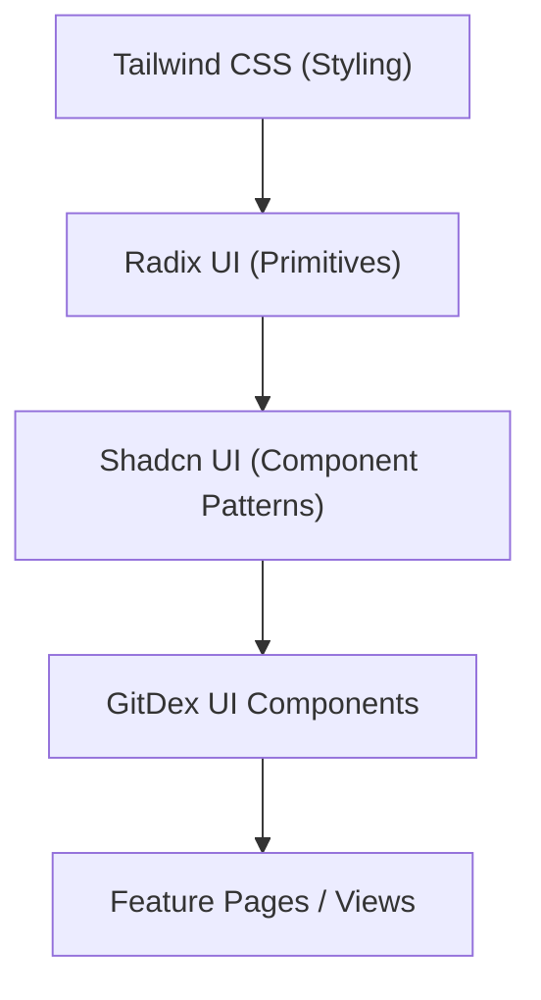

# Design System and Common Components

The GitDex user interface is built on a foundation of accessible, reusable components powered by **Shadcn UI**, **Radix UI**, and **Tailwind CSS**. This architecture ensures a consistent visual language, high accessibility (a11y), and rapid development cycles.

## Architecture Overview

The design system follows a layered approach where low-level primitives are wrapped in styled components to provide a consistent theme across the application.



## Utility Functions

### `cn()`
GitDex uses a utility function `cn` (located in `@/lib/utils`) to handle conditional class merging. It leverages `tailwind-merge` to ensure that conflicting Tailwind classes are resolved correctly, preventing style overrides from failing.

```tsx
import { cn } from "@/lib/utils";

// Example usage
<div className={cn("base-style", isActive && "active-style", customClassName)} />
```

## Core Components

### Button
The `Button` component is a highly flexible primitive used for all user interactions. It utilizes `class-variance-authority` (CVA) to manage multiple visual states.

#### Props
| Prop | Type | Default | Description |
| :--- | :--- | :--- | :--- |
| `variant` | `default` \| `destructive` \| `outline` \| `secondary` \| `ghost` \| `link` | `default` | The visual style of the button |
| `size` | `default` \| `sm` \| `lg` \| `icon` \| `icon-sm` \| `icon-lg` | `default` | The physical dimensions of the button |
| `asChild` | `boolean` | `false` | When true, the component renders its child instead of a `<button>` (via Radix Slot) |

#### Usage
```tsx
import { Button } from "@/components/ui/button";

export function Example() {
  return (
    <div className="flex gap-2">
      <Button variant="default">Primary Action</Button>
      <Button variant="destructive" size="sm">Delete</Button>
      <Button variant="outline" asChild>
        <a href="/settings">Settings</a>
      </Button>
    </div>
  );
}
```

### Card
The `Card` component provides a structured container for grouping related content. It is a composite component consisting of several sub-components.

#### Composition
- `Card`: The main container with border and shadow.
- `CardHeader`: Header section with vertical spacing.
- `CardTitle`: Bold, high-emphasis heading.
- `CardDescription`: Muted text for supplementary information.
- `CardContent`: The main body area.
- `CardFooter`: Bottom section for actions.

#### Usage
```tsx
import { Card, CardHeader, CardTitle, CardDescription, CardContent, CardFooter } from "@/components/ui/card";

export function UserProfileCard() {
  return (
    <Card>
      <CardHeader>
        <CardTitle>User Profile</CardTitle>
        <CardDescription>Manage your account settings.</CardDescription>
      </CardHeader>
      <CardContent>
        <p>User details go here...</p>
      </CardContent>
      <CardFooter>
        <Button>Save Changes</Button>
      </CardFooter>
    </Card>
  );
}
```

### Dialog (Modal)
The `Dialog` component is an accessible modal powered by Radix UI. It manages focus trapping and keyboard navigation automatically.

#### Components
- `Dialog`: The root provider.
- `DialogTrigger`: The element that opens the modal.
- `DialogContent`: The modal window itself (includes `DialogOverlay` and a close button).
- `DialogHeader` / `DialogFooter`: Layout helpers for alignment.
- `DialogTitle` / `DialogDescription`: Accessible labels for the modal.

#### Usage
```tsx
import {
  Dialog,
  DialogContent,
  DialogDescription,
  DialogHeader,
  DialogTitle,
  DialogTrigger,
} from "@/components/ui/dialog";

export function DeleteConfirmation() {
  return (
    <Dialog>
      <DialogTrigger asChild>
        <Button variant="destructive">Delete Repo</Button>
      </DialogTrigger>
      <DialogContent>
        <DialogHeader>
          <DialogTitle>Are you absolutely sure?</DialogTitle>
          <DialogDescription>
            This action cannot be undone. This will permanently delete your repository.
          </DialogDescription>
        </DialogHeader>
        <div className="flex justify-end gap-4">
          <Button variant="outline">Cancel</Button>
          <Button variant="destructive">Confirm</Button>
        </div>
      </DialogContent>
    </Dialog>
  );
}