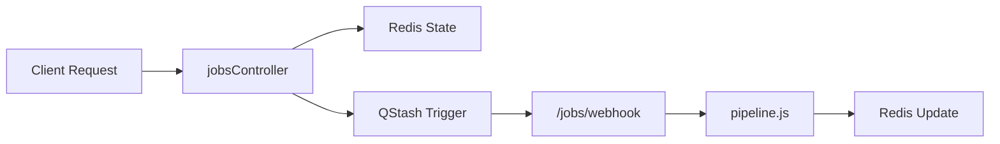
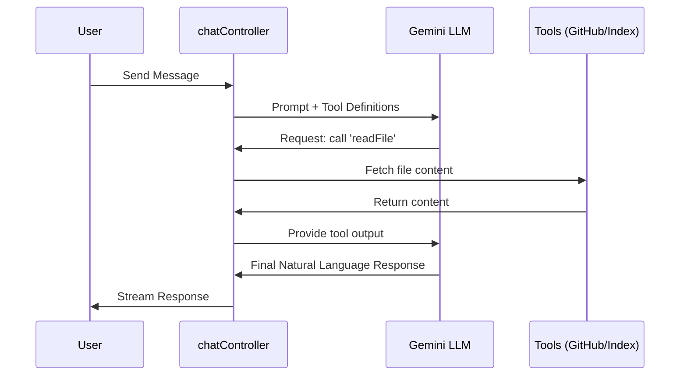

# Server-Side Endpoints

The Server-Side Endpoints module serves as the orchestration layer for GitDex, bridging the gap between the Next.js frontend, the AI models, and the repository indexing pipeline. This module is primarily responsible for two critical domains: **Asynchronous Job Management** (handling the heavy lifting of repository indexing) and **AI-Powered Chat** (providing an interface for users to query their codebase).

The architecture leverages a distributed task pattern using Redis and QStash to ensure that long-running indexing processes do not block the API response cycle, while utilizing the AI SDK to implement a tool-augmented chat experience.

### Architectural Role & Dependencies

This module acts as the "Brain" of the backend, coordinating between the following core dependencies:

| Dependency | Role | Purpose |
| :--- | :--- | :--- |
| `Express` | Web Framework | Routing and request/response handling. |
| `@octokit/rest` | GitHub API | Verifying repository existence and fetching raw code. |
| `Redis` / `Queue` | State Store | Tracking job progress and managing the task queue. |
| `@upstash/qstash` | Message Broker | Triggering asynchronous pipeline steps via webhooks. |
| `ai` / `@ai-sdk/google` | AI Orchestration | Managing LLM streams and function calling (tools). |

---

### Job Management Workflow

Indexing a repository is a resource-intensive process that cannot be handled in a single HTTP request. GitDex implements a deferred execution pattern. When a user submits a repository, the server validates the input, persists a "pending" state in Redis, and schedules the work through QStash.

#### Data Flow: Indexing Pipeline


The `jobsController.ts` manages the lifecycle of these tasks. The `createJob` handler ensures that only valid GitHub repositories enter the pipeline:

```typescript
export const createJob = async (req: any, res: any) => {
  const { repoUrl } = req.body;
  const { owner, repo } = parseOwnerRepo(repoUrl);
  
  // Validate existence before queueing
  const exists = await verifyRepoExists(owner, repo);
  if (!exists) return res.status(404).send("Repository not found");

  // Initialize state in Redis and trigger the first pipeline step
  await queue.add(owner, repo);
  await qstash.publishHTTP({
    url: process.env.WEBHOOK_URL + "/jobs/webhook",
    body: { owner, repo },
  });
  
  res.status(202).json({ message: "Job created" });
};
```

To prevent "zombie jobs" (tasks that fail silently or hang), the system includes a `cronHeal` endpoint. This utility scans the Redis store for stalled jobs and re-triggers the processing webhook, ensuring high reliability of the indexing service.

---

### AI Chat Integration

The chat endpoint is not a simple prompt-response loop. It implements a **Tool-Augmented Generation** pattern. Instead of sending the entire codebase to the LLM (which would exceed context windows), the server provides the AI with a set of "Tools" it can call to fetch specific information on demand.

#### Interaction Sequence: Tool Use


The `handleChat` controller uses the `ai` package to define these capabilities. By using Zod schemas, the server strictly defines what the AI can ask for:

```typescript
const tools = {
  searchCode: tool({
    description: 'Search for code snippets in the repository',
    parameters: z.object({ query: z.string() }),
    execute: async ({ query }) => { /* Search logic */ },
  }),
  readFile: tool({
    description: 'Read the content of a specific file',
    parameters: z.object({ path: z.string() }),
    execute: async ({ path }) => { /* File reading logic */ },
  }),
  // ... other tools like getFiles
};
```

The use of `streamText` allows the server to push tokens to the frontend in real-time, creating a responsive UX while the AI might be performing multiple tool calls in the background.

---

### API Reference

#### Job Endpoints
These endpoints manage the ingestion and tracking of repository analysis.

| Method | Endpoint | Description | Key Params |
| :--- | :--- | :--- | :--- |
| `POST` | `/jobs` | Initiates the indexing process. | `repoUrl` (body) |
| `GET` | `/jobs/:id` | Retrieves status for a specific job ID. | `id` (path) |
| `GET` | `/jobs/status/:owner/:repo` | Retrieves status by repo identity. | `owner`, `repo` |
| `POST` | `/jobs/heal` | Maintenance endpoint to restart stalled jobs. | N/A |
| `POST` | `/jobs/webhook` | QStash receiver that triggers `executeNextStep`. | Signature Header |

#### Chat Endpoints
The primary interface for interacting with the AI assistant.

| Method | Endpoint | Description | Key Params |
| :--- | :--- | :--- | :--- |
| `POST` | `/chat` | Streams an AI response based on repo context. | `messages` (array) |

**Security Note:** The `/jobs/webhook` endpoint is protected by a `verifyQstashSignature` middleware, ensuring that only authorized messages from Upstash can trigger the pipeline, preventing unauthorized resource consumption.