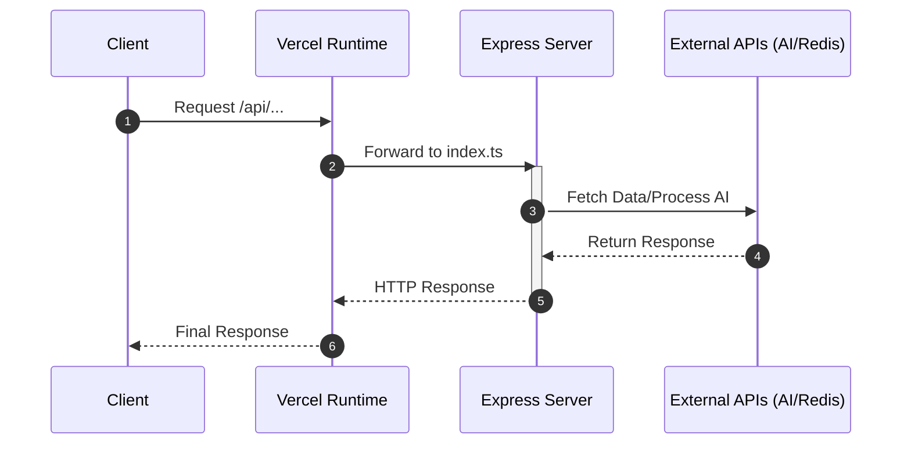

# Vercel Deployment

The GitDex backend is designed for deployment on Vercel using a serverless architecture. It leverages the `@vercel/node` runtime to execute the TypeScript-based Express server, ensuring the backend can scale automatically while integrating with external AI and data services.

## Deployment Architecture

The deployment follows a serverless pattern where all incoming requests are routed through a single entry point. The backend does not maintain a persistent local state, relying instead on external services like Upstash for queuing and caching.


## Server Configuration

The deployment is governed by the `vercel.json` configuration file, which defines how the source code is built and how traffic is routed to the serverless function.

### Build and Routing Setup

Vercel is configured to treat `index.ts` as the primary entry point. All incoming traffic, regardless of the path, is forwarded to this file to allow the Express framework to handle internal routing.

| Configuration Key | Value | Description |
| :--- | :--- | :--- |
| `version` | `2` | Vercel platform version |
| `builds[0].src` | `index.ts` | The source file to be compiled |
| `builds[0].use` | `@vercel/node` | The runtime environment for Node.js |
| `routes[0].src` | `/(.*)` | Wildcard regex capturing all requests |
| `routes[0].dest` | `index.ts` | Destination function for all requests |

### Cache Control
To ensure that AI-generated responses and repository analysis data are always current, the deployment enforces a strict cache-control policy via headers:

```json
"headers": {
  "Cache-Control": "no-store, must-revalidate"
}
```

## Backend Runtime Dependencies

The server leverages a modern TypeScript stack optimized for serverless execution. The following core dependencies are bundled during the Vercel build process:

| Category | Package | Purpose |
| :--- | :--- | :--- |
| **Web Framework** | `express` | Handles HTTP routing and middleware |
| **AI Integration** | `ai`, `@ai-sdk/google` | Interface for Google GenAI models |
| **Data & Queue** | `@upstash/redis`, `@upstash/qstash` | Serverless Redis and asynchronous job queuing |
| **GitHub API** | `@octokit/rest` | Interaction with GitHub repositories |
| **Utilities** | `js-tiktoken`, `mermaid` | Token counting and diagram generation |

## Request Flow Sequence

The following sequence illustrates the interaction between the Vercel runtime and the external services used by the backend.



## Invariants & Failure Modes

### Serverless Constraints
Because the backend runs as a Vercel Function, it is subject to specific architectural constraints:
*   **Statelessness:** The server cannot store files locally or maintain in-memory sessions. All state must be persisted in Upstash Redis.
*   **Execution Limits:** Long-running indexing tasks cannot be performed within a single request cycle due to Vercel's timeout limits. This is why `@upstash/qstash` is used to handle asynchronous background jobs.
*   **Cold Starts:** Initial requests after a period of inactivity may experience higher latency as the Node.js runtime initializes.

### Error Handling & Resilience
*   **Routing Failures:** Since all requests route to `index.ts`, any failure in the entry point results in a 500 error for the entire API.
*   **External Dependency Outages:** The system is heavily dependent on Google GenAI and Upstash. Failure in these services will disrupt AI chat and indexing pipelines respectively.