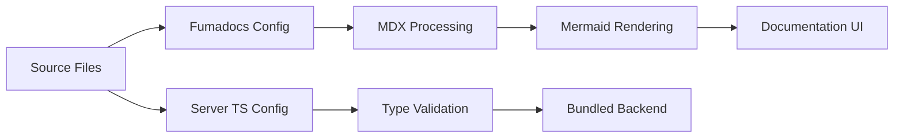

# Environment and Build Setup

The GitDex project utilizes a modern TypeScript and MDX-based build pipeline designed for high type safety and efficient documentation rendering. The setup is split between a Node.js server environment and a Next.js-based client utilizing the Fumadocs framework.

## TypeScript Configuration

The server-side environment is configured for modern ECMAScript standards, prioritizing strict type checking and compatibility with contemporary bundlers.

### Server Compiler Options

The `server/tsconfig.json` is configured to ensure maximum type safety and lean emission.

| Option | Value | Description |
| :--- | :--- | :--- |
| `target` | `ESNext` | Targets the latest JavaScript features. |
| `module` | `Preserve` | Preserves module syntax for the bundler to handle. |
| `moduleResolution` | `bundler` | Optimized for modern bundling tools. |
| `strict` | `true` | Enables all strict type-checking options. |
| `noEmit` | `true` | Prevents `tsc` from emitting files; relies on a bundler. |
| `noUncheckedIndexedAccess` | `true` | Forces explicit checks for `undefined` when accessing arrays/objects. |

```typescript
// Example of strict indexing enforced by noUncheckedIndexedAccess
const items: string[] = ["a", "b"];
const item = items[5]; // Type is string | undefined, not just string
if (item) {
  console.log(item.toUpperCase());
}
```

## Documentation and Client Setup

The client uses **Fumadocs** to manage technical documentation, enabling a seamless transition from Markdown/MDX to a fully interactive UI.

### Directory Mapping

The `client/cli.json` configuration defines aliases used by the Fumadocs CLI to locate core UI and logic components.

| Alias | Path | Description |
| :--- | :--- | :--- |
| `uiDir` | `./src/components/ui` | Core Radix UI primitive components. |
| `componentsDir` | `./src/components` | High-level shared UI components. |
| `blockDir` | `./src/components` | Custom documentation blocks. |
| `cssDir` | `./src/styles` | Global and component-specific stylesheets. |
| `libDir` | `./src/lib` | Shared utility functions and helper logic. |

### MDX Integration

The documentation pipeline supports advanced rendering through the `source.config.ts` configuration, specifically integrating Mermaid for architectural diagrams.

```typescript
import { defineDocs, defineConfig } from 'fumadocs-mdx/config';
import { remarkMdxMermaid } from 'fumadocs-core/mdx-plugins';

// Configuration integrates Mermaid plugin for diagram rendering
```

## Build Pipeline Flow

The following diagram illustrates how source files are processed through the respective build paths for the server and the documentation client.



## Invariants & Failure Modes

### Type Safety Invariants
- **Strict Indexing:** By setting `noUncheckedIndexedAccess` to `true`, the project eliminates a common class of runtime "undefined" errors. Developers are forced to handle missing keys, ensuring the backend does not crash during repository analysis.
- **Zero Emission:** The `noEmit: true` setting means the TypeScript compiler is used solely for validation. If the external build tool (e.g., esbuild or SWC) is misconfigured, the application may fail to run even if `tsc` reports no errors.

### Documentation Dependencies
- **Schema Validation:** The `cli.json` relies on a specific JSON schema (`@fumadocs/cli/dist/schema/src.json`). Any mismatch in the schema version during dependency updates may break the documentation build process.
- **Mermaid Rendering:** Documentation pages utilizing Mermaid diagrams depend on the `remarkMdxMermaid` plugin. Failure to load this plugin will result in raw Mermaid code being displayed to the end-user instead of visual diagrams.