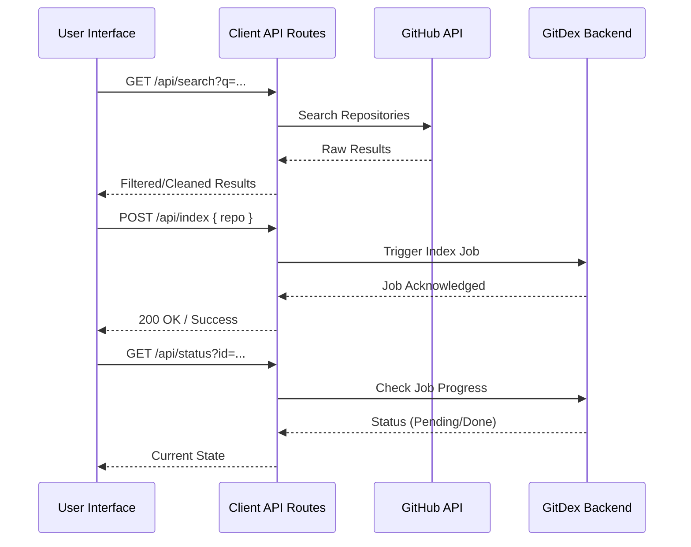

# Client-Side API Routes

In the GitDex architecture, the Client-Side API Routes serve as a **Backend-for-Frontend (BFF)** layer implemented using Next.js Route Handlers. Instead of the browser communicating directly with the GitHub API or the core GitDex backend service, these routes act as secure intermediaries.

This design pattern provides three primary advantages:
1. **Security**: Sensitive API keys (like GitHub tokens) remain server-side and are never exposed to the client.
2. **CORS Management**: It bypasses Cross-Origin Resource Sharing restrictions by proxying requests from the same domain.
3. **Data Optimization**: The routes can filter or reshape raw API responses to provide the frontend with exactly the data it needs, reducing payload sizes.

### Route Overview

The following table summarizes the responsibilities of the API routes located in `client/src/app/api/`.

| Route | Method | Purpose | Primary Dependency |
| :--- | :--- | :--- | :--- |
| `/api/search` | `GET` | Discover repositories via GitHub search | `@octokit/rest` |
| `/api/index` | `POST` | Initiate the indexing process for a repo | Internal Backend |
| `/api/status` | `GET` | Poll the current indexing state | Internal Backend |

---

### Request Workflow

The interaction between the user interface and these route handlers follows a linear progression: searching for a target, triggering the index, and monitoring the result.



---

### Detailed Route Analysis

#### 1. Repository Search (`/api/search`)
The search route is designed to provide a responsive "type-ahead" experience. It leverages the `@octokit/rest` library to query GitHub's API. 

A key architectural detail here is the **hybrid filtering approach**. The route fetches a larger result set from GitHub and then applies a lightweight local filter to ensure partial-name matches are more accurate than what the raw GitHub API returns.

```typescript
// Simplified logic from client/src/app/api/search/route.ts
export async function GET(req: Request) {
  // ... Octokit initialization ...
  const { data } = await octokit.search.repos({ q });
  
  // Lightweight filter to improve partial-name matches
  // This ensures the UI feels snappy and accurate during typing
  const filtered = data.items.filter(repo => 
    repo.full_name.toLowerCase().includes(query.toLowerCase())
  );
  
  return NextResponse.json(filtered);
}
```

#### 2. Indexing Trigger (`/api/index`)
The `/api/index` route handles `POST` requests to start the AI-powered analysis of a specific repository. This route acts as a bridge, forwarding the repository coordinates to the backend processing pipeline.

This is a critical junction in the data flow: it transitions the application from "Discovery Mode" (searching for a repo) to "Analysis Mode" (processing the codebase).

#### 3. Status Tracking (`/api/status`)
Because repository indexing is an asynchronous, resource-intensive task (involving cloning, parsing, and embedding), the frontend cannot wait for a single HTTP response. 

The `/api/status` route allows the frontend to implement a polling mechanism. It requests the current state of a job from the backend and returns a status update (e.g., "indexing", "completed", or "failed"), which the UI uses to update the progress bar or enable the AI chat interface.

```typescript
// Logic from client/src/app/api/status/route.ts
export async function GET(request: Request) {
  // Extract job identifier from request
  // Proxy request to the core backend service
  const status = await fetchBackendStatus(id);
  
  return NextResponse.json({ status });
}
```

### Summary of Data Flow
The client-side routes maintain a lean footprint. They do not persist data themselves; instead, they orchestrate the flow of information between the **GitHub Ecosystem** (via Octokit) and the **GitDex Backend** (via internal API calls), ensuring the frontend remains a pure presentation layer.