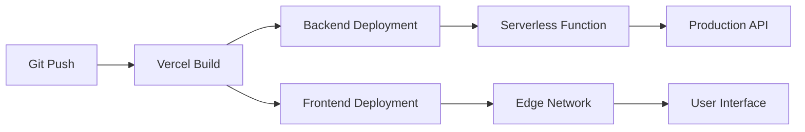
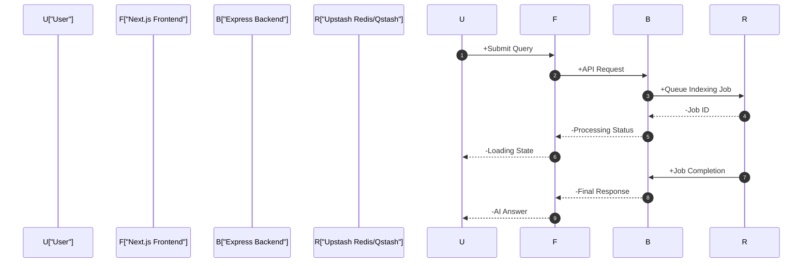

# Deployment Workflow

This section provides the technical instructions and architectural overview for deploying the GitDex backend and frontend to production environments.

## Backend Deployment

The GitDex backend is built using TypeScript and designed for serverless deployment on Vercel. While local development utilizes the Bun runtime, production deployment is managed via the `@vercel/node` runtime.

### Vercel Configuration

The deployment is governed by the `server/vercel.json` configuration file, which ensures that all incoming requests are routed to the primary entry point.

```json
{
  "version": 2,
  "builds": [
    {
      "src": "index.ts",
      "use": "@vercel/node"
    }
  ],
  "routes": [
    {
      "src": "/(.*)",
      "dest": "index.ts",
      "headers": {
        "Cache-Control": "no-store, must-revalidate"
      }
    }
  ]
}
```

### Deployment Steps

1.  **Environment Configuration**: Set up the required secret keys in the Vercel project dashboard (see Environment Requirements).
2.  **Build Process**: Vercel detects the `vercel.json` file and uses the `@vercel/node` builder to compile `index.ts`.
3.  **Routing**: All traffic directed to the backend URL is proxied to the `index.ts` handler, which manages the Express application.

## Frontend Deployment

The frontend is a Next.js application utilizing Turbopack for optimized build speeds.

### Build and Hosting

The frontend can be hosted on any platform supporting Next.js, with Vercel being the recommended target.

**Key Build Command:**
```bash
# From the client directory
npm run build 
# Executes: next build --turbopack
```

### Deployment Pipeline



## Integration Architecture

The interaction between the deployed frontend and backend follows a client-server model where the frontend manages the AI chat state and the backend handles heavy lifting like repository indexing via Upstash.



## Environment Requirements

Based on the project dependencies, the following infrastructure and environment variables must be configured for a successful production deployment.

| Component | Dependency | Required Configuration | Purpose |
| :--- | :--- | :--- | :--- |
| **AI Engine** | `@ai-sdk/google` | `GOOGLE_GENERATIVE_AI_API_KEY` | LLM context and answer generation. |
| **Queue/Cache** | `@upstash/redis` | `UPSTASH_REDIS_REST_URL` | Storing repository index and state. |
| **Scheduling** | `@upstash/qstash` | `QSTASH_TOKEN` | Managing asynchronous indexing jobs. |
| **GitHub API** | `@octokit/rest` | `GITHUB_TOKEN` | Authenticated repository data retrieval. |
| **Runtime** | `dotenv` | `.env` file (local) | Management of environment secrets. |

## Technical Specifications Summary

| Layer | Technology | Build Tool | Entry Point |
| :--- | :--- | :--- | :--- |
| **Backend** | Node.js / Express | `@vercel/node` | `server/index.ts` |
| **Frontend** | Next.js | Turbopack | `client/` |
| **Runtime** | Bun (Dev) / Vercel (Prod) | `bun build` / `next build` | N/A |