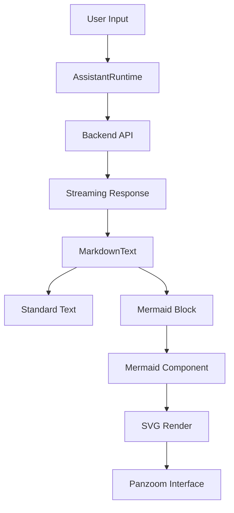

# AI Experience Layer

The AI Experience Layer is the primary interaction surface of GitDex, responsible for translating complex repository indices and LLM-generated insights into an intuitive, interactive user interface. This layer is architected to provide a seamless transition between conversational AI, structured data visualization (via Mermaid.js), and immersive aesthetic elements (via the Interactive Constellation).

The module focuses on three core pillars:
1.  **Conversational Interface**: A highly customizable chat framework leveraging `@assistant-ui/react` to handle streaming AI responses, tool calling, and thread management.
2.  **Visual Intelligence**: A dynamic rendering engine for Mermaid diagrams that allows users to visualize code architecture, flowcharts, and dependency graphs generated by the AI.
3.  **Immersive UI/UX**: A high-performance canvas-based background and a responsive, resizable modal system that ensures the AI assistant remains accessible without obstructing the primary repository view.

### Core Module Components

| Component | Responsibility | Key Dependencies |
| :--- | :--- | :--- |
| `AssistantModal` | Manages the chat container, resizable side-panel logic, and AI runtime context. | `@assistant-ui/react`, `lucide-react` |
| `Thread` | Implements the chat message stream, input composer, and AI suggestion system. | `@assistant-ui/react`, `@assistant-ui/react-ai-sdk` |
| `Mermaid` | Parses and renders Mermaid.js diagrams with pan-zoom and full-screen capabilities. | `mermaid`, `panzoom` (dynamic) |
| `InteractiveConstellation` | Renders a physics-based particle system for visual depth and engagement. | `HTMLCanvasElement` |

## Architecture, State & Data Flow

The AI Experience Layer operates as a consumer of the Backend Core Engine's AI processing pipeline. The data flow follows a unidirectional path from the server's streaming response to the client's specialized rendering components.

### Data Interaction Flow

1.  **Request Initiation**: The user interacts with the `ComposerPrimitive` in the `Thread` component, triggering a request via the `AssistantChatTransport`.
2.  **Runtime Processing**: The `AssistantRuntimeProvider` manages the state of the conversation, handling the asynchronous stream of tokens from the backend.
3.  **Content Parsing**: As the AI responds, the `MarkdownText` component parses the stream. When a code block with the `mermaid` language identifier is detected, the `Mermaid` component is instantiated.
4.  **Visualization Rendering**: The `Mermaid` component cleans the syntax, renders the SVG, and initializes a pan-zoom handler for complex diagrams.
5.  **UI State Synchronization**: The `AssistantModal` manages the physical presence of the chat interface, using local state to track width and visibility, ensuring the UI remains responsive across device sizes.



## In-Depth Code Walkthrough & Implementation Details

### 1. Physics-Based Interactive Background
The `InteractiveConstellation` component implements a custom particle physics engine using the HTML5 Canvas API. It utilizes a "magnetic attraction" model where particles drift naturally but gravitate toward the user's cursor.

```typescript title="client/src/components/InteractiveConstellation.tsx"
const render = () => {
  ctx.clearRect(0, 0, canvas.current!.width, canvas.current!.height);
  
  particles.forEach((p, i) => {
    // Move particle with velocity
    p.x += p.vx;
    p.y += p.vy;

    // Bounce off walls
    if (p.x < 0 || p.x > canvas.current!.width) p.vx *= -1;
    if (p.y < 0 || p.y > canvas.current!.height) p.vy *= -1;

    // Mouse Physics Interaction (Magnetic Attraction)
    const dx = mouse.x - p.x;
    const dy = mouse.y - p.y;
    const distance = Math.sqrt(dx * dx + dy * dy);
    if (distance < 150) {
      p.vx += dx * 0.001;
      p.vy += dy * 0.001;
    }

    // Draw particle node
    ctx.beginPath();
    ctx.arc(p.x, p.y, p.radius, 0, Math.PI * 2);
    ctx.fillStyle = getPrimaryColor();
    ctx.fill();
  });

  // Draw Connections (Lines)
  particles.forEach((p, i) => {
    particles.slice(i + 1).forEach(p2 => {
      const dist = Math.sqrt((p.x - p2.x)**2 + (p.y - p2.y)**2);
      if (dist < 100) {
        ctx.beginPath();
        ctx.moveTo(p.x, p.y);
        ctx.lineTo(p2.x, p2.y);
        ctx.strokeStyle = `rgba(100, 116, 139, ${1 - dist / 100})`;
        ctx.stroke();
      }
    });
  });
  
  requestAnimationFrame(render);
};
```

**Implementation Analysis:**
The `render` function runs on a `requestAnimationFrame` loop to ensure 60FPS performance. It calculates the distance between every pair of particles to draw connectivity lines, creating a "constellation" effect. The magnetic attraction is achieved by calculating the vector between the mouse coordinates and the particle center, applying a small acceleration constant (`0.001`) to the particle's velocity. This creates a fluid, organic feel.

### 2. Resizable Assistant Modal Logic
The `AssistantModal` provides a flexible container for the AI chat. It implements a manual drag-to-resize mechanism to allow users to prioritize either the chat or the repository content.

```typescript title="client/src/components/assistant-ui/assistant-modal.tsx"
const startResizing = (mouseDownEvent: React.MouseEvent) => {
  setIsResizing(true);
  setInitialX(mouseDownEvent.clientX);
  setInitialWidth(width);
  
  const handleMouseMove = (mouseMoveEvent: MouseEvent) => {
    if (!isResizing) return;
    const deltaX = mouseMoveEvent.clientX - initialX;
    setWidth(Math.max(300, Math.min(initialWidth + deltaX, 800)));
  };
  
  const handleMouseUp = () => {
    setIsResizing(false);
    document.removeEventListener('mousemove', handleMouseMove);
    document.removeEventListener('mouseup', handleMouseUp);
  };
  
  document.addEventListener('mousemove', handleMouseMove);
  document.addEventListener('mouseup', handleMouseUp);
};
```

**Implementation Analysis:**
The resizing logic bypasses standard CSS `resize: horizontal` to provide better control over boundaries (minimum 300px, maximum 800px). By attaching `mousemove` and `mouseup` listeners directly to the `document` rather than the handle, the implementation prevents "cursor slip" where the mouse moves faster than the DOM element can re-render, ensuring a smooth user experience.

### 3. Dynamic Mermaid Diagram Rendering
The `Mermaid` component is designed to handle AI-generated Mermaid syntax, which is often prone to minor formatting errors. It includes a cleaning phase and a dynamic zoom interface.

```typescript title="client/src/components/mermaid.tsx"
function fixMermaidSyntax(chart: string): string {
  return chart
    .replace(/```mermaid\n?([\s\S]*?)```/g, '$1') // Strip code fences
    .replace(/\n\s*\n/g, '\n') // Remove empty lines
    .trim();
}

const initializePanzoom = async (element: HTMLElement) => {
  const { Panzoom } = await import('@panzoom/panzoom');
  const panzoom = Panzoom(element, {
    maxScale: 5,
    minScale: 0.1,
    filterKey: () => false, // Disable keyboard controls
  });
  return panzoom;
};
```

**Implementation Analysis:**
`fixMermaidSyntax` acts as a sanitization layer, stripping Markdown fences that the LLM might include inside the specific Mermaid block. To optimize the initial bundle size, `Panzoom` is imported dynamically only when a Mermaid diagram is actually rendered. The `filterKey` override ensures that Panzoom doesn't intercept keyboard events that might be needed by the global application.

## API / Method Reference

### `Mermaid` Component
**Props:**
- `chart` (string): The raw Mermaid syntax string.
- `border` (boolean, optional): Whether to wrap the diagram in a bordered container.
- `margin` (boolean, optional): Whether to apply outer margins.

**Internal Helpers:**
- `cachePromise<T>(key, setPromise)`: Memoizes asynchronous Mermaid rendering calls to prevent flickering during re-renders.
- `wrapLabelText(text, maxLen)`: Inserts line breaks into long labels to prevent diagrams from becoming excessively wide.

### `AssistantModal` & `Thread`
**State Management:**
- `width`: Controlled numeric state for the sidebar width.
- `isResizing`: Boolean flag to track the active drag state of the resizer handle.

**Runtime Integration:**
- `AssistantRuntimeProvider`: Wraps the thread to provide context for the `@assistant-ui/react` primitives.
- `AssistantChatTransport`: Connects the UI primitives to the AI SDK, handling the request/response cycle.

### `InteractiveConstellation`
**Interfaces:**
- `Particle`: 
    - `x, y`: Current coordinates.
    - `vx, vy`: Velocity vectors.
    - `radius`: Particle size.
    - `baseX, baseY`: Original anchor points for parallax calculations.

## Error Handling, Edge Cases & Performance

### Error Recovery in Diagrams
Mermaid.js can throw fatal errors if the syntax is invalid, which would normally crash the React render tree. The `Mermaid` component mitigates this by:
1.  **Syntax Cleaning**: Using `fixMermaidSyntax` to remove common LLM hallucinated artifacts.
2.  **Error Boundaries**: While not explicitly shown as a separate class, the component uses a `try-catch` approach within the `mermaid.render` promise to handle rendering failures gracefully.

### Performance Optimizations
- **Canvas Rendering**: The `InteractiveConstellation` uses a single canvas rather than individual DOM elements for particles, reducing the number of nodes in the DOM and avoiding layout thrashing.
- **Dynamic Imports**: The `panzoom` library is loaded on-demand, reducing the main bundle size for users who do not interact with diagrams.
- **Frame Throttling**: The use of `requestAnimationFrame` ensures that the background animation is synchronized with the browser's refresh rate and paused when the tab is inactive.

### Edge Case Handling
- **Mobile Responsiveness**: The `AssistantModal` switches from a resizable sidebar to a full-screen overlay on mobile devices, using a backdrop to maintain focus on the chat.
- **Zoom Conflicts**: To prevent accidental zooming while scrolling the chat, the `Mermaid` component restricts zooming to `Ctrl/Cmd` key combinations.
- **Container Sizing**: The `ThreadScrollToBottom` component ensures that as the AI streams content, the viewport automatically tracks the latest message, preventing the user from having to manually scroll during long responses.