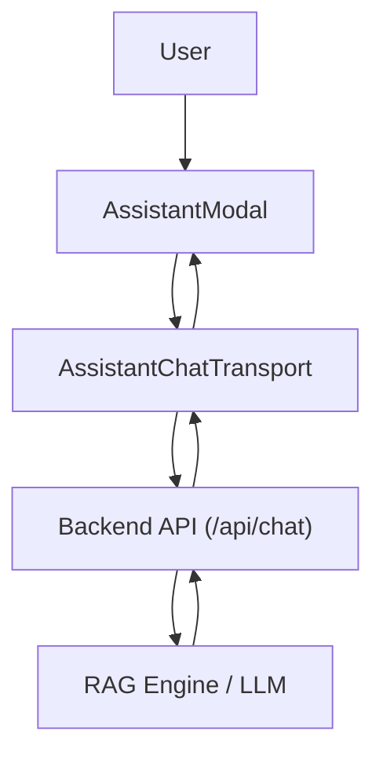

# AI Assistant Implementation

GitDex integrates a sophisticated AI-powered chat interface designed to help users explore and understand complex codebases. The implementation leverages `@assistant-ui/react` for the UI layer and a custom RAG (Retrieval-Augmented Generation) backend.

## Architecture Overview

The assistant is implemented as a decoupled client-side runtime that communicates with a specialized chat API. The client sends repository context via HTTP headers, ensuring the AI responds based on the currently viewed codebase.

## UI Components

### Assistant Modal
The `AssistantModal` serves as the primary entry point. It manages the visibility and responsive layout of the chat interface.

- **Responsive Design**: On desktop, it renders as a 480px wide sidebar. On mobile, it transitions to a full-screen overlay.
- **Runtime Configuration**: It utilizes `useChatRuntime` and `AssistantChatTransport` to connect to the API.
- **Context Injection**: The component passes the current `owner` and `repo` as custom headers (`x-github-owner`, `x-github-repo`), allowing the backend to scope its retrieval to the correct repository.

### Conversation Thread
The `Thread` component provides a feature-rich chat experience using a primitive-based architecture:

- **Welcome State**: When the thread is empty, `ThreadWelcome` displays a greeting and a set of `SUGGESTIONS` (e.g., "Explain the architecture", "Show me the API routes") to guide the user.
- **Message Rendering**: 
    - **User Messages**: Rendered with a distinct background and an edit action bar.
    - **Assistant Messages**: Support `MarkdownText` for code blocks and formatted text, and `ToolFallback` for handling tool-calling states.
- **Advanced Controls**:
    - **Branching**: Integrated `BranchPicker` allows users to navigate through different versions of a conversation after editing a previous prompt.
    - **Action Bar**: Provides utilities to copy messages, export responses as Markdown, or refresh the last generation.
- **Composer**: A flexible input area supporting attachments and a dynamic state (Send vs. Cancel/Stop) based on whether the AI is currently generating a response.

## QA Schema and Retrieval

To ensure high-quality, verifiable responses, GitDex utilizes a structured QA schema defined via `zod`. This schema governs how the AI provides citations and confidence levels.

### Citation Schema (`ProvideLinksToolSchema`)
The system supports rich citations to ensure that AI responses are grounded in actual code or documentation. The `LinkSchema` tracks:
- **Label**: The footnote identifier.
- **URL**: The direct link to the source.
- **Type**: Categorizes the source (e.g., `documentation`, `github_issue`, `stackoverflow_question`, `discord_message`).
- **Breadcrumbs**: A path array for better navigational context.

### Confidence Annotations (`ProvideAIAnnotationsToolSchema`)
The assistant can annotate its own confidence levels to alert the user when a response might be speculative. The `KnownAnswerConfidence` enum includes:
- `very_confident`
- `somewhat_confident`
- `not_confident`
- `no_sources`

This schema allows the UI to potentially render visual cues (like warnings or badges) when the AI is not confident in its retrieval.