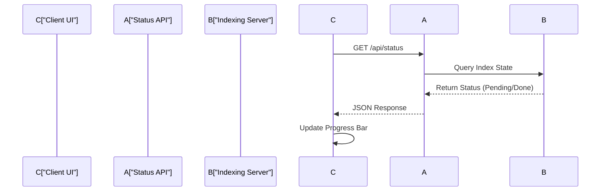

# API & Infrastructure

The API & Infrastructure layer manages the bridge between the Next.js documentation client and the indexing server. It handles request routing for serverless deployment, provides status endpoints for repository ingestion tracking, and manages the client-side polling mechanism to update the UI during the indexing lifecycle.

## Serverless Deployment Configuration

GitDex utilizes Vercel's serverless functions to host the indexing server. The routing is configured to treat the backend as a single-entry point application, ensuring all requests are funneled through the main handler.

```json title="server/vercel.json"
{
  "version": 2,
  "builds": [
    {
      "src": "index.ts",
      "use": "@vercel/node"
    }
  ],
  "routes": [
    {
      "src": "/(.*)",
      "dest": "index.ts",
      "headers": {
        "Cache-Control": "no-store, must-revalidate"
      }
    }
  ]
}
```

### Infrastructure Specifications

| Parameter | Value | Description |
| :--- | :--- | :--- |
| **Runtime** | `@vercel/node` | Node.js serverless environment for `index.ts`. |
| **Route Pattern** | `/(.*)` | Catch-all route directing all traffic to the backend entry point. |
| **Cache Strategy** | `no-store` | Prevents caching of API responses to ensure real-time indexing status updates. |

## Status Monitoring Architecture

The status monitoring system implements a polling pattern to track the progress of repository indexing. Because indexing is an asynchronous background process, the client must periodically query the API to determine when the documentation is ready for rendering.

### Request Flow



### API Route Handler

The status route acts as a proxy or interface to determine the current state of a specific repository's index.

```typescript title="client/src/app/api/status/route.ts"
import { NextResponse } from 'next/server';

export async function GET(request: Request) {
  // Logic to interface with the indexing server 
  // and return the current state of the repository.
  return NextResponse.json({ 
    status: 'indexing' | 'completed' | 'error',
    progress: number 
  });
}
```

## Client-Side Polling Logic

The `/status` page implements a state-driven polling mechanism using `useEffect` and `useCallback`. It manages three primary states: triggering the index, polling for completion, and handling errors.

### Indexing Lifecycle Management

```tsx title="client/src/app/[owner]/[repo]/status/page.tsx"
const initPoll = async () => {
  const result = await checkStatus();
  if (result.status === 'completed') {
    // Transition to documentation view
    router.push(`/${owner}/${repo}`);
    return true;
  }
  // Continue polling via timeout
  setTimeout(initPoll, 3000);
  return false;
};

const indexRepo = async () => {
  await fetch(`/api/index?owner=${owner}&repo=${repo}`, { method: 'POST' });
  setIndexing(true);
  initPoll();
};
```

### UI State Transitions

The status page maps the backend state to specific UI components to provide user feedback during the ingestion pipeline.

| Backend State | UI Component | Action/Behavior |
| :--- | :--- | :--- |
| `Idle` | `Button` | User triggers `indexRepo()` |
| `Indexing` | `Progress` + `Loader2` | `initPoll()` executes every 3 seconds |
| `Completed` | `BookOpen` | Redirects to documentation root |
| `Error` | `AlertCircle` | Displays failure message and retry option |