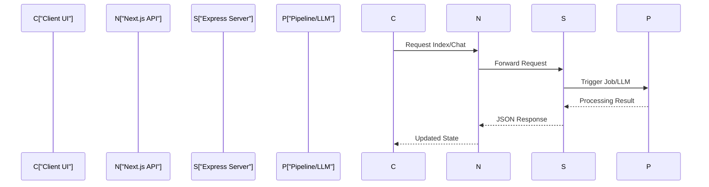
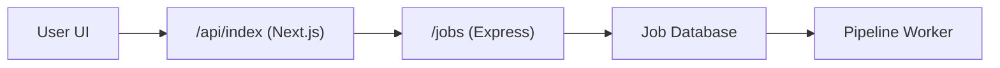

# API Reference

The API layer of GitDex serves as the critical orchestration bridge between the Next.js frontend and the Node.js backend. It transforms high-level user intents—such as "index this repository" or "explain this function"—into actionable pipeline jobs and LLM queries.

The architecture is split into two distinct layers: **Client-Side API Routes** (Next.js Route Handlers), which act as a secure proxy and interface for the browser, and **Server-Side Endpoints** (Express), which handle the heavy lifting of repository indexing, job state management, and AI integration.

## API Architectural Flow

Requests typically follow a proxied path to maintain security and leverage Next.js's edge capabilities before hitting the core backend logic.



## Server-Side Endpoints

The backend server, implemented via Express, manages the lifecycle of repository analysis. It is divided into job orchestration and AI interaction.

### Job Management
These endpoints handle the asynchronous nature of repository indexing, allowing the system to track progress without blocking the main thread.

| Endpoint | Method | Controller Action | Description |
| :--- | :--- | :--- | :--- |
| `/jobs` | `POST` | `createJob` | Initializes a new indexing job for a target repository. |
| `/jobs/:id` | `GET` | `getJobStatus` | Retrieves the current state of a specific job by ID. |
| `/jobs/status/:name` | `GET` | `getStatusByName` | Checks the status of a job using a human-readable repository name. |
| `/jobs/next` | `POST` | `executeNextStep` | Triggers the next phase of the indexing pipeline. |
| `/jobs/heal` | `POST` | `cronHeal` | A maintenance endpoint used to recover stalled jobs. |

### AI Chat Interface
The chat endpoint provides the primary interface for interacting with the indexed repository data.

| Endpoint | Method | Controller Action | Description |
| :--- | :--- | :--- | :--- |
| `/chat` | `POST` | `handleChat` | Processes user queries and returns AI-generated insights based on repo context. |

### Security & Triggering
To prevent unauthorized access to pipeline triggers and maintenance tasks, GitDex utilizes Qstash signature verification.

```typescript
const verifyQstashSignature = async (req: any, res: any, next: any) => {
  // Validates that the request originates from a trusted Qstash webhook
  // This ensures /jobs/heal and /jobs/next cannot be triggered by external actors
};
```

This middleware is applied to critical infrastructure routes to ensure that only scheduled cron jobs or authorized system events can advance the pipeline.

## Client-Side API Routes

Next.js route handlers are used to abstract the backend complexity from the frontend and provide a clean internal API for the UI components.

### Indexing Route
The `/api/index` route serves as the entry point for initiating the repository analysis process from the browser.

```typescript
// client/src/app/api/index/route.ts
export async function POST(request: Request) {
  // Extracts repository details from the request body
  // Proxies the request to the Backend Server /jobs endpoint
  // Returns the created Job ID to the frontend for polling
}
```

### Request Lifecycle: Indexing a Repo
When a user submits a repository for indexing, the following internal flow occurs:



1. **Initiation**: The client calls the Next.js `POST /api/index`.
2. **Creation**: The Next.js route forwards the payload to the Express `/jobs` endpoint.
3. **Persistence**: The `createJob` controller persists the job state in the database.
4. **Execution**: The system triggers the pipeline, and the client begins polling `/jobs/:id` to update the progress bar in the UI.