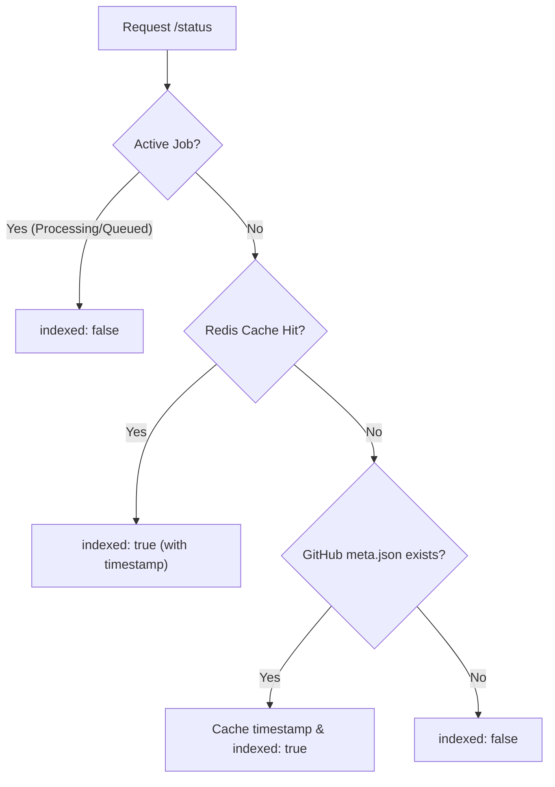
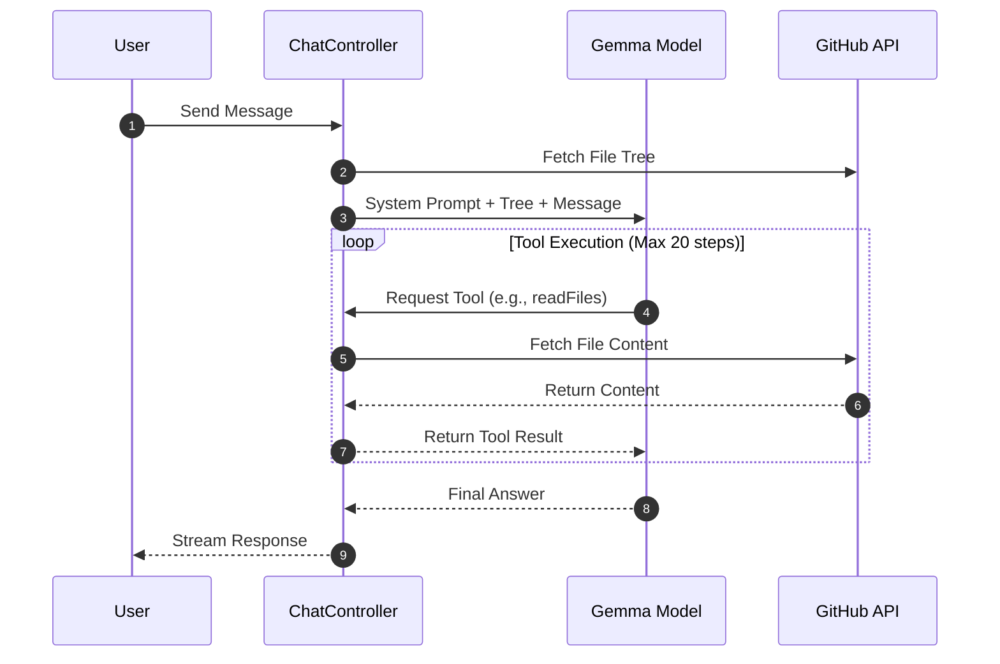

# Backend API & Controllers

The backend API serves as the orchestration layer for GitDex, managing the lifecycle of repository indexing jobs and powering the AI-driven chat interface. It is built using Express and integrates with GitHub's REST API, Redis for caching, and QStash for asynchronous pipeline execution.

## API Endpoint Overview

The primary routing is handled by the `jobsRoutes.ts` file, which exposes endpoints for job management, status tracking, and AI interactions [server/src/routes/jobsRoutes.ts:25-28]().

| Endpoint | Method | Controller/Handler | Description |
| :--- | :--- | :--- | :--- |
| `/index` | `POST` | `createJob` | Initiates a new indexing job for a repository [server/src/routes/jobsRoutes.ts:25](). |
| `/status/:jobId` | `GET` | `getJobStatus` | Retrieves the current state of a specific job by its ID [server/src/routes/jobsRoutes.ts:26](). |
| `/status` | `GET` | `getStatusByName` | Checks if a repository (owner/repo) is already indexed [server/src/routes/jobsRoutes.ts:27](). |
| `/chat` | `POST` | `handleChat` | Streams AI responses based on repository context [server/src/routes/jobsRoutes.ts:28](). |
| `/pipeline/step` | `POST` | `executeNextStep` | QStash-triggered webhook to advance the indexing pipeline [server/src/routes/jobsRoutes.ts:30-48](). |

## Job Management Logic

The `jobsController.ts` manages how repositories are queued for processing and how their status is reported to the frontend.

### Indexing Job Lifecycle
When a request is made to `/index`, the `createJob` function validates the `repoUrl` [server/src/controllers/jobsController.ts:10](). It then adds the job to the queue [server/src/controllers/jobsController.ts:12](). If the job is newly started and enters a `processing` state, the controller publishes a JSON payload to the `/api/pipeline/step` endpoint via QStash to trigger the first step of the AI pipeline [server/src/controllers/jobsController.ts:15-25]().

### Status Determination Flow
The `getStatusByName` function implements a prioritized check to determine if a repository is "indexed" [server/src/controllers/jobsController.ts:43-105]().

1. **Active Job Priority**: If a job is currently `processing` or `queued`, the API returns `indexed: false` to ensure the frontend continues polling for completion [server/src/controllers/jobsController.ts:56-63]().
2. **Caching Layer**: The system checks Redis for a `last_indexed:${owner}/${repo}` key to avoid redundant GitHub API calls [server/src/controllers/jobsController.ts:66-67]().
3. **GitHub Verification**: On a cache miss, the controller attempts to locate a `meta.json` file within the project's documentation repository [server/src/controllers/jobsController.ts:72-76](). If found, it retrieves the commit timestamp to verify the index exists [server/src/controllers/jobsController.ts:78-84]().

## AI Chat Engine

The `chatController.ts` implements a sophisticated RAG (Retrieval-Augmented Generation) loop using the AI SDK and Google's Gemma model [server/src/controllers/chatController.ts:65-66]().

### Contextual Grounding
To ensure the AI remains focused on the target repository, the controller performs the following:
- **Identity Enforcement**: A strict system prompt restricts the AI to answering only questions about the specific `${owner}/${repo}` repository [server/src/controllers/chatController.ts:34-53]().
- **Automated Context**: The controller fetches a recursive file tree (up to 300 items) from GitHub and injects it into the system prompt to give the AI an immediate overview of the project structure [server/src/controllers/chatController.ts:21-32]().
- **Referer Parsing**: If headers are missing, the controller can extract the repository owner and name from the HTTP referer [server/src/controllers/chatController.ts:146-157]().

### Tool-Based Exploration
The AI is not limited to the initial file tree; it can interactively explore the codebase using three defined tools [server/src/controllers/chatController.ts:71-137]():

| Tool | Description | Implementation Detail |
| :--- | :--- | :--- |
| `listFiles` | Lists files/dirs at a path | Uses `octokit.rest.repos.getContent` [server/src/controllers/chatController.ts:76-84](). |
| `readFile` | Reads a single file | Base64 decodes content; truncates at 15,000 characters [server/src/controllers/chatController.ts:87-97](). |
| `readFiles` | Reads up to 5 files | Batch processing for efficiency; truncates at 10,000 characters per file [server/src/controllers/chatController.ts:100-128](). |

### Interaction Sequence

## Security & Infrastructure

### QStash Signature Verification
To prevent unauthorized triggers of the indexing pipeline, the `/pipeline/step` route uses a `verifyQstashSignature` middleware [server/src/routes/jobsRoutes.ts:13-30](). It utilizes the `@upstash/qstash` `Receiver` to validate the `upstash-signature` header against the raw request body using configured signing keys [server/src/routes/jobsRoutes.ts:15-27]().

### Resource Constraints
- **AI Iterations**: The chat loop is capped at 20 steps using `stepCountIs(20)` to prevent infinite loops and excessive token usage [server/src/controllers/chatController.ts:140]().
- **Payload Management**: When retrieving job status, the massive `data` payload is explicitly omitted from the response to reduce bandwidth [server/src/controllers/jobsController.ts:39]().