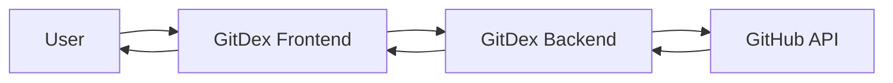
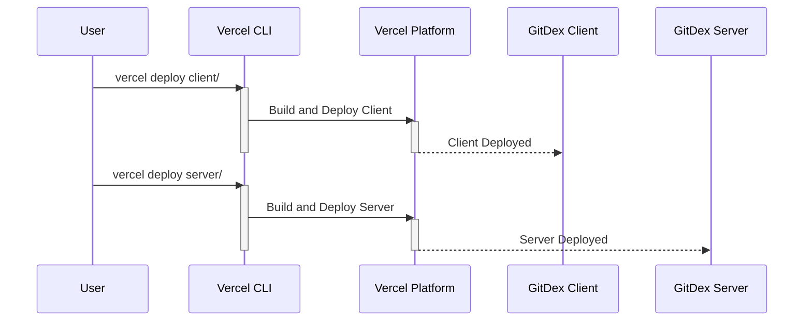

# Configuration and Deployment

This document provides a comprehensive guide to configuring and deploying GitDex in various environments. We will cover key configuration files, deployment strategies using Vercel, and essential integration points.

## Vercel Deployment

GitDex is designed for easy deployment using Vercel. Two primary `vercel.json` files are used, one for the client (frontend) and one for the server (backend).

### Client Configuration (`client/vercel.json`)

The client-side `vercel.json` file configures the Next.js frontend. It specifies the build and install commands, framework, and API rewrites.

```json title="client/vercel.json"
{
  "version": 2,
  "buildCommand": "bun run build",
  "installCommand": "bun install",
  "framework": "nextjs",
  "rewrites": [
    {
      "source": "/api/(.*)",
      "destination": "/api/$1"
    }
  ]
}
```

- **version**: Specifies the Vercel configuration version.
- **buildCommand**:  `bun run build` triggers the Next.js build process using Bun. [View on GitHub](https://github.com/shinymack/gitdex/blob/main/client/vercel.json)
- **installCommand**: `bun install` installs the project dependencies using Bun.
- **framework**:  Specifies `nextjs` framework.
- **rewrites**:  Rewrites any requests to `/api/*` to the corresponding serverless function.

### Server Configuration (`server/vercel.json`)

The server-side `vercel.json` file defines how the backend, built with Node.js, is deployed.

```json title="server/vercel.json"
{
  "version": 2,
  "builds": [
    {
      "src": "index.js",
      "use": "@vercel/node"
    }
  ],
  "routes": [
    {
      "src": "/(.*)",
      "dest": "index.js"
    }
  ]
}
```

- **version**: Specifies the Vercel configuration version.
- **builds**: Defines the build process, specifying that `index.js` should be built using the `@vercel/node` builder. [View on GitHub](https://github.com/shinymack/gitdex/blob/main/server/vercel.json)
- **routes**:  Routes all incoming requests to `index.js`, which handles the backend logic.

### Deployment Workflow

1.  **Clone the Repository**: Clone the GitDex repository to your local machine.
2.  **Vercel CLI**: Install the Vercel CLI if you haven't already.
3.  **Vercel Login**: Login to your Vercel account using the CLI.
4.  **Deploy**: Deploy both client and server by navigating to their respective directories (`client` and `server`) and running `vercel`.

## Configuration Files

### `client/source.config.ts`

This file configures the documentation site using Fumadocs.  It allows customization of the documentation's behavior, including MDX processing via remark plugins.

```typescript title="client/source.config.ts"
import { defineDocs, defineConfig } from 'fumadocs-mdx/config';
import { remarkMdxMermaid } from 'fumadocs-core/mdx-plugins';

export default defineConfig({
  mdxOptions: {
    remarkPlugins: [remarkMdxMermaid],
  },
});
```

- **defineConfig**:  Configures Fumadocs, allowing customization of MDX processing.
- **mdxOptions**:  Configures MDX-specific options.
- **remarkPlugins**:  Adds the `remarkMdxMermaid` plugin, enabling Mermaid diagram support in MDX files. [View on GitHub](https://github.com/shinymack/gitdex/blob/main/client/source.config.ts)

The `remarkMdxMermaid` plugin is crucial for rendering Mermaid diagrams within your documentation.

### `client/theme.config.ts`

While the provided file is empty, `theme.config.ts` is where you would configure the visual theme for the documentation site.  This includes colors, fonts, and overall styling.  Customizing this file allows you to tailor the documentation's look and feel to match your project's branding.

```typescript title="client/theme.config.ts"
// Theme configurations would go here.
```

## Mermaid Diagram Integration

The `remarkMdxMermaid` plugin enables the use of Mermaid diagrams within the MDX documentation.  This allows for visual representations of workflows, architectures, and other concepts.





This diagram illustrates the basic flow of user interaction with GitDex, from the frontend to the backend, and the interaction with the GitHub API.

## Key Integration Points

GitDex leverages several key technologies and integrations to provide its functionality:

*   **Next.js**: The frontend is built using Next.js, providing a performant and SEO-friendly user interface.
*   **Node.js**: The backend is built with Node.js, handling API requests and data processing.
*   **Vercel**: Provides a seamless deployment experience for both the frontend and backend.
*   **GitHub API**:  GitDex interacts with the GitHub API to fetch repository data and perform actions.
*   **Fumadocs**: Used to generate documentation.
*   **Bun**: GitDex uses Bun as its JavaScript runtime and package manager for faster install and build times.

### Deployment Flow





This sequence diagram showcases the deployment process using the Vercel CLI.

### Best Practices

*   **Environment Variables**: Use environment variables to store sensitive information such as API keys and database credentials. Configure these within Vercel's project settings.
*   **Continuous Integration/Continuous Deployment (CI/CD)**:  Integrate GitDex with a CI/CD pipeline to automate the build, test, and deployment processes. Vercel provides built-in support for CI/CD.
*   **Monitoring and Logging**: Implement monitoring and logging to track the performance and health of GitDex in production.  Vercel provides built-in monitoring tools.
*   **Documentation**:  Keep documentation up-to-date to ensure that users can easily understand and use GitDex.

By following these guidelines, you can effectively configure and deploy GitDex to meet your specific needs.
```