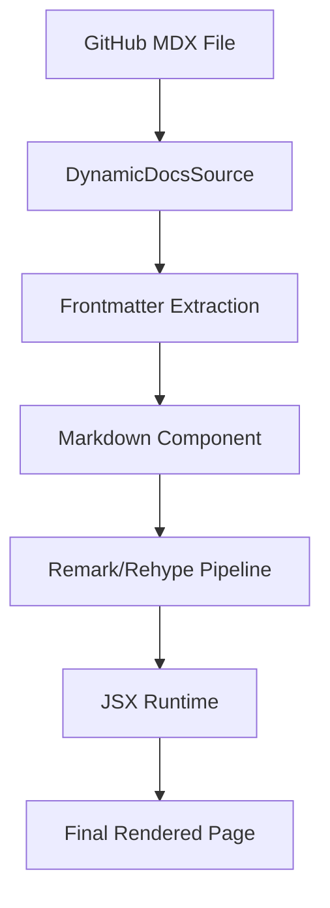

# Content Rendering

GitDex employs a sophisticated rendering pipeline that transforms raw Markdown files from GitHub repositories into interactive, high-performance documentation pages. The system combines static configuration with dynamic runtime processing to support advanced features like Mermaid diagrams, animated text, and dynamic code blocks.

## Rendering Pipeline

The content rendering flow is designed to be asynchronous and cached to ensure a smooth user experience.

## Markdown Processing

The `Markdown` component serves as the primary entry point for content transformation. It utilizes a custom processing pipeline to convert Markdown strings into React nodes.

### Processing Chain
The rendering engine uses the following sequence:
1. **Remark**: Parses the raw Markdown.
   - `remark-gfm`: Enables GitHub Flavored Markdown (tables, checklists, etc.).
2. **Rehype**: Converts the Markdown abstract syntax tree (MDAST) to a Hypertext abstract syntax tree (HAST).
3. **Custom Plugins**: 
   - `rehypeWrapWords`: A specialized plugin that wraps individual words in `` elements with the `animate-fd-fade-in` class to create a staggered entrance animation.
4. **JSX Runtime**: The final HAST is converted to JSX using `toJsxRuntime`, mapping standard HTML elements to specialized Fumadocs components.

### Code Block Enhancement
Standard `<pre>` elements are intercepted and replaced by the `Pre` component. This component detects the language identifier (e.g., `language-typescript`) and renders a `DynamicCodeBlock`, providing enhanced syntax highlighting and layout.

## Mermaid Diagram Integration

GitDex provides first-class support for Mermaid.js diagrams, featuring a robust "healing" layer to handle common syntax errors often found in AI-generated or loosely formatted Markdown.

### Syntax Fixing
Because Mermaid is sensitive to specific characters, the `fixMermaidSyntax` utility automatically sanitizes chart definitions:
- **Node Content**: Wraps labels in quotes to prevent parsing errors caused by special characters.
- **Arrow Normalization**: Converts non-standard arrow notations (e.g., `A ==> B: "Label"`) into valid Mermaid syntax (`A ==>|"Label"| B`).
- **Subgraph Formatting**: Ensures subgraphs are correctly cased and structured.

### Interactive Viewer
To improve the readability of complex diagrams, the `Mermaid` component integrates:
- **Theme Syncing**: Automatically switches between `dark` and `default` Mermaid themes based on the user's system preference.
- **Pan & Zoom**: Integrated `panzoom` allows users to navigate large diagrams using mouse dragging and Ctrl/Cmd + Scroll.
- **Error Boundaries**: If a diagram fails to render after syntax fixing, GitDex displays a user-friendly error box containing the raw source code for debugging.

## Dynamic Source Configuration

The `DynamicDocsSource` class handles the transformation of a flat list of GitHub files into a structured documentation hierarchy.

### Frontmatter Extraction
GitDex parses YAML-like frontmatter from the top of `.mdx` files to determine:
- **Title**: Overrides the default filename-based title.
- **Description**: Used for SEO and page summaries.
- **Sidebar Position**: Controls the manual ordering of pages.

### Hierarchical Page Tree
The system automatically generates a folder-based structure using a prefix-based naming convention (e.g., `1.0_intro.mdx`, `1.1_setup.mdx`). 
- Pages with matching numeric prefixes are grouped into folders.
- The `generateHierarchicalPageTree` method sorts these groups and individual pages based on their `sidebar_position`, ensuring the documentation follows a logical flow.