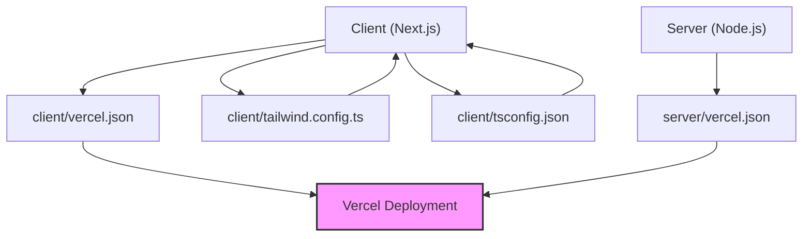

# Deployment and Configuration

This document details the deployment and configuration aspects of GitDex, covering both the client-side (Next.js frontend) and the server-side (Node.js backend). We'll explore key files and settings involved in deploying and customizing the application.

## Client-Side Deployment (Next.js)

The client-side of GitDex is built using Next.js, a React framework.  Deployment is typically handled using platforms like Vercel.

### `client/vercel.json`

This file configures Vercel's deployment settings for the client application.

```json title="client/vercel.json"
{
  "version": 2,
  "buildCommand": "bun run build",
  "installCommand": "bun install",
  "framework": "nextjs",
  "rewrites": [
    {
      "source": "/api/(.*)",
      "destination": "/api/$1"
    }
  ]
}
```

*   **`version`**: Specifies the Vercel configuration version.
*   **`buildCommand`**:  The command to build the Next.js application. Here, it utilizes `bun run build`.
*   **`installCommand`**: The command to install dependencies.  In this case, it uses `bun install`.
*   **`framework`**:  Indicates that the project uses the Next.js framework.
*   **`rewrites`**: Configures URL rewrites.  This example rewrites requests to `/api/*` to the corresponding serverless function.

[View on GitHub](https://github.com/shinymack/gitdex/blob/main/client/vercel.json)

### `client/tailwind.config.ts`

This file customizes the Tailwind CSS configuration for the client application's styling.

```typescript title="client/tailwind.config.ts"
import type { Config } from "tailwindcss"
import tailwindcssanimate from "tailwindcss-animate";
const config: Config = {
    darkMode: "class",
    content: [
        './pages/**/*.{ts,tsx}',
        './components/**/*.{ts,tsx}',
        './app/**/*.{ts,tsx}',
        './src/**/*.{ts,tsx}',
    ],
    prefix: "",
    theme: {
        container: {
            center: true,
            padding: "2rem",
            screens: {
                "2xl": "1400px",
            },
        },
        extend: {
            fontFamily: {
                headline: ['var(--font-mzh)', 'sans-serif'],
                text: ['var(--font-mzt)', 'serif'],
            },
            colors: {
                border: "hsl(var(--border))",
                input: "hsl(var(--input))",
                ring: "hsl(var(--ring))",
                background: "hsl(var(--background))",
                foreground: "hsl(var(--foreground))",
                primary: {
                    DEFAULT: "hsl(var(--primary))",
                    foreground: "hsl(var(--primary-foreground))",
                },
                secondary: {
                    DEFAULT: "hsl(var(--secondary))",
                    foreground: "hsl(var(--secondary-foreground))",
                },
                destructive: {
                    DEFAULT: "hsl(var(--destructive))",
                    foreground: "hsl(var(--destructive-foreground))",
                },
                muted: {
                    DEFAULT: "hsl(var(--muted))",
                    foreground: "hsl(var(--muted-foreground))",
                },
                accent: {
                    DEFAULT: "hsl(var(--accent))",
                    foreground: "hsl(var(--accent-foreground))",
                },
                popover: {
                    DEFAULT: "hsl(var(--popover))",
                    foreground: "hsl(var(--popover-foreground))",
                },
                card: {
                    DEFAULT: "hsl(var(--card))",
                    foreground: "hsl(var(--card-foreground))",
                },
            },
            borderRadius: {
                lg: "var(--radius)",
                md: "calc(var(--radius) - 2px)",
                sm: "calc(var(--radius) - 4px)",
            },
            keyframes: {
                "accordion-down": {
                    from: { height: "0" },
                    to: { height: "var(--radix-accordion-content-height)" },
                },
                "accordion-up": {
                    from: { height: "var(--radix-accordion-content-height)" },
                    to: { height: "0" },
                },
            },
            animation: {
                "accordion-down": "accordion-down 0.2s ease-out",
                "accordion-up": "accordion-up 0.2s ease-out",
            },
        },
    },
    plugins: [tailwindcssanimate],
}

export default config;
```

*   **`darkMode`**: Enables dark mode using CSS classes.
*   **`content`**:  Specifies the files to scan for Tailwind CSS classes. This ensures that only used styles are included in the final CSS.
*   **`theme.extend`**: Extends the default Tailwind CSS theme with custom fonts, colors, border radii, keyframes, and animations.  This allows for a unique and branded look and feel.
*   **`plugins`**:  Includes Tailwind CSS plugins, such as `tailwindcssanimate`, which provides pre-built animations.

[View on GitHub](https://github.com/shinymack/gitdex/blob/main/client/tailwind.config.ts)

### `client/tsconfig.json`

This file configures the TypeScript compiler options for the client application.

```json title="client/tsconfig.json"
{
  "compilerOptions": {
    "target": "ES2017",
    "lib": ["dom", "dom.iterable", "esnext"],
    "allowJs": true,
    "skipLibCheck": true,
    "strict": true,
    "noEmit": true,
    "esModuleInterop": true,
    "module": "esnext",
    "moduleResolution": "bundler",
    "resolveJsonModule": true,
    "isolatedModules": true,
    "jsx": "preserve",
    "incremental": true,
    "plugins": [
      {
        "name": "next"
      }
    ],
    "paths": {
      "@/*": ["./*"]
    }
  },
  "include": ["next-env.d.ts", "**/*.ts", "**/*.tsx", ".next/types/**/*.ts", "theme.config.ts", "src/app/docs/[owner]/[repo]/[[...slug]]/page.tsx"],
  "exclude": ["node_modules"]
}
```

*   **`compilerOptions`**:  Defines various compiler options such as target ECMAScript version, included libraries, module system, and JSX handling.  The `"strict": true` option enforces stricter type checking.
*   **`plugins`**: Uses the Next.js TypeScript plugin for enhanced type checking and features.
*   **`paths`**:  Configures path aliases, allowing for shorter and more readable import statements (e.g., `@/*` maps to the project root).
*   **`include`**: Specifies the files to include in the compilation process.

[View on GitHub](https://github.com/shinymack/gitdex/blob/main/client/tsconfig.json)

## Server-Side Deployment (Node.js)

The server-side likely handles API endpoints and other backend logic.  It can be deployed using Vercel or other Node.js hosting platforms.

### `server/vercel.json`

This file configures Vercel's deployment settings for the server application.

```json title="server/vercel.json"
{
  "version": 2,
  "builds": [
    {
      "src": "index.js",
      "use": "@vercel/node"
    }
  ],
  "routes": [
    {
      "src": "/(.*)",
      "dest": "index.js"
    }
  ]
}
```

*   **`version`**: Specifies the Vercel configuration version.
*   **`builds`**:  Defines how the server-side code is built. In this case, it uses `@vercel/node` to deploy the `index.js` file as a serverless function.
*   **`routes`**:  Configures routes for the server. This example routes all requests to the `index.js` file.

[View on GitHub](https://github.com/shinymack/gitdex/blob/main/server/vercel.json)

## Configuration Overview

The following Mermaid diagram illustrates a high-level overview of the deployment configuration process:





## Key Integration Points

*   **API Endpoint Routing:** The `rewrites` configuration in `client/vercel.json` is crucial for directing API requests from the client to the serverless functions.  Ensure these routes match the API endpoints defined in your server-side code.
*   **Tailwind CSS Customization:**  The `client/tailwind.config.ts` file enables extensive customization of the application's look and feel.  Leverage the theme extensions and plugins to create a visually appealing and branded experience.
*   **TypeScript Configuration:**  The `client/tsconfig.json` file ensures type safety and code quality.  Pay attention to the `strict` option and path aliases for improved development workflow.
*   **Vercel Deployment:** Both `client/vercel.json` and `server/vercel.json` are essential for seamless deployment on Vercel.  Verify the build and install commands are accurate for your project setup. Ensure you have a Vercel account and the Vercel CLI installed to deploy your application.

## Best Practices

*   **Environment Variables:**  Use environment variables for sensitive information like API keys and database credentials.  Vercel provides a secure way to manage environment variables.
*   **Code Splitting:**  Implement code splitting in your Next.js application to improve performance by loading only the necessary code for each page.
*   **Caching:**  Leverage caching mechanisms on both the client and server-side to reduce latency and improve response times.
*   **Monitoring:**  Set up monitoring tools to track the performance and health of your deployed application. Vercel offers built-in monitoring features.

The following code snippet provides an example of how to use environment variables in your Next.js application:

```typescript title="components/ExampleComponent.tsx"
const apiKey = process.env.NEXT_PUBLIC_API_KEY;

const ExampleComponent = () => {
  return (
    <div>
      API Key: {apiKey}
    </div>
  );
};

export default ExampleComponent;
```

**Explanation:** This code retrieves the API key from the `process.env` object, which contains environment variables. The `NEXT_PUBLIC_` prefix makes the variable accessible in the browser.

[View on GitHub](https://github.com/shinymack/gitdex/blob/main/components/ExampleComponent.tsx)

This guide provides a foundational understanding of the deployment and configuration aspects of GitDex. Remember to adapt these settings to your specific needs and environment.
```