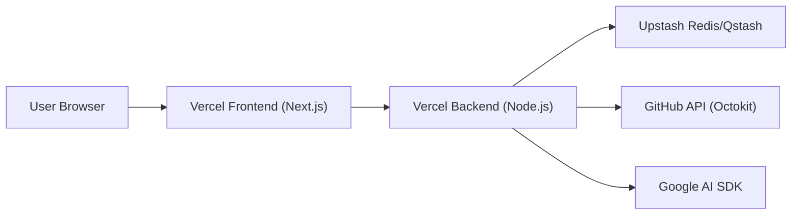

# Deployment and Configuration

GitDex is designed as a full-stack application consisting of a Next.js frontend and a Node.js/Bun backend. The project is optimized for deployment on Vercel, utilizing serverless functions for the backend and a managed build pipeline for the frontend.

## Deployment Architecture

The application follows a decoupled architecture where the client communicates with a specialized backend server that handles heavy-duty indexing and AI orchestration.



## Server Deployment

The backend is implemented as an Express application designed to run within Vercel's serverless environment.

### Vercel Configuration
The server uses a `vercel.json` configuration to route all incoming traffic to a single entry point (`index.ts`) using the `@vercel/node` runtime.

| Property | Value | Description |
| :--- | :--- | :--- |
| Build Source | `index.ts` | The main entry point for the server. |
| Runtime | `@vercel/node` | Vercel's Node.js serverless runtime. |
| Route Pattern | `/(.*)` | All requests are proxied to `index.ts`. |
| Cache Control | `no-store` | Ensures responses are not cached by the edge. |

### Local Development
For local development, the server uses the Bun runtime for high-performance execution and hot-reloading.

```bash
# Install dependencies
bun install

# Start in development mode with watch support
bun run dev
```

## Client Deployment

The frontend is a Next.js application leveraging the App Router and Turbopack for optimized build times.

### Build Process
The client is configured to use Turbopack for both development and production builds to accelerate the compilation of the complex UI components and AI SDK integrations.

| Stage | Command | Purpose |
| :--- | :--- | :--- |
| Development | `next dev --turbopack` | Local dev server with fast refresh. |
| Build | `next build --turbopack` | Production optimization and bundling. |
| Start | `next start` | Launching the production server. |

### Key Frontend Dependencies
The client integrates several specialized libraries that require specific environment considerations:
* **AI Interface:** `@assistant-ui` and `@ai-sdk/react` for the chat experience.
* **Documentation:** `fumadocs` for MDX-based content rendering.
* **Visualizations:** `three`, `mermaid`, and `react-svg-pan-zoom` for codebase mapping.

## Environment and Configuration

The application requires several external service integrations. Configuration is managed via environment variables (handled by `dotenv` on the server).

### Required Integration Services

| Service | Library Used | Purpose |
| :--- | :--- | :--- |
| **Google AI** | `@ai-sdk/google` | LLM powering the repository analysis. |
| **Upstash** | `@upstash/redis` | State management and caching. |
| **Upstash** | `@upstash/qstash` | Asynchronous job queue for indexing. |
| **GitHub** | `@octokit/rest` | Repository data retrieval. |

## Invariants & Failure Modes

### Architectural Trade-offs
* **Serverless Backend:** By using `@vercel/node` and routing all requests to `index.ts`, the backend behaves as a monolithic serverless function. This simplifies routing but may lead to "cold starts" during periods of inactivity.
* **Async Indexing:** Because repository indexing is resource-intensive, the system uses `@upstash/qstash` to move indexing logic out of the request-response cycle. This prevents Vercel function timeouts.

### Potential Failure Modes
* **Rate Limiting:** High-frequency calls to the GitHub API via `Octokit` or the Google AI SDK may trigger rate limits.
* **Memory Constraints:** Large repository indexing may exceed the memory limits of serverless functions; this is mitigated by the queue-based processing model.
* **CORS Policy:** The server uses the `cors` middleware to manage cross-origin requests between the Vercel frontend and backend domains. Misconfiguration here will result in `403 Forbidden` or `CORS` errors in the browser.