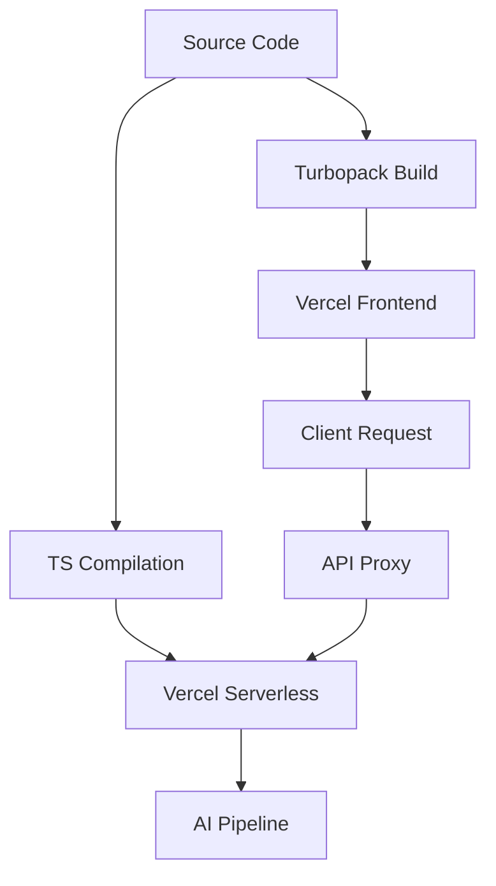

# Deployment & Environment

## System Role & Architectural Position

The Deployment & Environment layer governs the transformation of the GitDex codebase into executable cloud artifacts. The architecture utilizes a decoupled deployment strategy: a static-optimized frontend powered by Next.js and a serverless backend orchestration layer hosted on Vercel. This separation ensures that the high-compute requirements of the AI processing pipeline (Backend Core Engine) do not block the delivery of the AI Experience Layer (Frontend).

The deployment environment is characterized by a strict build-time dependency graph and a runtime configuration that prioritizes low-latency routing for chat interactions and documentation rendering.

### Environmental Specifications

| Component | Runtime/Environment | Build Tooling | Primary Deployment Target | Key Constraint |
| :--- | :--- | :--- | :--- | :--- |
| **Frontend** | Next.js 16 (React 19) | Turbopack / Tailwind 4 | Vercel Edge/Serverless | Bundle size & Hydration |
| **Backend** | Node.js (@vercel/node) | TypeScript Compiler | Vercel Serverless | Execution Timeout |
| **CLI Tooling** | @fumadocs/cli | Node.js | Local Development | Path Alias Resolution |
| **AI SDK** | Vercel AI SDK 6.0 | npm / pnpm | Cloud Runtime | API Rate Limits |

## Core Execution & Data Flow Mechanics

The deployment pipeline follows a unidirectional flow from source to cloud. The frontend leverages Turbopack for incremental builds, significantly reducing the time to generate the documentation site from MDX source files. The backend is packaged as a single entry point (`index.ts`), which handles all incoming requests through a unified routing layer.

### Deployment Lifecycle



### Build and Execution Sequence
1. **Frontend Compilation**: `next build --turbopack` resolves the dependency tree, including the `fumadocs` documentation framework, and generates optimized chunks for the AI Experience Layer.
2. **CLI Configuration**: The `@fumadocs/cli` utilizes `cli.json` to map UI components and styles, ensuring consistent documentation rendering across different build environments.
3. **Backend Provisioning**: The `vercel.json` configuration instructs the Vercel runtime to treat `index.ts` as the primary handler for all routes (`/(.*)`).
4. **Header Injection**: The serverless runtime injects `Cache-Control: no-store, must-revalidate` headers to prevent the caching of dynamic AI responses and indexing states.

## Implementation Deep Dive

### Frontend Build Orchestration
The `package.json` defines the operational scripts for the client. The adoption of Turbopack suggests a requirement for high-velocity iteration cycles during the development of the AI interface.

```json title="client/package.json"
{
  "scripts": {
    "dev": "next dev --turbopack",
    "build": "next build --turbopack",
    "start": "next start",
    "lint": "eslint"
  },
  "dependencies": {
    "next": "^16.2.9",
    "react": "^19.2.7",
    "ai": "^6.0.208",
    "fumadocs-ui": "^15.8.5"
  }
}
```
- **`--turbopack`**: Replaces Webpack for faster bundling and HMR (Hot Module Replacement) during development and build phases.
- **`next build`**: Generates the production-ready `.next` folder, optimizing the AI-SDK and Radix-UI components for the browser.

### Serverless Routing Configuration
The backend is configured as a monolithic serverless function. This simplifies the deployment of the Node.js orchestration layer and ensures a single point of entry for all API requests.

```json title="server/vercel.json"
{
  "version": 2,
  "builds": [
    {
      "src": "index.ts",
      "use": "@vercel/node"
    }
  ],
  "routes": [
    {
      "src": "/(.*)",
      "dest": "index.ts",
      "headers": {
        "Cache-Control": "no-store, must-revalidate"
      }
    }
  ]
}
```
- **`@vercel/node`**: Specifies the runtime environment for the `index.ts` entry point.
- **`src: "/(.*)"`**: A wildcard route that directs all incoming traffic to the core backend engine, allowing the internal router to handle endpoint dispatching.
- **`Cache-Control`**: Forced invalidation ensures that the client always receives the most recent state of the repository indexing process.

### Documentation CLI Schema
The `cli.json` file provides the mapping for the Fumadocs CLI, allowing the system to automate the generation of documentation components.

```json title="client/cli.json"
{
  "$schema": "node_modules/@fumadocs/cli/dist/schema/src.json",
  "aliases": {
    "uiDir": "./src/components/ui",
    "componentsDir": "./src/components",
    "blockDir": "./src/components",
    "cssDir": "./src/styles",
    "libDir": "./src/lib"
  },
  "baseDir": "src",
  "uiLibrary": "radix-ui"
}
```
- **`aliases`**: Maps logical directory names to physical paths, enabling the CLI to inject generated components into the correct architectural layers.
- **`uiLibrary`**: Explicitly sets `radix-ui` as the primitive provider, ensuring the CLI generates compatible accessibility-first components.

## Method / State Reference & Error Recovery

### Deployment Configuration Parameters

| Parameter | Source | Type | Purpose | Default/Requirement |
| :--- | :--- | :--- | :--- | :--- |
| `NEXT_PUBLIC_API_URL` | Env Var | String | Backend API endpoint | Required for Client $\rightarrow$ Server communication |
| `VERCEL_REGION` | Vercel Config | String | Deployment region | Closest to LLM provider to reduce latency |
| `NODE_VERSION` | Engine | String | Node.js runtime version | $\ge$ 18.x (for `@vercel/node`) |
| `TURBOPACK_ENABLED` | Script Flag | Boolean | Bundle optimization | `true` (via `--turbopack`) |

### Failure Modes & Recovery

| Failure Scenario | Root Cause | Impact | Mitigation Strategy |
| :--- | :--- | :--- | :--- |
| **Cold Start Latency** | Serverless function hibernation | Delayed AI response (TTFB) | Use Vercel "Warm" functions or Edge Runtime for API proxy. |
| **Build-time Alias Mismatch** | `cli.json` path inconsistency | Failed documentation render | Verify `baseDir` and `aliases` against physical `src` structure. |
| **Memory Overflow** | Large repository indexing in Node.js | `OOM` (Out of Memory) Crash | Implement streaming data transformation in the AI Processing Pipeline. |
| **Hydration Mismatch** | Next.js 16 / React 19 version conflict | UI flickers/Interactive errors | Synchronize `client/package.json` versions and clear `.next` cache. |