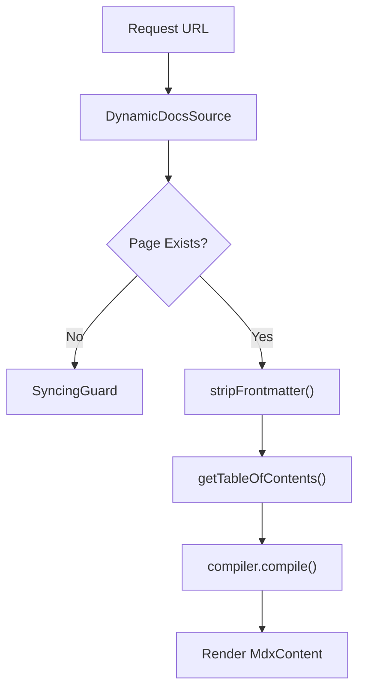

# Frontend Application Structure

GitDex utilizes the Next.js App Router to provide a highly dynamic, repository-centric documentation experience. The application is structured to treat GitHub owners and repositories as top-level dynamic parameters, allowing the platform to scale across any public repository without static route definitions.

## App Router Architecture

The frontend follows a hierarchical layout pattern that separates global application state from repository-specific context.

### Root Layout
The `client/src/app/layout.tsx` file serves as the entry point for the entire application. It configures global providers and styles required for the UI:

- **Theme Management**: Uses `ThemeProvider` for system-aware dark/light mode switching.
- **Documentation Framework**: Wraps the application in `RootProvider` from `fumadocs-ui` to enable documentation features.
- **Typography**: Integrates `MozillaHeadline` and `MozillaText` fonts for consistent branding.
- **Global UI**: Includes a `Toaster` component for application-wide notifications.

### Repository-Level Layout
The `client/src/app/[owner]/[repo]/layout.tsx` layout captures the GitHub `owner` and `repo` parameters from the URL. This layout ensures that every page within a specific repository context has access to the same surrounding UI elements.

A key feature of this layout is the integration of the `AssistantModal`, which is initialized with the current repository context, allowing the AI assistant to remain persistent as the user navigates through different documentation pages of the same project.

## Dynamic Documentation Routing

The core documentation engine is implemented using a catch-all segment at `client/src/app/[owner]/[repo]/[[...slug]]/page.tsx`. This allows GitDex to handle an arbitrary number of nested documentation pages dynamically.

### Route Resolution Logic
The page component implements a specific logic flow to resolve the requested content:

1. **Root Redirect**: If the `slug` is empty (user is at `/[owner]/[repo]`), the system uses `DynamicDocsSource` to identify the first available page and redirects the user there.
2. **Page Retrieval**: If a slug is provided, `DynamicDocsSource` attempts to fetch the corresponding page content.
3. **Syncing Guard**: If the page cannot be found or the repository is still being processed, the `SyncingGuard` component is returned to inform the user that the documentation is being prepared.
4. **Rendering**: Once a page is retrieved, the content is processed and rendered using `DocsPage` and `DocsBody`.

### Routing Map

| Route Pattern | Component/Logic | Purpose |
| :--- | :--- | :--- |
| `/` | `RootLayout` | Global styles, theme, and root providers. |
| `/[owner]/[repo]` | `Layout` $\rightarrow$ `Page` | Repo context setup $\rightarrow$ Redirect to first page. |
| `/[owner]/[repo]/[...slug]` | `Page` | Dynamic MDX rendering for specific docs. |

## Content Processing Pipeline

Because the documentation is generated dynamically, the frontend must handle raw MDX content and convert it into renderable React components on the fly.

### The Compilation Flow



### MDX Handling Details
The application employs a custom preprocessing step to ensure stability during the rendering phase:

- **Frontmatter Stripping**: The `stripFrontmatter` function uses a `while` loop to remove all leading YAML frontmatter blocks (delimited by `---`). This prevents the JSX parser from crashing if the AI model generates duplicate or empty frontmatter blocks.
- **Dynamic Compilation**: The `compiler.compile` method transforms the cleaned MDX string into a React component.
- **Component Mapping**: `getMDXComponents` is used to map standard MDX elements to custom, styled GitDex components.

```typescript
// Example of the frontmatter stripping logic used in the pipeline
function stripFrontmatter(content: string): string {
  let text = content.trim();

  while (text.startsWith('---')) {
    const closeIndex = text.indexOf('---', 3);
    if (closeIndex === -1) break;
    text = text.slice(closeIndex + 3).trim();
  }

  return text;
}
```

## Performance and Rendering Strategy

To ensure the documentation reflects the most current state of the repository analysis, the dynamic routing pages are configured for real-time updates:

- **Dynamic Rendering**: `export const dynamic = 'force-dynamic'` ensures that the page is not statically cached at build time.
- **Cache Invalidation**: `export const revalidate = 0` forces Next.js to fetch fresh data on every request, preventing users from seeing stale documentation after a repository re-index.
- **Static Params**: `generateStaticParams` returns an empty array, explicitly opting out of static site generation (SSG) for these dynamic routes.