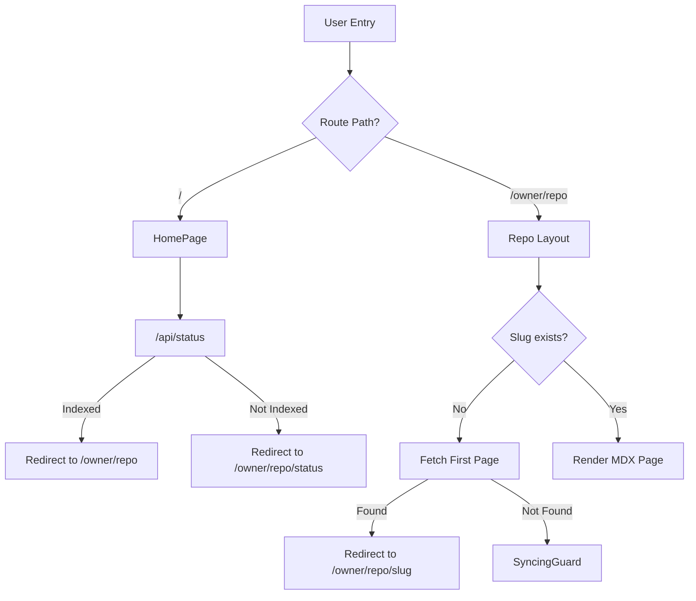
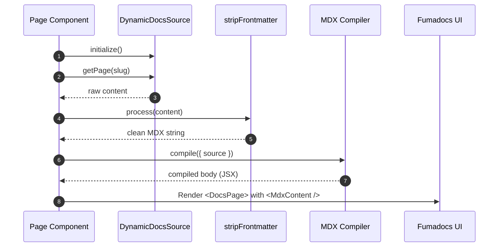

# Frontend Framework and Routing

GitDex utilizes the Next.js App Router to provide a highly dynamic, repository-centric navigation experience. The routing architecture is designed to handle an arbitrary number of GitHub repositories, transforming them into structured documentation sites on the fly.

## Routing Architecture Overview

The project employs a combination of static entry points and nested dynamic segments to manage the transition from the landing page to specific repository documentation.

### Route Map

| Route | Type | Purpose | Key File |
| :--- | :--- | :--- | :--- |
| `/` | Static | Landing page with repository search and discovery. | `app/page.tsx` |
| `/[owner]/[repo]` | Dynamic | Entry point for a specific repository; handles initial redirects. | `app/[owner]/[repo]/[[...slug]]/page.tsx` |
| `/[owner]/[repo]/[...slug]` | Catch-all | Renders specific documentation pages based on the provided slug. | `app/[owner]/[repo]/[[...slug]]/page.tsx` |
| `/[owner]/[repo]/status` | Dynamic | Displays the current indexing status for a repository. | Referenced in `app/page.tsx` |



## Home Page and Repository Entry

The root page (`app/page.tsx`) serves as the gateway to the application. It is a client-side component that handles user input and determines the destination route based on the indexing state of the requested repository.

### Repository Resolution Logic
When a user submits a repository (either via a GitHub URL or `owner/repo` format), the following sequence occurs:
1. **Validation**: The input is passed through `validateGitHubUrl`.
2. **Status Check**: A request is sent to `/api/status?owner={owner}&repo={repo}`.
3. **Conditional Routing**:
    - If the repository is indexed (`data.indexed` or `data.lastIndexed` is true), the user is redirected to the repository's main path.
    - If not indexed, the user is routed to the `/status` page to monitor the ingestion process.

## Dynamic Repository Routing

The application uses nested dynamic segments `[owner]` and `[repo]` to encapsulate all repository-specific logic.

### Repository Layout
The `app/[owner]/[repo]/layout.tsx` provides a shared wrapper for all pages within a specific repository's scope. Its primary responsibility is providing the global AI context via the `AssistantModal`.

```tsx
export default async function Layout(props: LayoutProps) {
  const params = await props.params;

  return (
    <div className="font-sans">
      {props.children ? (
        props.children
      ) : (
        <div className="flex flex-col items-center justify-center min-h-screen">
          <Loader2 className="w-8 h-8 animate-spin mb-4" />
        </div>
      )}
      <AssistantModal owner={params.owner} repo={params.repo} />
    </div>
  );
}
```

### Documentation Page Rendering
The `[[...slug]]` catch-all segment in `app/[owner]/[repo]/[[...slug]]/page.tsx` manages the rendering of the generated documentation. This page is configured as `force-dynamic` with a `revalidate` period of `0` to ensure the latest AI-generated content is always served.

#### Page Resolution Workflow
1. **Initialization**: A `DynamicDocsSource` is instantiated using the `owner` and `repo` parameters.
2. **Slug Handling**:
    - If no slug is provided, the system attempts to locate the first available page via `source.getFirstPage()` and redirects the user there.
    - If a slug is provided, the system attempts to retrieve the corresponding page via `source.getPage(slug)`.
3. **Fallback**: If no page is found, the `SyncingGuard` component is rendered, notifying the user that the documentation is still being prepared.

## MDX Processing Pipeline

Once a page is identified, the raw content is processed through a compilation pipeline before being rendered via the Fumadocs UI.

### Compilation Sequence



### Key Processing Functions

#### Frontmatter Stripping
To prevent the JSX parser from crashing due to raw YAML blocks often generated by LLMs, the `stripFrontmatter` function recursively removes all leading `---` blocks:

```tsx
function stripFrontmatter(content: string): string {
  let text = content.trim();
  while (text.startsWith('---')) {
    const closeIndex = text.indexOf('---', 3);
    if (closeIndex === -1) break;
    text = text.slice(closeIndex + 3).trim();
  }
  return text;
}
```

#### Final Rendering
The final output integrates several components to provide a production-ready documentation experience:
- **`DocsPage` & `DocsBody`**: Provided by `fumadocs-ui` for standard documentation layout.
- **`getTableOfContents`**: Extracts headings from the cleaned MDX to generate navigation.
- **`getMDXComponents`**: Injects custom components into the MDX rendering process, passing the `owner`, `repo`, and `defaultBranch` as context.