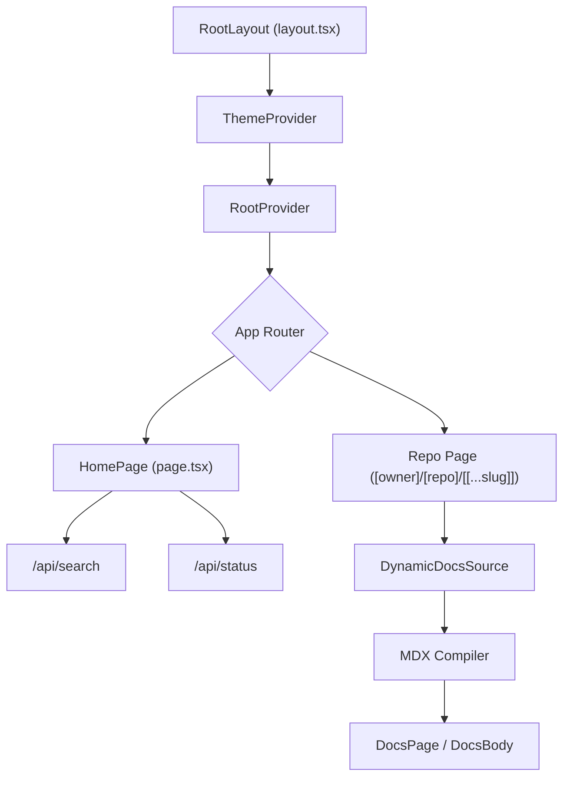

# Frontend Framework

The GitDex frontend is built using the Next.js App Router, leveraging a combination of server-side rendering (SSR) for dynamic documentation and client-side interactivity for repository discovery and search. The framework integrates **Fumadocs** for the documentation UI and MDX rendering, providing a highly performant, searchable documentation experience.

## Global Layout and Provider Hierarchy

The application uses a centralized layout system to manage global state, themes, and UI providers. The `RootLayout` serves as the entry point for all pages, ensuring consistent styling and accessibility.

### Layout Configuration
The root layout implements the following provider stack:
- **ThemeProvider**: Manages light, dark, and system theme switching using `next-themes` Sources: [client/src/app/layout.tsx:18-23]().
- **RootProvider**: A Fumadocs provider that manages the documentation context, with search explicitly disabled in the root to allow for custom repository-level search implementation Sources: [client/src/app/layout.tsx:24-27]().
- **Toaster**: A global notification system powered by `sonner` for application-wide alerts Sources: [client/src/app/layout.tsx:28]().

### Visual Identity
The framework utilizes custom font variables (`MozillaHeadline` and `MozillaText`) applied at the body level to maintain brand consistency Sources: [client/src/app/layout.tsx:17]().

## Dynamic Routing for Repositories

GitDex employs a deeply nested dynamic route structure to handle an arbitrary number of GitHub repositories and their corresponding documentation pages.

### Routing Structure
The primary routing logic is defined in `client/src/app/[owner]/[repo]/[[...slug]]/page.tsx`.

| Route Segment | Type | Purpose |
| :--- | :--- | :--- |
| `[owner]` | Dynamic | The GitHub username or organization name Sources: [client/src/app/[owner]/[repo]/[[...slug]]/page.tsx:12](). |
| `[repo]` | Dynamic | The specific repository name Sources: [client/src/app/[owner]/[repo]/[[...slug]]/page.tsx:13](). |
| `[[...slug]]` | Optional Catch-all | The path to a specific documentation page within the repository Sources: [client/src/app/[owner]/[repo]/[[...slug]]/page.tsx:14](). |

### Page Resolution Logic
The documentation page implements a strict resolution flow to ensure users always see the most relevant content:

1. **Root Request**: If no `slug` is provided, the system initializes a `DynamicDocsSource` and redirects the user to the first available page of the repository. If no pages exist, it renders a `SyncingGuard` component Sources: [client/src/app/[owner]/[repo]/[[...slug]]/page.tsx:37-46]().
2. **Page Retrieval**: For requests with a `slug`, the `DynamicDocsSource` attempts to fetch the specific page. If the page is missing, the `SyncingGuard` is displayed Sources: [client/src/app/[owner]/[repo]/[[...slug]]/page.tsx:51-55]().
3. **Dynamic Rendering**: The page is configured with `force-dynamic` and `revalidate = 0` to ensure that documentation updates are reflected immediately without stale cache interference Sources: [client/src/app/[owner]/[repo]/[[...slug]]/page.tsx:20-21]().

## MDX Processing Pipeline

To transform raw repository content into interactive documentation, GitDex utilizes a specialized compilation pipeline.

### Compilation Workflow
1. **Frontmatter Stripping**: A utility function `stripFrontmatter` recursively removes all leading YAML frontmatter blocks from the raw MDX content to prevent JSX parser crashes caused by double or empty frontmatter generated by AI models Sources: [client/src/app/[owner]/[repo]/[[...slug]]/page.tsx:27-35]().
2. **TOC Generation**: The `getTableOfContents` function analyzes the cleaned MDX content to generate a navigation tree for the page Sources: [client/src/app/[owner]/[repo]/[[...slug]]/page.tsx:57]().
3. **Compilation**: The `compiler.compile` method transforms the MDX string into a React component (`MdxContent`) Sources: [client/src/app/[owner]/[repo]/[[...slug]]/page.tsx:59-63]().
4. **Component Injection**: The final output is wrapped in `DocsPage` and `DocsBody` components, with custom MDX components injected via `getMDXComponents` Sources: [client/src/app/[owner]/[repo]/[[...slug]]/page.tsx:66-70]().

## Home Page and Repository Entry

The home page (`client/src/app/page.tsx`) acts as the primary discovery interface, allowing users to search for repositories and check their indexing status.

### Repository Search & Validation
The search interface implements a debounced request to `/api/search` to provide real-time repository suggestions Sources: [client/src/app/page.tsx:53-64](). Before redirection, the system validates the GitHub URL using `validateGitHubUrl` to ensure the input conforms to expected patterns Sources: [client/src/app/page.tsx:85-89]().

### Status-Based Redirection
The frontend determines the user's destination based on the repository's current indexing state:
- **Indexed/Last Indexed**: Redirects the user directly to the documentation path (e.g., `/owner/repo`) Sources: [client/src/app/page.tsx:97-98]().
- **Not Indexed**: Redirects the user to the status page (e.g., `/owner/repo/status`) to track the indexing progress Sources: [client/src/app/page.tsx:99]().

## Component Relationship Diagrams

### App Router Architecture
This diagram illustrates the relationship between the global layout, the home page, and the dynamic documentation routes.



### Documentation Resolution Sequence
This sequence describes the logic flow when a user requests a repository documentation page.

```mermaid
sequenceDiagram
    autonumber
    participant U as User
    participant P as Page Component
    participant DSS as DynamicDocsSource
    participant C as MDX Compiler
    participant UI as Fumadocs UI

    U ->> P: Request /owner/repo/slug
    P ->> DSS: initialize()
    P ->> DSS: getPage(slug)
    
    alt Page Not Found
        DSS -->> P: null
        P ->> UI: Render <SyncingGuard />
    else Page Found
        DSS -->> P: pageContent
        P ->> P: stripFrontmatter()
        P ->> C: compile(mdxContent)
        C -->> P: MdxContent Component
        P ->> UI: Render <DocsPage> with <MdxContent />
    end