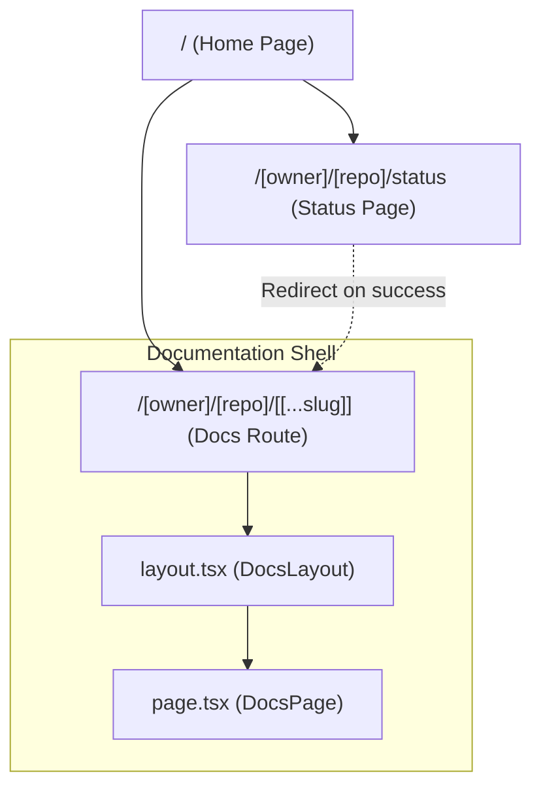
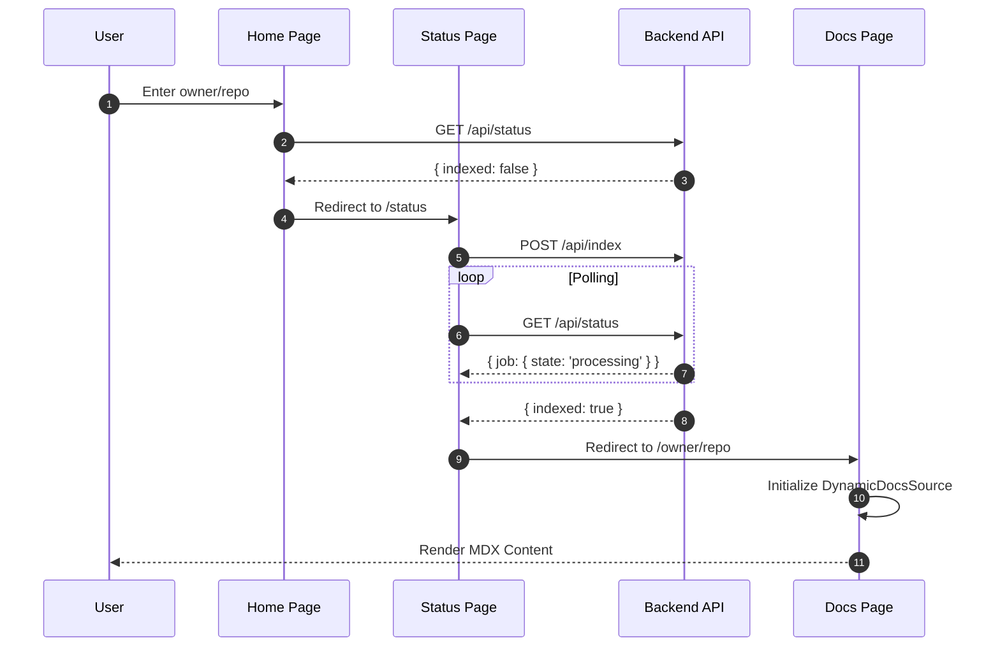

# Frontend Routing & Layout

GitDex utilizes the Next.js App Router to implement a highly dynamic routing system that adapts to GitHub repository structures. The architecture is designed to handle on-demand documentation generation, providing a seamless transition from a repository search to a fully indexed documentation site.

## Route Hierarchy

The application uses a combination of static and dynamic segments to manage the user journey from the landing page to specific documentation slugs.



## Route Analysis

### 1. Landing Page (`/`)
The root page serves as the entry point. It provides a search interface for GitHub repositories and determines the destination route based on the repository's indexing status.

- **Validation**: Uses `validateGitHubUrl` to ensure the input is a valid GitHub link.
- **Redirection Logic**:
  - Calls `/api/status?owner=${owner}&repo=${repo}`.
  - If `data.indexed` or `data.lastIndexed` is true, the user is routed to `/[owner]/[repo]`.
  - Otherwise, the user is routed to `/[owner]/[repo]/status`.

### 2. Status Page (`/[owner]/[repo]/status`)
This is a client-side route that manages the lifecycle of the AI indexing process.

- **Polling Mechanism**: Implements a `useCallback` loop that polls `/api/status` every 2–5 seconds (using a linear backoff).
- **State Management**: Tracks job states including `loading`, `not-indexed`, `queued`, `processing`, and `failed`.
- **Action Trigger**: If a repository is not indexed, the `indexRepo` function sends a POST request to `/api/index` with the repository URL.
- **Completion**: Once `data.indexed` is returned as true, the client triggers `router.push('/${owner}/${repo}')`.

### 3. Dynamic Documentation Route (`/[owner]/[repo]/[[...slug]]`)
This route uses a catch-all segment (`[[...slug]]`) to render the generated documentation.

#### The Layout (`layout.tsx`)
The layout wraps the documentation pages and initializes the global navigation state.

- **`DynamicDocsSource`**: Instantiated using the `owner` and `repo` params to fetch the page tree.
- **Fumadocs Integration**: Utilizes `DocsLayout` to provide the sidebar and navigation.
- **Reindex Capability**: Includes a `ReindexButton` allowing users to trigger a fresh index of the repository from within the docs.

#### The Page (`page.tsx`)
The page component handles the actual rendering of MDX content based on the current slug.

- **Slug Handling**: If the `slug` is empty, the page automatically redirects to the first available page provided by `source.getFirstPage()`.
- **Content Processing**: 
  - **Frontmatter Stripping**: Uses a `stripFrontmatter` function to remove YAML blocks from the top of the AI-generated content to prevent JSX parsing errors.
  - **Compilation**: The cleaned MDX is passed through a custom `compiler.compile()` method.
  - **TOC Generation**: Uses `getTableOfContents` from `fumadocs-core` to generate the right-hand navigation.

## Documentation Navigation Flow

The following sequence diagram illustrates the flow when a user attempts to access documentation for a repository.



## Technical Implementation Details

### Dynamic Segment Resolution
The routing relies on asynchronous `params` resolution to handle the dynamic nature of GitHub repository identifiers.

| Segment | Type | Purpose | Source |
| :--- | :--- | :--- | :--- |
| `[owner]` | Dynamic | GitHub username or organization | URL Param |
| `[repo]` | Dynamic | Repository name | URL Param |
| `[[...slug]]` | Catch-all | Nested documentation paths | URL Param |

### Content Rendering Pipeline
The transition from raw data to a rendered page follows this strict sequence in `page.tsx`:

```typescript
// 1. Resolve route params
const { owner, repo, slug = [] } = await params;

// 2. Initialize data source
const source = new DynamicDocsSource(owner, repo);
await source.initialize();

// 3. Fetch and clean content
const page = source.getPage(slug);
const mdxContent = stripFrontmatter(page.content);

// 4. Compile and Render
const compiled = await compiler.compile({ source: mdxContent });
const MdxContent = compiled.body;
```

### Performance Configurations
To ensure documentation is always up-to-date and reflects the latest AI indexing, the docs page is configured for dynamic rendering:

- `export const dynamic = 'force-dynamic';`: Disables static optimization to ensure the latest index is fetched.
- `export const revalidate = 0;`: Prevents caching of the page content.