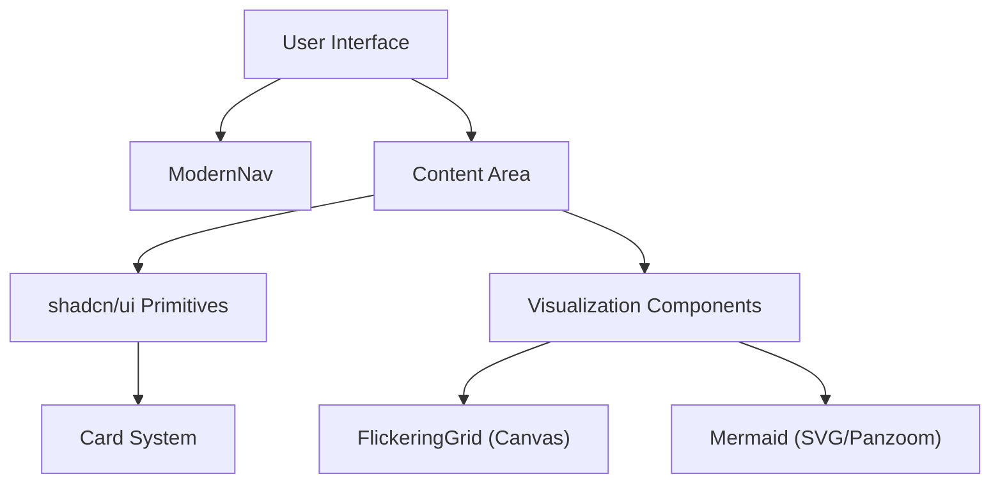

# UI Component System

GitDex employs a hybrid design architecture that balances structural consistency with high-performance technical visualizations. The system is built upon **shadcn/ui** primitives for interface stability and custom-engineered components for data visualization and aesthetic depth.

## Architecture Overview

The UI layer is split between static layout primitives and dynamic visualization engines.

## Core Primitives

The foundation of GitDex is built using Radix UI and Tailwind CSS via shadcn/ui. These components ensure accessibility and a consistent design language.

### Card System
The `Card` component is the primary container for grouping related information. It is composed of several sub-components to maintain a strict typographic hierarchy:

- `Card`: The main container with border and shadow.
- `CardHeader`: Provides spacing and alignment for the top section.
- `CardTitle`: High-emphasis heading.
- `CardDescription`: Muted supporting text.
- `CardContent`: The primary body area.
- `CardFooter`: Bottom alignment for actions or metadata.

## Specialized Visualizations

To handle technical documentation and a "developer-centric" aesthetic, GitDex implements specialized components that go beyond standard HTML elements.

### FlickeringGrid
A high-performance background effect implemented via the HTML5 Canvas API. It creates a subtle, interactive grid of flickering squares that respond to user movement.

**Technical Implementation:**
- **DPI Scaling:** Automatically detects `devicePixelRatio` to ensure sharpness on Retina displays.
- **Interpolation:** Uses linear interpolation for opacity transitions to prevent jarring flicker.
- **Interactive Aura:** Tracks mouse coordinates to increase cell opacity within a 160px radius.

**Configuration Props:**

| Prop | Type | Default | Description |
| :--- | :--- | :--- | :--- |
| `squareSize` | `number` | `4` | The size of each grid cell in pixels. |
| `gridGap` | `number` | `15` | Spacing between cells. |
| `flickerChance` | `number` | `0.1` | Probability of a cell changing target opacity per frame. |
| `maxOpacity` | `number` | `0.15` | The upper limit of cell visibility. |

### Mermaid Diagrams
The `Mermaid` component provides a robust wrapper around `mermaid.js`, transforming text-based chart definitions into interactive SVG visualizations.

**Key Features:**
- **Syntax Normalization:** Includes a `fixMermaidSyntax` engine that automatically wraps long labels with ` ` tags and cleanses quotes to prevent rendering crashes.
- **Dynamic Theme Sync:** Integrates with `next-themes` to switch between `dark` and `default` Mermaid themes in real-time.
- **Pan & Zoom:** Wraps the resulting SVG in a `panzoom` container, allowing users to navigate complex diagrams via dragging and Ctrl/Cmd + Scroll.
- **Error Boundary:** Captures rendering failures and displays the raw chart code in a debug-friendly UI.

## Layout & Navigation

### ModernNav
The navigation system utilizes glassmorphism and fluid animations to provide a lightweight feel.

- **Visual Style:** `backdrop-blur-md` with a semi-transparent background (`bg-background/45`).
- **Responsiveness:** Transitions from a centered desktop pill to a mobile-optimized menu with a slide-down drawer.
- **Theme Integration:** Direct coupling with the `useTheme` hook for instant light/dark mode switching.