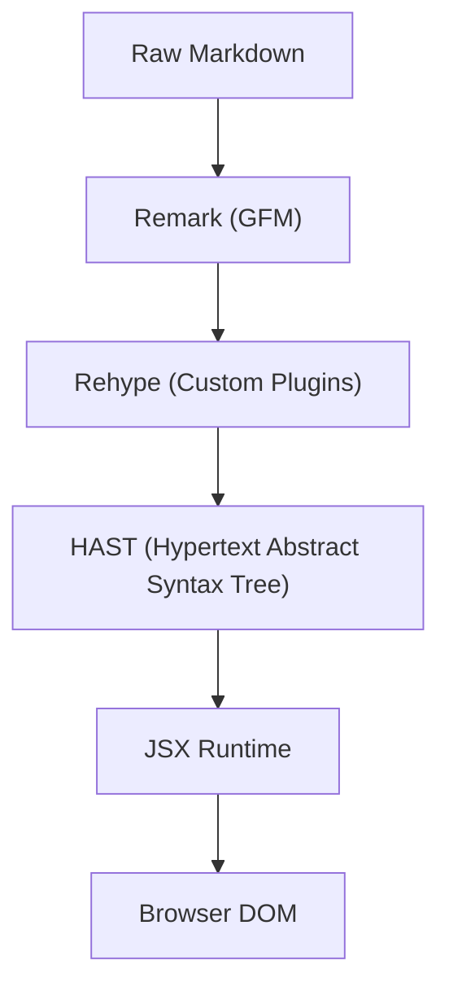

# UI and Rendering Engine

GitDex employs a sophisticated rendering pipeline designed to transform raw Markdown and diagram definitions into a high-performance, interactive user interface. The engine balances static analysis with dynamic client-side hydration to ensure smooth transitions and rich visual feedback.

## Rendering Pipeline

The core documentation rendering follows a structured transformation path from raw text to React components.

### Markdown Processing

GitDex utilizes a combination of `remark` and `rehype` to process content. This allows the system to support GitHub Flavored Markdown (GFM) while maintaining the ability to inject custom React components.

- **GFM Support**: Integration of `remark-gfm` ensures that tables, task lists, and strikethroughs are rendered correctly.
- **Custom Components**: The engine overrides standard HTML elements with specialized UI components. For example, `<pre>` blocks are replaced by `DynamicCodeBlock` from `fumadocs-ui` to provide enhanced syntax highlighting and interactivity.
- **Performance Optimization**: To prevent UI jank during text updates, GitDex uses `useDeferredValue` and a Promise-based cache (`Map<string, Promise<ReactNode>>`) to avoid redundant processing of identical content.

### Word-by-Word Animation

A unique feature of the GitDex UI is the `rehypeWrapWords` plugin. This plugin intercepts the AST during the rehype phase and wraps individual words in `` elements.

These spans are assigned the `animate-fd-fade-in` class, creating a staggered, elegant entrance effect as content is rendered on the screen, enhancing the perceived quality of the documentation.

## Mermaid Diagram Engine

GitDex provides an advanced implementation of Mermaid.js, moving beyond simple rendering to include syntax correction and interactive navigation.

### Automated Syntax Correction

AI-generated diagrams often contain syntax errors. GitDex implements a `fixMermaidSyntax` utility that pre-processes chart definitions before they reach the Mermaid engine. Key corrections include:

- **Quote Normalization**: Automatically cleans and wraps node content in quotes to prevent breakage from special characters.
- **Arrow Labeling**: Converts non-standard arrow labels (e.g., `A --> B: "Label"`) into valid Mermaid syntax (`A -->|"Label"| B`).
- **Case Sensitivity**: Normalizes `SubGraph` keywords to the lowercase `subgraph` required by the parser.

### Interactive Visuals

To handle complex architectural diagrams, the engine integrates `panzoom`.

- **Navigation**: Users can drag to pan and use `Ctrl/Cmd + Scroll` to zoom into specific sections of a diagram.
- **Theme Synchronization**: The engine listens to the global theme provider, switching Mermaid's internal theme between `dark` and `default` in real-time.
- **Graceful Degradation**: If a diagram fails to render even after syntax correction, GitDex renders a specialized error boundary. This boundary provides a red-themed alert and a collapsible `
` block allowing the user to inspect the raw diagram code.

## Styling and Theming

The UI is built on **Tailwind CSS** with a custom design system defined in `globals.css`.

### Design Tokens

GitDex uses a nature-inspired color palette focusing on greens and earthy neutrals to reduce eye strain during long reading sessions.

| Token | Light Mode | Dark Mode |
| :--- | :--- | :--- |
| `--background` | `#f8f5f0` (Beige) | `#1c2a1f` (Deep Green) |
| `--primary` | `#2e7d32` (Forest Green) | `#4caf50` (Light Green) |
| `--foreground` | `#3e2723` (Dark Brown) | `#f0ebe5` (Off-white) |

### Typography

The system utilizes a tiered font strategy for maximum readability:
- **Sans**: `MozillaHeadline` for headers and primary UI.
- **Serif**: `MozillaText` for long-form documentation bodies.
- **Mono**: Standard monospace for code blocks and technical identifiers.