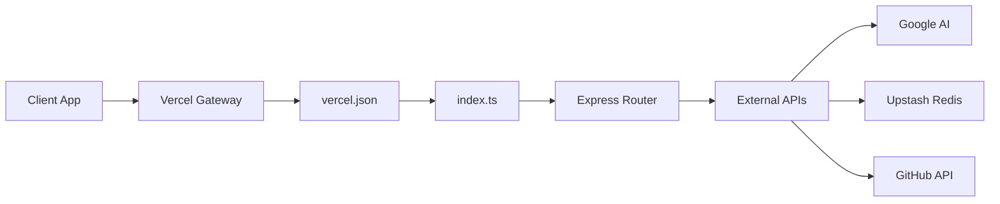

# Vercel Deployment

The Vercel Deployment module provides the necessary configuration to transition the GitDex server from a local Bun-based development environment to a production-ready serverless architecture. By leveraging Vercel's serverless functions, the backend can scale dynamically to handle repository indexing and AI-powered queries without the overhead of managing persistent virtual machines.

In the overall architecture of GitDex, this module acts as the bridge between the raw Node.js/TypeScript logic and the Vercel edge network, ensuring that all API requests are correctly routed to the server's entry point.

### Serverless Architecture Flow

The deployment is configured to treat the entire server as a single serverless function. Instead of deploying multiple isolated functions, GitDex uses a "monolithic" serverless approach where `index.ts` handles all incoming routing via Express.



### Vercel Configuration Analysis

The deployment behavior is governed by the `vercel.json` file. This configuration is critical because it instructs the Vercel build pipeline on how to transform the TypeScript source into a deployable runtime.

#### Routing and Build Pipeline
The server utilizes the `@vercel/node` builder to compile the TypeScript entry point. All traffic hitting the deployment URL is captured and forwarded to the main index file.

```json
{
  "version": 2,
  "builds": [
    {
      "src": "index.ts",
      "use": "@vercel/node"
    }
  ],
  "routes": [
    {
      "src": "/(.*)",
      "dest": "index.ts",
      "headers": {
        "Cache-Control": "no-store, must-revalidate"
      }
    }
  ]
}
```

**Key Architectural Decisions:**
*   **Wildcard Routing (`/(.*)`):** By routing all paths to `index.ts`, the project maintains the flexibility of the Express router defined in the source code, allowing for easy API versioning and endpoint management without updating the `vercel.json` for every new route.
*   **Cache Suppression:** The `Cache-Control: no-store, must-revalidate` header is explicitly set. This is vital for an AI application where repository indexing status and chat responses must be real-time and should never be served from a stale edge cache.

### Production Dependency Stack

The server's `package.json` reflects a stack optimized for serverless execution. Since serverless functions have strict cold-start and memory constraints, the dependency list focuses on lightweight, API-driven integrations.

| Dependency | Role in Deployment |
| :--- | :--- |
| `express` | Handles the request/response lifecycle within the serverless function. |
| `@upstash/redis` | Provides a serverless-compatible data store for state and indexing. |
| `@upstash/qstash` | Manages asynchronous job queuing to avoid serverless timeout limits. |
| `@ai-sdk/google` | Interfaces with Google Generative AI for repository analysis. |
| `cors` | Ensures the Next.js client can securely communicate with the serverless backend. |

### Deployment Considerations

When deploying the server, the following environment constraints apply:

1.  **Runtime Transition:** While development uses `bun index.ts` for speed and built-in TypeScript support, Vercel utilizes the `@vercel/node` runtime. The `package.json` ensures compatibility by using `type: "module"`.
2.  **Statelessness:** Because the environment is serverless, no local file system storage is used. All persistent data—such as indexed repository metadata—is offloaded to Upstash Redis, ensuring that the server remains stateless and scalable across multiple Vercel regions.
3.  **Execution Limits:** To prevent the serverless function from timing out during heavy repository indexing, the architecture offloads long-running tasks to a job queue (implemented via QStash), allowing the Vercel function to return a `202 Accepted` response immediately.