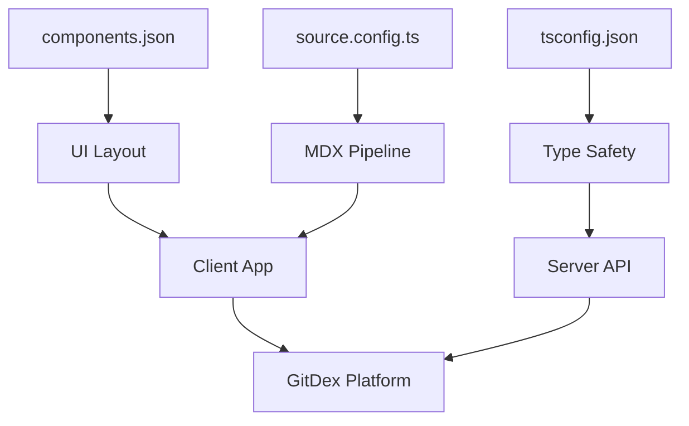

# Project Configuration

Project Configuration in GitDex defines the development standards, build-time rules, and architectural constraints for both the client and server. By utilizing a monorepo approach, GitDex maintains a strict separation between the frontend UI ecosystem and the backend runtime environment while ensuring that both adhere to modern TypeScript standards.

This module is critical for ensuring that the AI-powered repository analysis remains maintainable, that the UI remains consistent via standardized component libraries, and that the server-side logic is type-safe and performant.

## Frontend Infrastructure

The client configuration is split between UI component management and content processing. GitDex leverages `shadcn/ui` for its interface and `Fumadocs` for its documentation capabilities.

### UI Component Configuration
The `components.json` file acts as the manifest for the UI layer. It defines how components are installed, where they reside, and how the project handles styling.

| Configuration Key | Value | Purpose |
| :--- | :--- | :--- |
| `style` | `new-york` | Defines the visual aesthetic of shadcn components. |
| `rsc` | `true` | Enables React Server Components. |
| `baseColor` | `neutral` | Sets the primary color palette for the UI. |
| `iconLibrary` | `lucide` | Standardizes the iconography across the app. |

A key feature of this configuration is the use of **path aliases**, which prevent "import hell" by providing clean pointers to core directories:

```json
"aliases": {
  "components": "@/src/components",
  "utils": "@/src/lib/utils",
  "ui": "@/src/components/ui",
  "lib": "@/src/lib",
  "hooks": "@/src/hooks"
}
```

### Source & Documentation Config
To support high-quality technical documentation within the app, GitDex uses `fumadocs-mdx`. The `source.config.ts` file configures the MDX pipeline to support complex visualizations.

```typescript
import { defineDocs, defineConfig } from 'fumadocs-mdx/config';
import { remarkMdxMermaid } from 'fumadocs-core/mdx-plugins';
```

The inclusion of `remarkMdxMermaid` is a strategic architectural choice, allowing the system to render Mermaid diagrams directly from Markdown, which is essential for visualizing the AI-generated repository structures.

## Backend Type Safety

The server-side configuration is governed by a rigorous `tsconfig.json` designed for modern Node.js environments. The focus here is on maximum type safety and compatibility with the latest ECMAScript standards.

### Compiler Strategy
The server utilizes `ESNext` for both `lib` and `target`, ensuring the backend can leverage the most recent JavaScript features without unnecessary transpilation overhead.

```json
"compilerOptions": {
  "target": "ESNext",
  "module": "Preserve",
  "moduleResolution": "bundler",
  "strict": true,
  "noUncheckedIndexedAccess": true
}
```

Two specific flags are noteworthy for the project's stability:
1.  **`strict: true`**: Forces comprehensive type checking, reducing runtime crashes during AI data processing.
2.  **`noUncheckedIndexedAccess: true`**: Prevents the common "undefined" error when accessing array elements or dictionary keys, forcing the developer to explicitly handle potential missing values.

## Configuration Workflow

The following diagram illustrates how these configuration files influence the development lifecycle and the resulting application behavior.



By separating these concerns, GitDex ensures that changes to the UI styling (via `components.json`) do not impact the stability of the backend AI logic (via `tsconfig.json`), while providing a unified, type-safe experience across the entire monorepo.