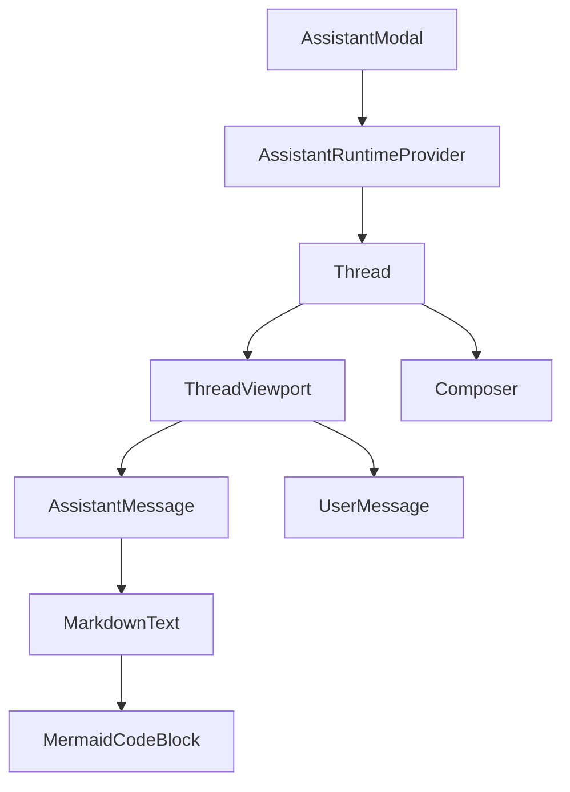
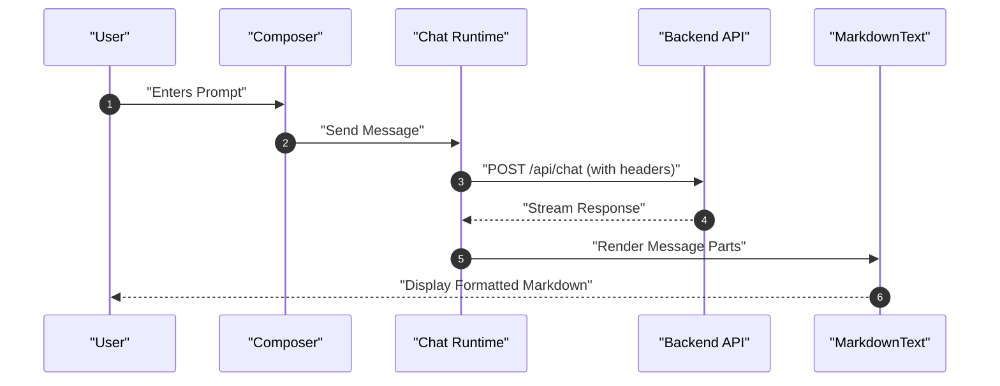

# AI Chat Interface

The AI Chat Interface provides an interactive, AI-powered assistant capable of analyzing specific GitHub repositories. It is built using the `@assistant-ui` framework, integrating a runtime-based communication layer with a highly customized frontend experience.

## Component Architecture

The chat interface is organized as a layered hierarchy, where the modal provides the runtime context and the thread handles the message orchestration.



## Assistant Modal and Runtime

The `AssistantModal` serves as the entry point and configuration layer for the chat session. It encapsulates the `AssistantRuntimeProvider`, which manages the state and communication with the backend.

### Runtime Configuration
The component utilizes `useChatRuntime` and `AssistantChatTransport` to establish a connection to the backend API.

```tsx
const runtime = useChatRuntime({
  transport: new AssistantChatTransport({
    api: `${apiBaseUrl}/api/chat`,
    headers: {
      "x-github-owner": owner,
      "x-github-repo": repo,
    },
  }),
});
```

### UI/UX Features
- **Responsive Design**: On mobile devices (width < 768px), the modal occupies the full screen with a backdrop blur. On desktop, it appears as a right-aligned sidebar.
- **Dynamic Resizing**: Desktop users can resize the panel via a drag handle. The width is constrained between a minimum of `360px` and a maximum of 50% of the window width.
- **Session Control**: A reset button triggers `runtime.thread.reset()` to clear the chat history.

## Thread Management

The `Thread` component manages the display and input of the conversation. It leverages `ThreadPrimitive` to handle complex AI interaction patterns like message branching and streaming.

### Message Lifecycle and Limits
To ensure performance and API stability, the interface enforces strict limits on thread activity:

| Limit Type | Maximum Value | Behavior when Reached |
| :--- | :--- | :--- |
| **User Messages** | 10 | Composer is replaced by a "Message Limit Reached" warning. |
| **Attachments** | 5 | Attachment button is replaced by a "limit reached" badge. |

### Thread Components
- **ThreadWelcome**: Displayed when the thread is empty. It provides repository-specific context and a set of suggested prompts to guide the user.
- **Composer**: A multi-functional input area featuring an attachment dropzone, a message input, and toggleable Send/Cancel buttons depending on whether the AI is currently generating a response.
- **BranchPicker**: Allows users to navigate between different versions of the conversation when a message has been edited.

### Interaction Sequence
The following sequence describes the flow from user input to AI response rendering.



## Markdown Rendering

The `MarkdownText` component is a specialized renderer that transforms AI responses into rich HTML. It is built upon `@assistant-ui/react-markdown` and extended with several plugins.

### Rendering Pipeline
The component uses the following plugins to support advanced notation:
- **remark-gfm**: GitHub Flavored Markdown (tables, checklists).
- **remark-math**: Mathematical expression parsing.
- **rehype-katex**: High-quality LaTeX rendering for formulas.

### Specialized Code Blocks
The interface differentiates between standard code and architectural diagrams:

1. **Standard Code**: Rendered with a `CodeHeader` that displays the language and provides a "Copy to Clipboard" utility.
2. **Mermaid Diagrams**: When the language is identified as `mermaid`, the `SyntaxHighlighter` redirects the content to a `MermaidCodeBlock`.

```tsx
const MermaidCodeBlock: FC<{ chart: string }> = ({ chart }) => {
  return (
    <div className="my-5 w-full border border-border rounded-lg overflow-hidden bg-background">
      <div className="flex items-center justify-between ...">
        <span className="font-mono text-xs text-muted-foreground">mermaid diagram</span>
        {/* Copy Button */}
      </div>
      <div className="p-1 bg-background">
        <Mermaid chart={chart} border={false} margin={false} />
      </div>
    </div>
  );
};
```

### Styled Components
Custom styling is applied via a `memoizeMarkdownComponents` map, ensuring consistent typography and spacing. Key customizations include:
- **Tables**: Wrapped in an `overflow-x-auto` container with specific `aui-md-th` and `aui-md-td` styles.
- **Headings**: Progressive sizing from `text-4xl` (h1) down to `text-base` (h6).
- **Inline Code**: Styled with `aui-md-inline-code` for a distinct background and border.