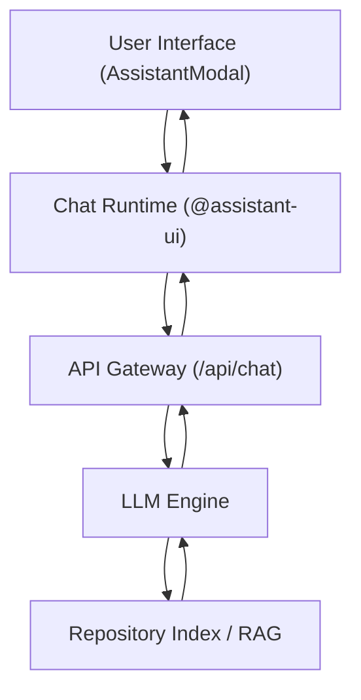

# AI Assistant Integration

GitDex features a sophisticated AI-powered QA system designed to help users navigate and understand complex repositories. The integration combines a responsive chat interface with a structured data schema to ensure that AI responses are grounded in the actual codebase and external documentation.

## System Architecture

The AI Assistant operates as a client-side wrapper around a specialized chat runtime that communicates with a RAG (Retrieval-Augmented Generation) backend.



## The Chat Interface

The assistant is implemented as a sliding sidebar modal (`AssistantModal`) that provides a seamless overlay experience without navigating away from the current repository view.

### Key UI Features
- **Responsive Design**: On desktop, the assistant is a resizable right-side panel. On mobile devices, it transitions to a full-screen overlay with a backdrop blur.
- **Contextual Awareness**: The system automatically injects the current `owner` and `repo` into the request headers (`x-github-owner`, `x-github-repo`), ensuring the AI is always scoped to the correct project.
- **Thread Management**: 
  - **Reset Capability**: Users can clear chat history via the `RotateCcw` action to start a fresh session.
  - **Branching**: Supports message editing and branching, allowing users to pivot the conversation at any point in the history.

### Conversation Controls
To maintain performance and prevent API abuse, the following constraints are enforced within `thread.tsx`:
- **Message Limit**: Threads are capped at **10 messages**. Once reached, the input composer is replaced by a limit notification.
- **Attachment Limit**: Users can attach up to **5 files/references** per conversation.

## User Experience Flow

When a user opens the assistant, they are greeted with a welcome screen containing **Suggested Prompts**. These prompts are designed to guide users toward the most common repository queries:
- **Architecture Overview**: "Give me an overview of this repository's architecture and main components."
- **API Discovery**: "What are all the API routes or endpoints defined in this codebase?"
- **Security/Auth**: "How does authentication and authorization work in this codebase?"

## Underlying Data Schema

GitDex uses a strict Zod-based schema to handle AI tool outputs, ensuring that the LLM provides structured references rather than hallucinations. This is defined in `inkeep-qa-schema.ts`.

### Link and Source Tracking
The `ProvideLinksToolSchema` ensures that every claim made by the AI can be backed by a source. The system supports various record types:

| Record Type | Description |
| :--- | :--- |
| `documentation` | Official project docs |
| `github_issue` | Related GitHub issues |
| `github_discussion` | Community discussions |
| `stackoverflow_question` | External community knowledge |
| `discord_message` | Chat-based knowledge |

### Confidence Scoring
To improve trust, the AI provides an `answerConfidence` metric via the `ProvideAIAnnotationsToolSchema`. The possible confidence levels are:
- `very_confident`
- `somewhat_confident`
- `not_confident`
- `no_sources`

## Implementation Details

### Runtime Configuration
The assistant uses the `@assistant-ui/react-ai-sdk` for state management. The transport layer is configured as follows:

```typescript
const runtime = useChatRuntime({
  transport: new AssistantChatTransport({
    api: `${apiBaseUrl}/api/chat`,
    headers: {
      "x-github-owner": owner,
      "x-github-repo": repo,
    },
  }),
});
```

### Message Rendering
The `AssistantMessage` component handles several states:
1. **Running (Empty)**: Displays a pulsing primary color indicator.
2. **Running (Streaming)**: Renders markdown in real-time with a "Generating..." badge.
3. **Complete**: Provides an action bar with options to **Copy**, **Export as Markdown**, or **Refresh** the response.