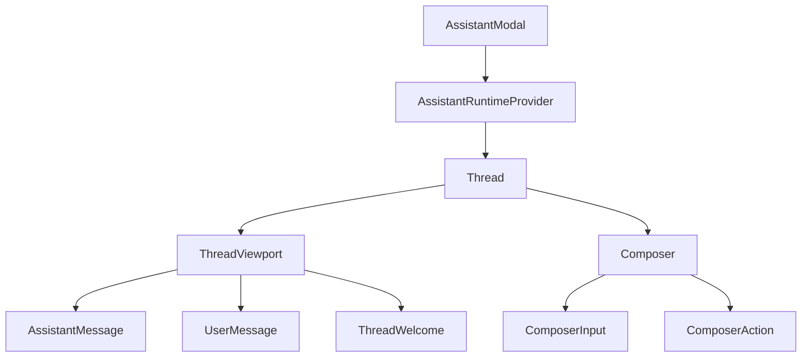
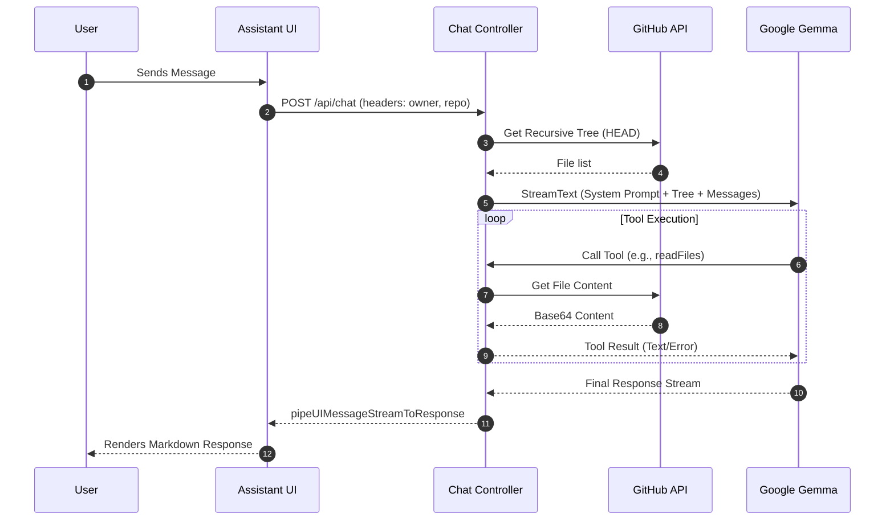

# Assistant UI & Chat Interface

The Assistant UI provides a seamless, integrated AI chat experience that allows users to explore specific GitHub repositories. It consists of a flexible frontend modal and thread system powered by the `@assistant-ui` framework, integrated with a backend controller that utilizes Large Language Models (LLMs) and the GitHub API.

## Frontend Component Architecture

The chat interface is built using a hierarchical component structure that manages everything from the UI window state to the individual message rendering.

### AssistantModal
The `AssistantModal` serves as the primary entry point and container for the chat interface. It handles the visibility, positioning, and runtime configuration.

- **Runtime Provider**: Utilizes `AssistantRuntimeProvider` and `useChatRuntime` to manage the chat state.
- **Transport**: Implements `AssistantChatTransport` to communicate with the backend `/api/chat` endpoint.
- **State Management**: Manages the open/closed state, mobile responsiveness, and a custom resizing logic for desktop users (min width 360px, max width 50% of screen).
- **Context Passing**: Sends `x-github-owner` and `x-github-repo` headers with every request to ensure the AI is grounded in the correct repository.

### Thread & Viewport
The `Thread` component manages the actual conversation flow and layout.

- **Viewport**: A scrollable area that auto-scrolls to the bottom as new messages arrive.
- **Welcome Screen**: When the thread is empty, `ThreadWelcome` displays repository-specific greetings and a set of `SUGGESTIONS` to guide the user (e.g., "Explain the architecture").
- **Message Rendering**: Differentiates between `UserMessage` and `AssistantMessage`, each with its own action bar (e.g., edit for users, copy/export for the assistant).

### Composer
The `Composer` is the input area where users interact with the AI. It includes several production guards:
- **Message Limit**: A hard limit of 10 user messages per thread. Once reached, the input is replaced by a limit warning, prompting the user to reset the chat.
- **Attachment Limit**: A maximum of 5 total attachments per thread.
- **Stateful UI**: Switches between a "Send" button and a "Cancel" (stop generating) button based on the `thread.isRunning` state.



## Backend Integration & Chat Controller

The backend is handled by the `chatController.ts`, which manages the interaction between the AI SDK, the LLM (Google Gemma), and the GitHub API via Octokit.

### Request Handling
When a request hits the `handleChat` handler, the system:
1. Extracts the `owner` and `repo` from headers or the referer URL.
2. Fetches a recursive file tree of the repository (up to 300 paths) to provide the AI with initial structural context.
3. Constructs a strict **System Prompt** that defines the AI's identity as "GitDex Assistant" and enforces a strict scope policy.

### AI Tooling
The assistant is not just a text generator; it is equipped with tools to actively explore the codebase.

| Tool | Description | Input Schema | Constraint |
| :--- | :--- | :--- | :--- |
| `listFiles` | Lists files/dirs at a specific path | `{ path: string }` | Must be a directory |
| `readFile` | Reads content of a single file | `{ path: string }` | Truncated at 15,000 chars |
| `readFiles` | Reads multiple files in one call | `{ paths: string[] }` | Max 5 files; 10k chars per file |

### AI Scope & Security Policy
The system prompt implements strict guardrails to prevent prompt injection and out-of-scope usage:
- **Repository Lock**: The AI must decline general programming questions (e.g., "Write a bubble sort") if they do not reference the specific codebase.
- **Prompt Protection**: Instructions explicitly forbid the AI from revealing the system prompt or ignoring previous instructions.
- **Developer Focus**: Answers are mandated to be concise and developer-focused, preferring actual file reads over guessing.



## Implementation Details

### Content Truncation
To prevent context window overflow and API timeouts, the controller implements strict truncation logic:

```typescript
// Example from readFile tool execution
if ('content' in data && data.encoding === 'base64') {
    const content = Buffer.from(data.content, 'base64').toString('utf-8');
    return { 
        content: content.slice(0, 15000) + (content.length > 15000 ? '\n...[truncated]' : '') 
    };
}
```

### Runtime Configuration
The frontend connects to the backend using environment variables for the API base URL, ensuring flexibility across development and production environments.

```typescript
const runtime = useChatRuntime({
  transport: new AssistantChatTransport({
    api: `${apiBaseUrl}/api/chat`,
    headers: {
      "x-github-owner": owner,
      "x-github-repo": repo,
    },
  }),
});