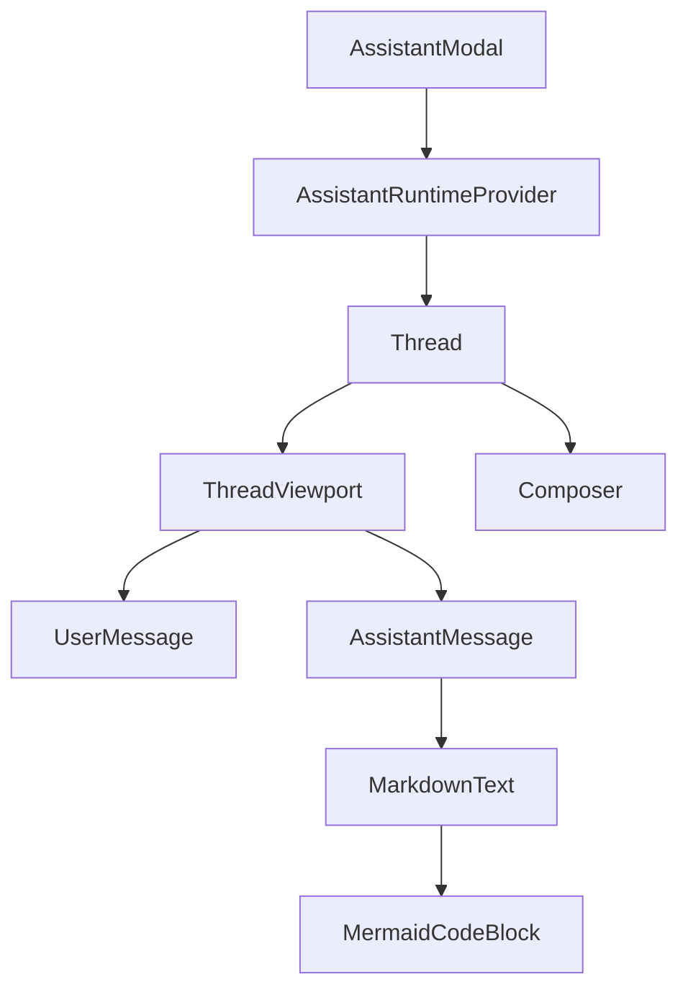
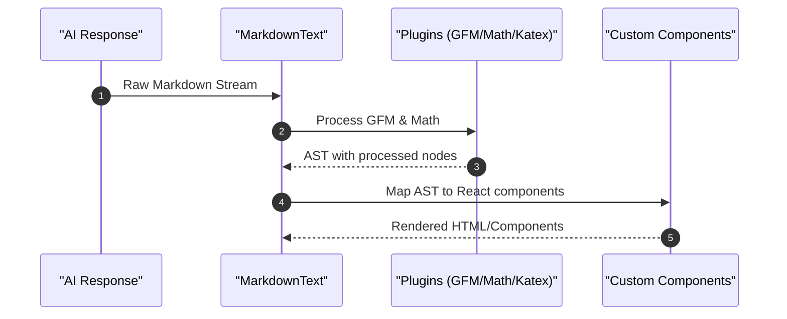

# Chat & Assistant Interface

The Chat & Assistant Interface provides a rich, interactive AI experience allowing users to query the indexed codebase of a specific GitHub repository. It is implemented as a slide-out modal that manages conversation state, renders complex markdown, and handles AI stream interactions.

## Component Architecture

The interface is built using a layered approach, separating the runtime configuration, the layout container, and the conversational thread.

### Assistant Modal
The `AssistantModal` serves as the primary entry point and layout wrapper. It handles the visual state of the chat interface and integrates the AI runtime.

- **Responsiveness**: On mobile devices (width < 768px), the modal takes up the full screen and disables body scrolling. On desktop, it appears as a right-aligned sidebar. Sources: [assistant-modal.tsx:20-30]()
- **Resizability**: Desktop users can drag the left border of the modal to adjust its width, with constraints between 360px and 50% of the window width. Sources: [assistant-modal.tsx:32-57]()
- **Runtime Configuration**: It initializes the `AssistantChatTransport` which connects to the backend chat API using the current repository's owner and repo as headers. Sources: [assistant-modal.tsx:61-68]()

## Thread Management

The `Thread` component manages the flow of the conversation, implementing the messaging viewport and the input area.

### Conversation Lifecycle
The thread utilizes several primitives from `@assistant-ui/react` to manage the message stream:

| Feature | Implementation Detail | Source |
| :--- | :--- | :--- |
| **Empty State** | `ThreadWelcome` displays suggested prompts when no messages exist. | [thread.tsx:43-55]() |
| **Message Limits** | Hard limit of 10 user messages per thread to prevent context overflow. | [thread.tsx:131-136]() |
| **Attachments** | Maximum of 5 total attachments allowed across the conversation. | [thread.tsx:165-168]() |
| **Branching** | `BranchPicker` allows users to navigate between different conversation paths. | [thread.tsx:285-303]() |

### Suggested Prompts
To guide users, the `ThreadWelcome` component provides a set of predefined prompts:
- **Architecture**: "Give me an overview of this repository's architecture and main components."
- **API Routes**: "What are all the API routes or endpoints defined in this codebase and what do they do?"
- **Authentication**: "How does authentication and authorization work in this codebase?"
Sources: [thread.tsx:76-86]()

## Markdown & Rich Text Rendering

The `MarkdownText` component provides a highly customized rendering engine for AI responses, ensuring technical documentation and code are presented clearly.

### Processing Pipeline
The component uses a combination of remark and rehype plugins to handle specialized syntax:

### Key Rendering Features
- **Math & Tables**: Integrated with `remark-gfm` for tables and `remark-math`/`rehype-katex` for mathematical notation. Sources: [markdown-text.tsx:18-21]()
- **Code Blocks**:
    - **Standard Code**: Features a `CodeHeader` that displays the language and provides a "Copy to Clipboard" utility. Sources: [markdown-text.tsx:32-48]()
    - **Mermaid Diagrams**: Specifically detects the `mermaid` language identifier and redirects the content to the `MermaidCodeBlock` component for visual rendering. Sources: [markdown-text.tsx:63-84, 188-192]()
- **Styling**: Custom CSS classes (e.g., `aui-md-h1`, `aui-md-p`) are applied to ensure consistency with the project's design system. Sources: [markdown-text.tsx:47-179]()

## User & Assistant Interactions

The interface distinguishes between user and assistant messages through specific action bars and states.

### User Interface
User messages are aligned to the right and include a `UserActionBar` that allows users to edit their previous prompts via the `EditComposer`. Sources: [thread.tsx:247-273]()

### Assistant Interface
Assistant messages include several specialized utilities:
1. **Streaming State**: A pulse animation and "Generating..." indicator appear while the AI is processing. Sources: [thread.tsx:207-223]()
2. **Action Bar**: Provides three main utilities:
    - **Copy**: Copies the message content to the clipboard.
    - **Export**: Downloads the response as a Markdown file.
    - **Reload**: Triggers a regeneration of the response.
    Sources: [thread.tsx:230-244]()
3. **Error Handling**: `MessageError` displays failure notices within the message stream if the API request fails. Sources: [thread.tsx:195-202]()