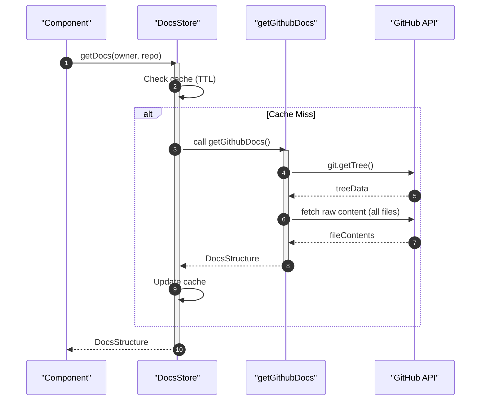
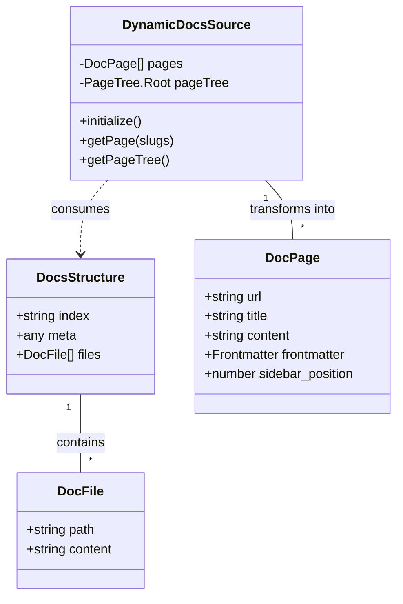

# Client-Side Data Orchestration

The Client-Side Data Orchestration layer in GitDex manages the retrieval, caching, and structural processing of repository documentation. This system ensures that documentation is fetched efficiently from GitHub and transformed into a hierarchical format suitable for the frontend navigation and rendering components.

## Data Acquisition Flow

GitDex retrieves documentation from a dedicated GitHub repository (`gitdex-docs`) rather than the target repository itself. This allows for managed documentation regardless of the target repository's structure.

### GitHub Documentation Retrieval
The `getGithubDocs` function handles the communication with the GitHub API [client/src/lib/github.ts:13-65](). The process follows these steps:
1. **Tree Discovery**: Uses `@octokit/rest` to fetch the recursive git tree of the `main` branch [client/src/lib/github.ts:33-37]().
2. **File Filtering**: Filters the tree for blobs located within the `docs/${owner}/${repo}` path [client/src/lib/github.ts:39-41]().
3. **Content Fetching**: Performs concurrent `fetch` requests to `raw.githubusercontent.com` to retrieve the raw text content of each file [client/src/lib/github.ts:22-31]().
4. **Metadata Parsing**: Searches for a `meta.json` file within the directory to extract repository-specific configuration [client/src/lib/github.ts:48-53]().

### Retrieval Sequence

## State Management and Caching

To minimize redundant API calls and improve page load times, GitDex implements a client-side caching layer using Zustand [client/src/lib/docs-store.ts:1-44]().

### The Docs Store
The `useDocsStore` manages a `DocsCache` object where keys are formatted as `${owner}/${repo}` [client/src/lib/docs-store.ts:4-11]().

| Feature | Implementation Detail | Source |
| :--- | :--- | :--- |
| **Cache TTL** | 10 minutes (`10 * 60 * 1000` ms) | [client/src/lib/docs-store.ts:14-14]() |
| **Storage Key** | `${owner}/${repo}` | [client/src/lib/docs-store.ts:20-20]() |
| **Cache Clearing** | Global (`clearCache`) and Per-Repo (`clearCacheFor`) | [client/src/lib/docs-store.ts:34-43]() |

## Dynamic Documentation Processing

Once raw data is retrieved, the `DynamicDocsSource` class transforms the flat file list into a structured documentation tree [client/src/lib/dynamic-source.ts:18-138]().

### Frontmatter Extraction
The system parses YAML-style frontmatter from the top of `.mdx` files using a regular expression [client/src/lib/dynamic-source.ts:63-84]().

**Supported Frontmatter Fields:**
- `title`: Overrides the auto-generated title from the filename.
- `description`: A brief summary of the page.
- `sidebar_position`: Controls the sorting order (defaults to 999 if absent) [client/src/lib/dynamic-source.ts:44-45]().

### Hierarchical Tree Generation
The `generateHierarchicalPageTree` method converts the flat list of pages into a nested structure compatible with `fumadocs-core/page-tree` [client/src/lib/dynamic-source.ts:86-134]().

1. **Grouping**: Pages are analyzed for a numeric prefix (e.g., `1.1`). If a prefix is found, the page is grouped under a top-level page matching the primary index (e.g., `1`) [client/src/lib/dynamic-source.ts:92-102]().
2. **Sorting**: Pages are sorted based on their `sidebar_position` [client/src/lib/dynamic-source.ts:104-108]().
3. **Node Creation**:
    - **Pages**: Simple nodes with a URL and title [client/src/lib/dynamic-source.ts:114-117]().
    - **Folders**: Nodes that contain an `index` page and a list of `children` sub-pages [client/src/lib/dynamic-source.ts:119-126]().

### Data Model Relationship

## API Summary

### DynamicDocsSource Methods
| Method | Parameters | Return Type | Description | Source |
| :--- | :--- | :--- | :--- | :--- |
| `initialize()` | None | `Promise<void>` | Fetches docs and builds the page tree | [client/src/lib/dynamic-source.ts:34-61]() |
| `getPage()` | `slugs: string[]` | `DocPage \| null` | Retrieves a specific page by its slug path | [client/src/lib/dynamic-source.ts:63-66]() |
| `getFirstPage()` | None | `DocPage \| null` | Returns the first sorted page in the set | [client/src/lib/dynamic-source.ts:68-70]() |
| `getPageTree()` | None | `PageTree.Root` | Returns the generated hierarchical tree | [client/src/lib/dynamic-source.ts:72-74]() |